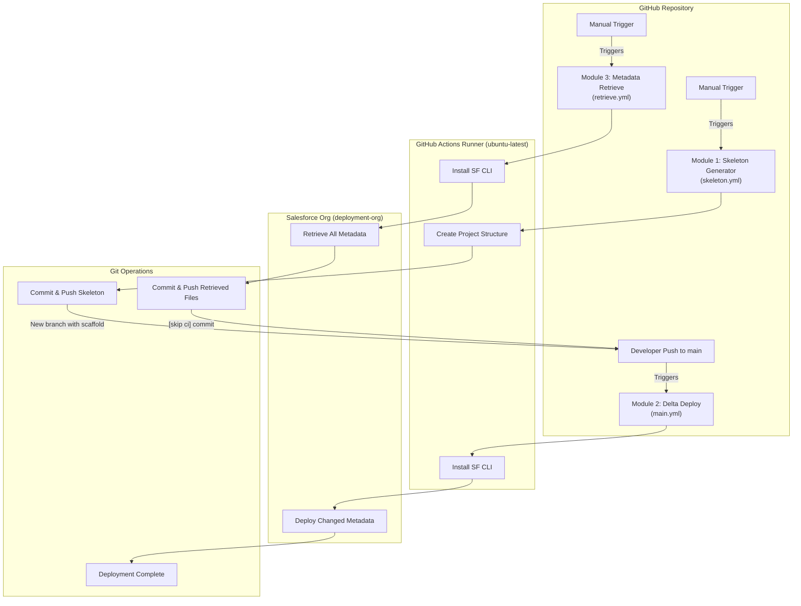
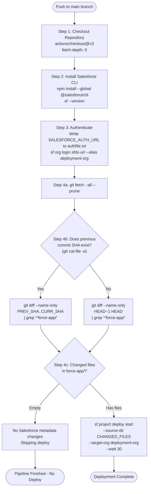
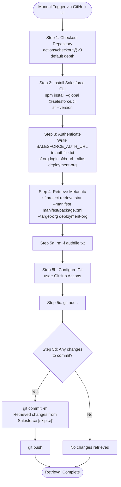
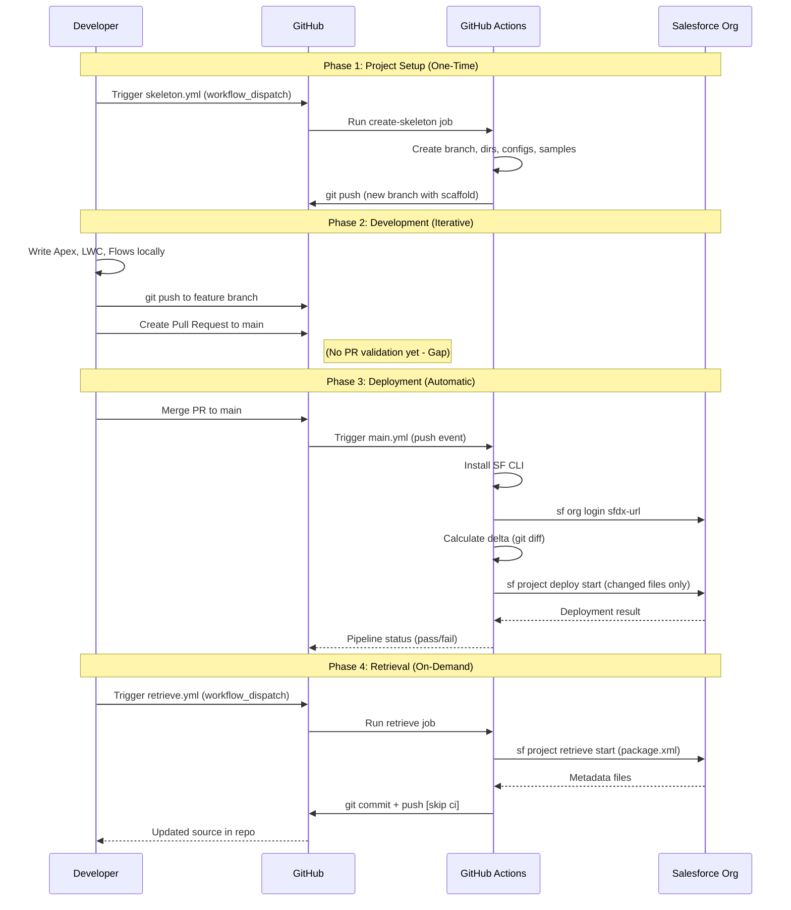
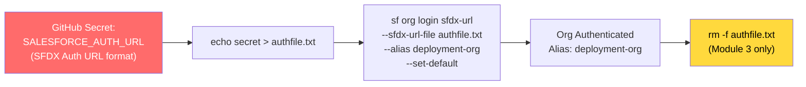
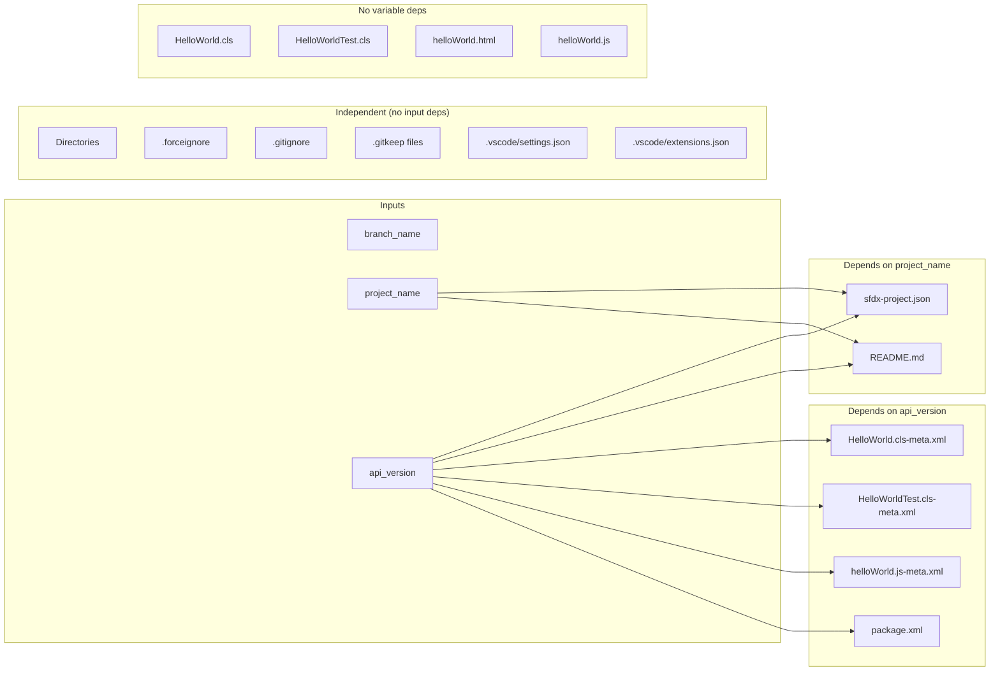
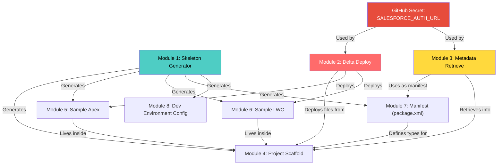

# Elite-sbox: Complete Modules, Features & Workflow Diagrams

> **Repository:** Elite-sbox
> **Type:** Salesforce DX CI/CD Framework & Project Scaffolding Engine
> **Files:** 4 source files (3 workflows + 1 README)
> **API Version:** 59.0 (configurable)

---

## Table of Contents

1. [System Architecture Overview](#1-system-architecture-overview)
2. [Module Registry (Complete)](#2-module-registry-complete)
3. [Module 1 -- Skeleton Generator](#3-module-1----skeleton-generator-skeletonyml)
4. [Module 2 -- Delta Deployment Pipeline](#4-module-2----delta-deployment-pipeline-mainyml)
5. [Module 3 -- Metadata Retrieval Pipeline](#5-module-3----metadata-retrieval-pipeline-retrieveyml)
6. [Module 4 -- Generated Project Scaffold](#6-module-4----generated-project-scaffold)
7. [Module 5 -- Sample Apex Code](#7-module-5----sample-apex-code)
8. [Module 6 -- Sample LWC Component](#8-module-6----sample-lwc-component)
9. [Module 7 -- Manifest & Metadata Definitions](#9-module-7----manifest--metadata-definitions)
10. [Module 8 -- Developer Environment Config](#10-module-8----developer-environment-config)
11. [Workflow Diagrams](#11-workflow-diagrams)
12. [File-to-Module Mapping](#12-file-to-module-mapping)
13. [Function-Level Traceability Matrix](#13-function-level-traceability-matrix)

---

## 1. System Architecture Overview

```
+-----------------------------------------------------------------------+
|                        GitHub Repository (Elite-sbox)                  |
|                                                                       |
|  +----------------------------+  +----------------------------------+ |
|  |  .github/workflows/        |  |  Generated Output (via skeleton) | |
|  |                            |  |                                  | |
|  |  skeleton.yml  (Module 1)  |  |  force-app/main/default/         | |
|  |  main.yml      (Module 2)  |  |    classes/     (Module 5)       | |
|  |  retrieve.yml  (Module 3)  |  |    lwc/         (Module 6)       | |
|  |                            |  |    triggers/    (Module 4)       | |
|  +----------------------------+  |    aura/        (Module 4)       | |
|                                  |    objects/     (Module 4)       | |
|  +----------------------------+  |    layouts/     (Module 4)       | |
|  |  Config Files (Module 8)   |  |    flows/       (Module 4)       | |
|  |                            |  |    permissionsets/ (Module 4)    | |
|  |  .vscode/settings.json     |  |    profiles/    (Module 4)       | |
|  |  .vscode/extensions.json   |  |    staticresources/ (Module 4)  | |
|  |  .forceignore              |  |    tabs/        (Module 4)       | |
|  |  .gitignore                |  |    pages/       (Module 4)       | |
|  |  sfdx-project.json         |  |    components/  (Module 4)       | |
|  +----------------------------+  |    email/       (Module 4)       | |
|                                  |    queues/      (Module 4)       | |
|  +----------------------------+  |    reports/     (Module 4)       | |
|  |  Manifest (Module 7)       |  |    dashboards/  (Module 4)       | |
|  |                            |  |                                  | |
|  |  manifest/package.xml      |  |  scripts/apex/  (Module 4)       | |
|  +----------------------------+  |  config/        (Module 4)       | |
|                                  +----------------------------------+ |
+-----------------------------------------------------------------------+
           |                    |                    |
           v                    v                    v
   +---------------+   +-----------------+   +----------------+
   | GitHub Actions |   | Salesforce Org  |   | Developer IDE  |
   | (Ubuntu Runner)|   | (deployment-org)|   | (VS Code)      |
   +---------------+   +-----------------+   +----------------+
```

---

## 2. Module Registry (Complete)

| # | Module Name | Source File | Type | Trigger | Status |
|---|-------------|-------------|------|---------|--------|
| 1 | Skeleton Generator | `skeleton.yml` | GitHub Actions Workflow | Manual (`workflow_dispatch`) | Active |
| 2 | Delta Deployment Pipeline | `main.yml` | GitHub Actions Workflow | Auto (`push` to `main`) | Active |
| 3 | Metadata Retrieval Pipeline | `retrieve.yml` | GitHub Actions Workflow | Manual (`workflow_dispatch`) | Active |
| 4 | Generated Project Scaffold | `skeleton.yml` (output) | Directory Structure | Created by Module 1 | Template |
| 5 | Sample Apex Code | `skeleton.yml` (output) | Apex Class + Test | Created by Module 1 | Template |
| 6 | Sample LWC Component | `skeleton.yml` (output) | LWC Bundle | Created by Module 1 | Template |
| 7 | Manifest & Metadata Definitions | `skeleton.yml` (output) | package.xml | Created by Module 1 | Template |
| 8 | Developer Environment Config | `skeleton.yml` (output) | IDE + SFDX Config | Created by Module 1 | Template |

---

## 3. Module 1 -- Skeleton Generator (`skeleton.yml`)

**File:** `.github/workflows/skeleton.yml`
**Size:** 546 lines, 19 KB
**Job:** `create-skeleton`
**Runner:** `ubuntu-latest`
**Permissions:** `contents: write`

### 3.1 Input Parameters

| Parameter | Required | Default | Description |
|-----------|----------|---------|-------------|
| `branch_name` | Yes | `sfdc-project` | Target branch (creates new if not exists) |
| `project_name` | Yes | `my-sfdc-project` | Name embedded in sfdx-project.json & README |
| `api_version` | Yes | `59.0` | Salesforce API version for all metadata |

### 3.2 Complete Step Inventory (14 Steps)

| Step # | Step Name | Function | Lines | Idempotent? |
|--------|-----------|----------|-------|-------------|
| 1 | Checkout code | Clones repo with full history (`fetch-depth: 0`), uses `GITHUB_TOKEN` | 29-33 | Yes |
| 2 | Configure Git | Sets bot user identity for commits | 38-41 | Yes |
| 3 | Checkout branch | Fetches origin, checks if branch exists remotely; creates new or checks out existing | 46-63 | Yes |
| 4 | Create SFDC Skeleton | Creates 17 `force-app/` subdirectories + 3 utility directories | 68-97 | Yes (`mkdir -p`) |
| 5 | Create sfdx-project.json | Generates SFDX config with project name, namespace, login URL, API version | 102-125 | Yes (skip if exists) |
| 6 | Create .forceignore | Generates ignore rules for SF push/pull operations | 130-156 | Yes (skip if exists) |
| 7 | Create .gitignore | Generates Git ignore rules for SF artifacts, auth files, IDE files | 161-204 | Yes (skip if exists) |
| 8 | Create VS Code settings | Generates `settings.json` (formatting, search exclusions) and `extensions.json` (SF extension pack) | 209-236 | **No** (overwrites) |
| 9 | Create sample Apex class | Generates `HelloWorld.cls`, `HelloWorldTest.cls` with meta XML | 241-291 | Yes (skip if exists) |
| 10 | Create sample LWC | Generates `helloWorld/` bundle (HTML + JS + meta XML) | 296-347 | Yes (skip if dir exists) |
| 11 | Create package.xml | Generates manifest with 21 metadata types | 352-449 | **No** (overwrites) |
| 12 | Create README | Generates README with setup instructions | 454-492 | **No** (overwrites) |
| 13 | Create placeholder files | Touches `.gitkeep` in 11 empty directories | 497-513 | Yes |
| 14 | Commit and Push | Stages all, commits with descriptive message, pushes to branch | 518-545 | Yes (no-op if no changes) |

### 3.3 Features Matrix

| Feature | Function | Detail |
|---------|----------|--------|
| **F1.1** Branch Management | Auto-create or reuse branch | Checks `git ls-remote --heads` before creating |
| **F1.2** Directory Scaffolding | Create 20 directories | 17 under `force-app/`, plus `scripts/apex/`, `config/`, `.vscode/` |
| **F1.3** SFDX Project Config | Generate `sfdx-project.json` | Configurable name, namespace, login URL, API version |
| **F1.4** Source Ignore Rules | Generate `.forceignore` | Excludes Admin profile, jsconfig, eslintrc, appMenus, objectTranslations, connectedApps |
| **F1.5** Git Ignore Rules | Generate `.gitignore` | Excludes .sf/, .sfdx/, logs, OS files, IDE files, node_modules, auth files, deployment artifacts |
| **F1.6** IDE Configuration | Generate VS Code settings | Format-on-save, tab size 4, search exclusions, recommended extensions (4 extensions) |
| **F1.7** Sample Apex | Generate HelloWorld class + test | `with sharing`, static method, null handling, 2 test assertions |
| **F1.8** Sample LWC | Generate helloWorld component | `lightning-card`, `lightning-input`, reactive property, 3 target pages |
| **F1.9** Metadata Manifest | Generate `package.xml` | 21 metadata types with wildcard members |
| **F1.10** Documentation | Generate README.md | Auth, deploy, test commands; project structure overview |
| **F1.11** Placeholder Files | Create `.gitkeep` files | 11 directories preserved in Git |
| **F1.12** Auto-Commit | Stage, commit, push | Descriptive commit message with project details; skips if no changes |

---

## 4. Module 2 -- Delta Deployment Pipeline (`main.yml`)

**File:** `.github/workflows/main.yml`
**Size:** 57 lines, 1.7 KB
**Job:** `deploy`
**Runner:** `ubuntu-latest`
**Trigger:** Push to `main` branch

### 4.1 Complete Step Inventory (4 Steps)

| Step # | Step Name | Function | Lines |
|--------|-----------|----------|-------|
| 1 | Checkout code | Clones repo with full history (`fetch-depth: 0`), uses `actions/checkout@v3` | 13-16 |
| 2 | Install Salesforce CLI | Global npm install of `@salesforce/cli`, prints version | 18-21 |
| 3 | Authenticate to Salesforce | Writes `SALESFORCE_AUTH_URL` secret to file, authenticates with SFDX URL method, aliases as `deployment-org` | 23-26 |
| 4 | Deploy changed metadata only | Computes delta between commits, filters to `force-app/`, deploys only changed files | 28-56 |

### 4.2 Features Matrix

| Feature | Function | Detail |
|---------|----------|--------|
| **F2.1** Auto-Trigger | Push-based deployment | Every push to `main` triggers the pipeline |
| **F2.2** CLI Installation | Install SF CLI via npm | Global install of `@salesforce/cli` |
| **F2.3** SFDX Auth URL Login | Authenticate to org | Uses `sf org login sfdx-url` with file-based auth URL from secret |
| **F2.4** Commit Delta Calculation | Identify changed files | Compares `github.event.before` SHA with `github.sha` |
| **F2.5** Fallback Delta | Handle missing prev commit | Falls back to `HEAD~1` diff if previous SHA not found |
| **F2.6** Force-app Filter | Scope to metadata only | `grep '^force-app/'` filters out non-metadata changes |
| **F2.7** Conditional Deploy | Skip if no changes | Skips `sf project deploy start` if no force-app files changed |
| **F2.8** Deploy with Wait | Synchronous deployment | `--wait 30` waits up to 30 minutes for deployment result |

### 4.3 Delta Calculation Logic (Step 4 Detail)

```
INPUT:  PREV = github.event.before (previous commit SHA)
        CURR = github.sha (current commit SHA)

STEP 1: git fetch --all --prune

STEP 2: IF git cat-file -e "$PREV"^{commit} succeeds
            CHANGED_FILES = git diff --name-only $PREV $CURR | grep '^force-app/'
        ELSE
            CHANGED_FILES = git diff --name-only HEAD~1 HEAD | grep '^force-app/'

STEP 3: IF CHANGED_FILES is empty
            EXIT (skip deploy)
        ELSE
            sf project deploy start --source-dir $CHANGED_FILES
                                    --target-org deployment-org
                                    --wait 30
```

---

## 5. Module 3 -- Metadata Retrieval Pipeline (`retrieve.yml`)

**File:** `.github/workflows/retrieve.yml`
**Size:** 38 lines, 1.1 KB
**Job:** `retrieve`
**Runner:** `ubuntu-latest`
**Permissions:** `contents: write`
**Trigger:** Manual (`workflow_dispatch`)

### 5.1 Complete Step Inventory (5 Steps)

| Step # | Step Name | Function | Lines |
|--------|-----------|----------|-------|
| 1 | Checkout code | Clones repo (shallow, default depth), uses `actions/checkout@v3` | 13-14 |
| 2 | Install Salesforce CLI | Global npm install of `@salesforce/cli`, prints version | 16-19 |
| 3 | Authenticate to Salesforce | Same SFDX URL auth pattern as Module 2 | 21-24 |
| 4 | Retrieve from Salesforce | Pulls metadata using `manifest/package.xml` as manifest | 26-28 |
| 5 | Commit changes to GitHub | Cleans up auth file, configures git user, stages all, commits with `[skip ci]`, pushes | 30-37 |

### 5.2 Features Matrix

| Feature | Function | Detail |
|---------|----------|--------|
| **F3.1** Manual Trigger | On-demand retrieval | Triggered via GitHub Actions UI or API |
| **F3.2** CLI Installation | Install SF CLI | Same as Module 2 |
| **F3.3** SFDX Auth URL Login | Authenticate to org | Same pattern as Module 2 |
| **F3.4** Manifest-Based Retrieve | Pull specific metadata | Uses `sf project retrieve start --manifest manifest/package.xml` |
| **F3.5** Auth Cleanup | Remove auth file | `rm -f authfile.txt` before commit |
| **F3.6** Auto-Commit | Commit retrieved metadata | Stages all changes, commits if any exist |
| **F3.7** CI Skip Tag | Prevent deployment loop | Commit message includes `[skip ci]` to avoid triggering Module 2 |
| **F3.8** Auto-Push | Push to current branch | `git push` to origin |

---

## 6. Module 4 -- Generated Project Scaffold

**Source:** Created by Module 1 (Step 4 + Step 13)
**Type:** Directory structure with `.gitkeep` placeholders

### 6.1 Complete Directory Tree

```
force-app/
  main/
    default/
      classes/          -- Apex classes (.cls + .cls-meta.xml)
      triggers/         -- Apex triggers (.trigger + .trigger-meta.xml)     [.gitkeep]
      lwc/              -- Lightning Web Components (bundles)
      aura/             -- Aura Components (bundles)                        [.gitkeep]
      objects/          -- Custom Objects & Fields (.object-meta.xml)        [.gitkeep]
      layouts/          -- Page Layouts (.layout-meta.xml)                   [.gitkeep]
      flows/            -- Flows & Process Builders (.flow-meta.xml)         [.gitkeep]
      permissionsets/   -- Permission Sets (.permissionset-meta.xml)         [.gitkeep]
      profiles/         -- Profiles (.profile-meta.xml)                      [.gitkeep]
      staticresources/  -- Static Resources (zip, js, css, images)           [.gitkeep]
      tabs/             -- Custom Tabs (.tab-meta.xml)                       [.gitkeep]
      pages/            -- Visualforce Pages (.page + .page-meta.xml)        [.gitkeep]
      components/       -- Visualforce Components (.component-meta.xml)      [.gitkeep]
      email/            -- Email Templates
      queues/           -- Queues
      reports/          -- Report definitions
      dashboards/       -- Dashboard definitions
scripts/
  apex/                 -- Anonymous Apex scripts                            [.gitkeep]
config/                 -- Configuration files                               [.gitkeep]
manifest/               -- Deployment manifests (package.xml)
.vscode/                -- IDE settings
```

### 6.2 Directory-to-Metadata Type Mapping

| Directory | SF Metadata Type | API Name | Supports Wildcard |
|-----------|-----------------|----------|-------------------|
| `classes/` | ApexClass | `ApexClass` | Yes |
| `triggers/` | ApexTrigger | `ApexTrigger` | Yes |
| `lwc/` | LightningComponentBundle | `LightningComponentBundle` | Yes |
| `aura/` | AuraDefinitionBundle | `AuraDefinitionBundle` | Yes |
| `objects/` | CustomObject / CustomField | `CustomObject`, `CustomField` | Yes |
| `layouts/` | Layout | `Layout` | Yes |
| `flows/` | Flow | `Flow` | Yes |
| `permissionsets/` | PermissionSet | `PermissionSet` | Yes |
| `profiles/` | Profile | `Profile` | Yes |
| `staticresources/` | StaticResource | `StaticResource` | Yes |
| `tabs/` | CustomTab | `CustomTab` | Yes |
| `pages/` | ApexPage | `ApexPage` | Yes |
| `components/` | ApexComponent | `ApexComponent` | Yes |
| `email/` | EmailTemplate | `EmailTemplate` | Yes |
| `queues/` | Queue | `Queue` | Yes |
| `reports/` | Report | `Report` | Yes |
| `dashboards/` | Dashboard | `Dashboard` | Yes |

---

## 7. Module 5 -- Sample Apex Code

**Source:** Created by Module 1 (Step 9)
**Files Generated:** 4

### 7.1 HelloWorld.cls

| Attribute | Value |
|-----------|-------|
| **Access** | `public with sharing` |
| **Pattern** | Stateless utility class |
| **Methods** | 1 |

| Method | Signature | Logic |
|--------|-----------|-------|
| `sayHello` | `public static String sayHello(String name)` | If name is blank/null returns `'Hello, World!'`; otherwise returns `'Hello, ' + name + '!'` |

### 7.2 HelloWorldTest.cls

| Attribute | Value |
|-----------|-------|
| **Access** | `@isTest private` |
| **Methods** | 1 |

| Method | Signature | Assertions |
|--------|-----------|------------|
| `testSayHello` | `@isTest static void testSayHello()` | `assertEquals('Hello, World!', sayHello(null))` -- tests null path |
| | | `assertEquals('Hello, Test!', sayHello('Test'))` -- tests value path |

### 7.3 Metadata Files

| File | API Version | Status |
|------|-------------|--------|
| `HelloWorld.cls-meta.xml` | `${api_version}` (input) | Active |
| `HelloWorldTest.cls-meta.xml` | `${api_version}` (input) | Active |

---

## 8. Module 6 -- Sample LWC Component

**Source:** Created by Module 1 (Step 10)
**Bundle:** `force-app/main/default/lwc/helloWorld/`
**Files Generated:** 3

### 8.1 helloWorld.html (Template)

| Element | Type | Attributes | Purpose |
|---------|------|------------|---------|
| `<lightning-card>` | Base Component | `title="Hello World"`, `icon-name="custom:custom14"` | Card container |
| `<lightning-input>` | Base Component | `label="Enter your name"`, `value={name}`, `onchange={handleNameChange}` | Text input bound to `name` |
| `<p><strong>{greeting}</strong></p>` | HTML | Reactive expression | Displays computed greeting |

### 8.2 helloWorld.js (Controller)

| Member | Type | Detail |
|--------|------|--------|
| `name` | `@track` property | Reactive string, initialized to `''` |
| `greeting` | Getter (computed) | Returns `'Hello, ${name}!'` if name is truthy, else `'Hello, World!'` |
| `handleNameChange(event)` | Event handler | Sets `this.name = event.target.value` |

### 8.3 helloWorld.js-meta.xml (Config)

| Attribute | Value |
|-----------|-------|
| `apiVersion` | `${api_version}` (input) |
| `isExposed` | `true` |
| **Targets** | `lightning__AppPage`, `lightning__RecordPage`, `lightning__HomePage` |

---

## 9. Module 7 -- Manifest & Metadata Definitions

**Source:** Created by Module 1 (Step 11)
**File:** `manifest/package.xml`

### 9.1 Complete Metadata Types (21 Types)

| # | Metadata Type | API Name | Wildcard | Category |
|---|---------------|----------|----------|----------|
| 1 | Apex Class | `ApexClass` | `*` | Code |
| 2 | Apex Trigger | `ApexTrigger` | `*` | Code |
| 3 | Lightning Web Component | `LightningComponentBundle` | `*` | UI |
| 4 | Aura Component | `AuraDefinitionBundle` | `*` | UI (Legacy) |
| 5 | Custom Object | `CustomObject` | `*` | Data Model |
| 6 | Layout | `Layout` | `*` | UI Config |
| 7 | Flow | `Flow` | `*` | Automation |
| 8 | Permission Set | `PermissionSet` | `*` | Security |
| 9 | Profile | `Profile` | `*` | Security |
| 10 | Static Resource | `StaticResource` | `*` | Assets |
| 11 | Custom Tab | `CustomTab` | `*` | UI Config |
| 12 | Visualforce Page | `ApexPage` | `*` | UI (Legacy) |
| 13 | Visualforce Component | `ApexComponent` | `*` | UI (Legacy) |
| 14 | Email Template | `EmailTemplate` | `*` | Communication |
| 15 | Queue | `Queue` | `*` | Assignment |
| 16 | Report | `Report` | `*` | Analytics |
| 17 | Dashboard | `Dashboard` | `*` | Analytics |
| 18 | Custom Field | `CustomField` | `*` | Data Model |
| 19 | Validation Rule | `ValidationRule` | `*` | Data Quality |
| 20 | Workflow Rule | `WorkflowRule` | `*` | Automation (Legacy) |
| 21 | Custom Metadata | `CustomMetadata` | `*` | Configuration |

---

## 10. Module 8 -- Developer Environment Config

**Source:** Created by Module 1 (Steps 5-8)

### 10.1 sfdx-project.json

| Field | Value | Purpose |
|-------|-------|---------|
| `packageDirectories[0].path` | `"force-app"` | Source directory for deployment |
| `packageDirectories[0].default` | `true` | Default package directory |
| `name` | `"${project_name}"` | Project identifier |
| `namespace` | `""` | No managed package namespace |
| `sfdcLoginUrl` | `"https://login.salesforce.com"` | Production/DE org login endpoint |
| `sourceApiVersion` | `"${api_version}"` | Default API version for new metadata |

### 10.2 .forceignore (11 Rules)

| Rule | Pattern | Reason |
|------|---------|--------|
| 1 | `package.xml` | Prevent manifest from being pushed to org |
| 2 | `**/jsconfig.json` | LWC build artifact |
| 3 | `**/.eslintrc.json` | LWC build artifact |
| 4 | `*/_tests_/*` | LWC Jest test files |
| 5 | `**/profiles/Admin.profile-meta.xml` | Admin profile should not be tracked |
| 6 | `*/appMenus/*` | App navigation metadata (auto-generated) |
| 7 | `*/objectTranslations/*` | Translation metadata (managed separately) |
| 8 | `*/connectedApps/*` | Connected apps (environment-specific) |

### 10.3 .gitignore (14 Rules)

| Category | Patterns |
|----------|----------|
| Salesforce | `.sf/`, `.sfdx/`, `.localdevserver/` |
| LWC | `*/lwc//.css.map`, `*/lwc//.js.map` |
| Logs | `*.log`, `logs/` |
| OS | `.DS_Store`, `Thumbs.db` |
| IDE | `.idea/`, `*.sublime-project`, `*.sublime-workspace` |
| Node | `node_modules/`, `package-lock.json` |
| Auth | `authfile.txt`, `*.key`, `*.crt` |
| Deployment | `deployment-result.json`, `changed-files.txt`, `delta-package/` |

### 10.4 VS Code Settings

**settings.json:**
| Setting | Value |
|---------|-------|
| `editor.formatOnSave` | `true` |
| `editor.tabSize` | `4` |
| `salesforcedx-vscode-apex.java.home` | `""` (auto-detect) |
| `search.exclude` | `node_modules`, `bower_components`, `.sfdx`, `.sf` |

**extensions.json (4 Recommended):**
| Extension ID | Purpose |
|--------------|---------|
| `salesforce.salesforcedx-vscode` | Salesforce Extension Pack (core) |
| `salesforce.salesforcedx-vscode-apex` | Apex Language Server, syntax, IntelliSense |
| `salesforce.salesforcedx-vscode-lwc` | LWC IntelliSense, linting, preview |
| `redhat.vscode-xml` | XML editing for metadata files |

---

## 11. Workflow Diagrams

### 11.1 High-Level System Architecture



### 11.2 Module 1: Skeleton Generator -- Full Workflow

```mermaid
flowchart TD
    START([Manual Trigger via GitHub UI]) --> INPUT["Collect Inputs:<br/>branch_name<br/>project_name<br/>api_version"]

    INPUT --> CHECKOUT["Step 1: Checkout Repository<br/>actions/checkout@v4<br/>fetch-depth: 0"]

    CHECKOUT --> GITCONFIG["Step 2: Configure Git<br/>user: github-actions[bot]"]

    GITCONFIG --> BRANCH_CHECK{"Step 3: Does branch<br/>exist on remote?"}

    BRANCH_CHECK -->|"Yes (git ls-remote finds it)"| EXISTING["git checkout branch<br/>git pull origin branch"]
    BRANCH_CHECK -->|"No"| NEW["git checkout -b branch"]

    EXISTING --> DIRS
    NEW --> DIRS

    DIRS["Step 4: Create 20 Directories<br/>mkdir -p force-app/main/default/{classes,<br/>triggers,lwc,aura,objects,layouts,flows,<br/>permissionsets,profiles,staticresources,<br/>tabs,pages,components,email,queues,<br/>reports,dashboards}<br/>+ scripts/apex, config, .vscode"]

    DIRS --> SFDX_CHECK{"Step 5: sfdx-project.json<br/>exists?"}
    SFDX_CHECK -->|"No"| SFDX_CREATE["Create sfdx-project.json<br/>with project_name & api_version"]
    SFDX_CHECK -->|"Yes"| SKIP_SFDX["Skip"]

    SFDX_CREATE --> FI_CHECK
    SKIP_SFDX --> FI_CHECK

    FI_CHECK{"Step 6: .forceignore<br/>exists?"}
    FI_CHECK -->|"No"| FI_CREATE["Create .forceignore<br/>8 ignore patterns"]
    FI_CHECK -->|"Yes"| SKIP_FI["Skip"]

    FI_CREATE --> GI_CHECK
    SKIP_FI --> GI_CHECK

    GI_CHECK{"Step 7: .gitignore<br/>exists?"}
    GI_CHECK -->|"No"| GI_CREATE["Create .gitignore<br/>14 ignore patterns"]
    GI_CHECK -->|"Yes"| SKIP_GI["Skip"]

    GI_CREATE --> VSCODE
    SKIP_GI --> VSCODE

    VSCODE["Step 8: Create/Overwrite VS Code Config<br/>settings.json + extensions.json"]

    VSCODE --> APEX_CHECK{"Step 9: HelloWorld.cls<br/>exists?"}
    APEX_CHECK -->|"No"| APEX_CREATE["Create 4 Apex files:<br/>HelloWorld.cls<br/>HelloWorld.cls-meta.xml<br/>HelloWorldTest.cls<br/>HelloWorldTest.cls-meta.xml"]
    APEX_CHECK -->|"Yes"| SKIP_APEX["Skip"]

    APEX_CREATE --> LWC_CHECK
    SKIP_APEX --> LWC_CHECK

    LWC_CHECK{"Step 10: lwc/helloWorld/<br/>dir exists?"}
    LWC_CHECK -->|"No"| LWC_CREATE["Create 3 LWC files:<br/>helloWorld.html<br/>helloWorld.js<br/>helloWorld.js-meta.xml"]
    LWC_CHECK -->|"Yes"| SKIP_LWC["Skip"]

    LWC_CREATE --> PKG
    SKIP_LWC --> PKG

    PKG["Step 11: Create/Overwrite<br/>manifest/package.xml<br/>21 metadata types"]

    PKG --> README["Step 12: Create/Overwrite<br/>README.md"]

    README --> GITKEEP["Step 13: Touch .gitkeep<br/>in 11 empty directories"]

    GITKEEP --> CHANGES_CHECK{"Step 14: Any changes<br/>to commit?"}
    CHANGES_CHECK -->|"Yes"| COMMIT["git add .<br/>git commit -m 'Add Salesforce DX project skeleton'<br/>git push origin branch"]
    CHANGES_CHECK -->|"No"| NO_CHANGES["No changes to commit<br/>Skeleton already exists"]

    COMMIT --> DONE([Skeleton Created Successfully])
    NO_CHANGES --> DONE
```



### 11.3 Module 2: Delta Deployment -- Full Workflow



### 11.4 Module 3: Metadata Retrieval -- Full Workflow



### 11.5 End-to-End Development Lifecycle



### 11.6 Authentication Flow (Shared Across Modules 2 & 3)



### 11.7 File Generation Dependency Graph (Module 1)



---

## 12. File-to-Module Mapping

| File Path | Module | Created By | Runtime Role |
|-----------|--------|------------|--------------|
| `.github/workflows/skeleton.yml` | 1 | Manual (developer) | Executes Modules 4-8 generation |
| `.github/workflows/main.yml` | 2 | Manual (developer) | Auto-deploys on push |
| `.github/workflows/retrieve.yml` | 3 | Manual (developer) | On-demand metadata pull |
| `force-app/main/default/classes/HelloWorld.cls` | 5 | Module 1 (Step 9) | Sample Apex class |
| `force-app/main/default/classes/HelloWorld.cls-meta.xml` | 5 | Module 1 (Step 9) | Apex metadata |
| `force-app/main/default/classes/HelloWorldTest.cls` | 5 | Module 1 (Step 9) | Sample test class |
| `force-app/main/default/classes/HelloWorldTest.cls-meta.xml` | 5 | Module 1 (Step 9) | Test metadata |
| `force-app/main/default/lwc/helloWorld/helloWorld.html` | 6 | Module 1 (Step 10) | LWC template |
| `force-app/main/default/lwc/helloWorld/helloWorld.js` | 6 | Module 1 (Step 10) | LWC controller |
| `force-app/main/default/lwc/helloWorld/helloWorld.js-meta.xml` | 6 | Module 1 (Step 10) | LWC config |
| `manifest/package.xml` | 7 | Module 1 (Step 11) | Retrieve manifest |
| `sfdx-project.json` | 8 | Module 1 (Step 5) | SFDX project config |
| `.forceignore` | 8 | Module 1 (Step 6) | Source push/pull ignore |
| `.gitignore` | 8 | Module 1 (Step 7) | Git ignore rules |
| `.vscode/settings.json` | 8 | Module 1 (Step 8) | IDE config |
| `.vscode/extensions.json` | 8 | Module 1 (Step 8) | IDE extensions |
| `README.md` | -- | Module 1 (Step 12) | Documentation |

---

## 13. Function-Level Traceability Matrix

Every discrete function the system performs, mapped to source location:

| ID | Function | Module | File | Line(s) | Input | Output |
|----|----------|--------|------|---------|-------|--------|
| F1.01 | Clone repository with full history | 1 | skeleton.yml | 29-33 | `GITHUB_TOKEN` | Local working copy |
| F1.02 | Set git bot identity | 1 | skeleton.yml | 39-41 | -- | Git config updated |
| F1.03 | Check remote branch existence | 1 | skeleton.yml | 54 | `branch_name` | Boolean |
| F1.04 | Create new branch | 1 | skeleton.yml | 60 | `branch_name` | New local branch |
| F1.05 | Checkout existing branch | 1 | skeleton.yml | 56-57 | `branch_name` | Branch switched |
| F1.06 | Create 17 force-app directories | 1 | skeleton.yml | 76-92 | -- | Directories created |
| F1.07 | Create 3 utility directories | 1 | skeleton.yml | 93-95 | -- | scripts/, config/, .vscode/ |
| F1.08 | Generate sfdx-project.json | 1 | skeleton.yml | 107-121 | `project_name`, `api_version` | Config file |
| F1.09 | Generate .forceignore | 1 | skeleton.yml | 132-152 | -- | Ignore rules file |
| F1.10 | Generate .gitignore | 1 | skeleton.yml | 163-200 | -- | Git ignore file |
| F1.11 | Generate VS Code settings | 1 | skeleton.yml | 211-223 | -- | IDE settings |
| F1.12 | Generate VS Code extensions | 1 | skeleton.yml | 225-234 | -- | Extension recommendations |
| F1.13 | Generate HelloWorld.cls | 1 | skeleton.yml | 247-258 | -- | Apex class |
| F1.14 | Generate HelloWorld.cls-meta.xml | 1 | skeleton.yml | 261-266 | `api_version` | Metadata XML |
| F1.15 | Generate HelloWorldTest.cls | 1 | skeleton.yml | 269-277 | -- | Test class |
| F1.16 | Generate HelloWorldTest.cls-meta.xml | 1 | skeleton.yml | 280-285 | `api_version` | Metadata XML |
| F1.17 | Generate helloWorld.html | 1 | skeleton.yml | 304-312 | -- | LWC template |
| F1.18 | Generate helloWorld.js | 1 | skeleton.yml | 315-328 | -- | LWC controller |
| F1.19 | Generate helloWorld.js-meta.xml | 1 | skeleton.yml | 331-341 | `api_version` | LWC config |
| F1.20 | Generate package.xml | 1 | skeleton.yml | 358-446 | `api_version` | Manifest (21 types) |
| F1.21 | Generate README.md | 1 | skeleton.yml | 459-490 | `project_name`, `api_version` | Documentation |
| F1.22 | Create .gitkeep placeholders | 1 | skeleton.yml | 499-511 | -- | 11 placeholder files |
| F1.23 | Detect uncommitted changes | 1 | skeleton.yml | 523 | -- | Boolean |
| F1.24 | Stage, commit, and push | 1 | skeleton.yml | 526-535 | `branch_name` | Git commit + push |
| F2.01 | Clone repository with full history | 2 | main.yml | 13-16 | -- | Local working copy |
| F2.02 | Install Salesforce CLI | 2 | main.yml | 19-20 | -- | `sf` available globally |
| F2.03 | Write auth URL to file | 2 | main.yml | 25 | `SALESFORCE_AUTH_URL` | authfile.txt |
| F2.04 | Authenticate to Salesforce | 2 | main.yml | 26 | authfile.txt | Org session (deployment-org) |
| F2.05 | Fetch all remote refs | 2 | main.yml | 36 | -- | Updated refs |
| F2.06 | Validate previous commit exists | 2 | main.yml | 38 | `github.event.before` | Boolean |
| F2.07 | Calculate file delta (full diff) | 2 | main.yml | 40 | PREV_SHA, CURR_SHA | File list |
| F2.08 | Calculate file delta (fallback) | 2 | main.yml | 43 | HEAD~1 | File list |
| F2.09 | Filter to force-app/ files | 2 | main.yml | 40,43 | File list | Filtered file list |
| F2.10 | Deploy changed files | 2 | main.yml | 52-55 | Filtered files, org alias | Deployment result |
| F2.11 | Skip deploy if no changes | 2 | main.yml | 49-50 | Filtered file list | No-op |
| F3.01 | Clone repository (shallow) | 3 | retrieve.yml | 13-14 | -- | Local working copy |
| F3.02 | Install Salesforce CLI | 3 | retrieve.yml | 17-18 | -- | `sf` available globally |
| F3.03 | Write auth URL to file | 3 | retrieve.yml | 23 | `SALESFORCE_AUTH_URL` | authfile.txt |
| F3.04 | Authenticate to Salesforce | 3 | retrieve.yml | 24 | authfile.txt | Org session (deployment-org) |
| F3.05 | Retrieve metadata via manifest | 3 | retrieve.yml | 28 | package.xml, org alias | Retrieved metadata files |
| F3.06 | Delete auth file | 3 | retrieve.yml | 32 | -- | authfile.txt removed |
| F3.07 | Configure git user for commit | 3 | retrieve.yml | 33-34 | -- | Git config set |
| F3.08 | Stage all changes | 3 | retrieve.yml | 35 | -- | Files staged |
| F3.09 | Commit if changes exist | 3 | retrieve.yml | 36 | -- | Commit with [skip ci] |
| F3.10 | Push to origin | 3 | retrieve.yml | 37 | -- | Remote updated |

**Total Functions: 44** (24 in Module 1, 11 in Module 2, 10 in Module 3)

---

## 14. Cross-Module Dependency Map


