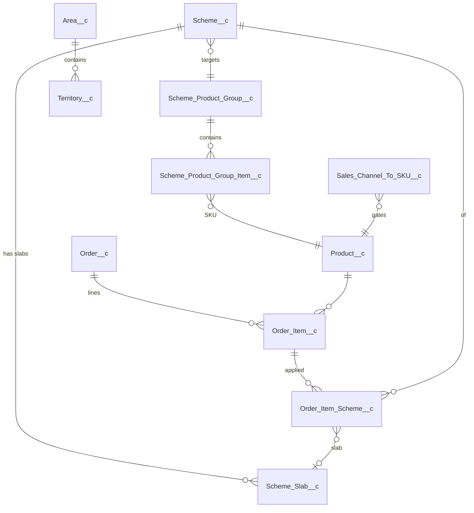
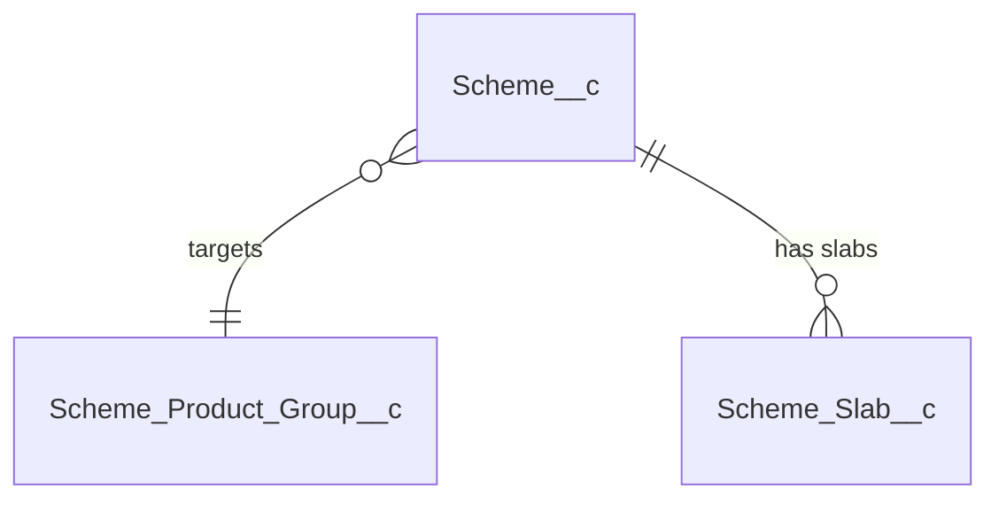

# Scheme Management — Architecture & UI Design

> Status: **DRAFT for Solution Architect review.** No code to be written until sign-off.
> Source BRD: `Scheme Management BRD .docx` + Session 1 (19 May 2026) & Session 2 (21 May 2026) transcripts.
> Sample data: `KA QPS Slab (Overall Order Level and Plum Related Scheme).xlsx`, `KA_Schemes FY26-27.xlsx`, `TN Schemes.xlsx`, `West Q1 Schemss.xlsx`.

---

## Reference — Full ER Diagram

The full data model is shown below. **Section 1** (Scheme Product Group Creation) covers `Scheme_Product_Group__c` and `Scheme_Product_Group_Item__c` (top of the diagram); the remaining objects are covered in Sections 2–8 (still to be restructured — see the placeholder further down).

### ER Diagram



Cascade levels (Region / Area / Territory / Outlet Category) are stored as fields directly on `Scheme__c` (see Section 3) — no separate junction object.

---

## Section 1 — Scheme Product Group Creation

> **New section format (from this iteration onward):** each section presents the new SObject(s) first, then a UI example as structured tables + a numbered interaction list, then a short explanation. The remaining content (legacy §3.4 onward + §4..§12) is still in the prior format and is being re-flowed one per session.

A **Scheme Product Group** is a named bundle of SKUs that one or more schemes can target. It exists so an admin can define a scheme once against many SKUs instead of one scheme per SKU. Groups are created at **Sales Channel** level (FR-005), and the `Group_Purpose__c` picklist controls which validation rules apply.

### 1.1 Object — `Scheme_Product_Group__c` (NEW)

The parent record for the bundle.

| Field | Type | Required | Notes |
|---|---|---|---|
| `Name` | Auto-number `SPG-{0000}` | system | display id |
| `Group_Label__c` | Text(120) | Yes | human label, e.g. "Cake-25g-MRP10" or "Atta-AnyPack" |
| `Sales_Channel__c` | Picklist (mirrors `Product__c.Channel__c`) | Yes | single-channel grouping (FR-005) |
| `Group_Purpose__c` | Picklist | Yes | `Price_Division` / `FOC_Qualifier` / `FOC_Free` |
| `MRP__c` | Currency(10,2) | Conditional | required **only when** `Group_Purpose__c = Price_Division` |
| `Net_Weight__c` | Number(10,2) | Conditional | required **only when** `Group_Purpose__c = Price_Division` (cakes); validates member uniformity |
| `Description__c` | Text Area | No | |
| `Is_Active__c` | Checkbox | No | defaults true |
| `Member_Count__c` | Roll-up COUNT | system | from `Scheme_Product_Group_Item__c` |

**Validation:**
- `Group_Purpose__c = Price_Division` → MRP + Net_Weight mandatory; trigger enforces `All_Members_Same_MRP__c` + `All_Members_Same_NetWeight__c` across child items.
- `Group_Purpose__c = FOC_Qualifier` / `FOC_Free` → MRP / Net_Weight may be null; uniformity check skipped (mixed-MRP / mixed-grammage SKUs allowed).

**Sharing:** Public Read/Write to `Scheme_Admin` permission set; Public Read-Only to all others.
**Volume:** ~500–1,500 groups org-wide. Custom index on `Sales_Channel__c + Group_Purpose__c + Is_Active__c`.

### 1.2 Object — `Scheme_Product_Group_Item__c` (NEW)

Junction between `Scheme_Product_Group__c` and `Product__c` — one row per SKU in the group.

| Field | Type | Required | Notes |
|---|---|---|---|
| `Scheme_Product_Group__c` | Master-Detail → `Scheme_Product_Group__c` | Yes | cascade delete with parent |
| `Product__c` | Lookup → `Product__c` | Yes | the SKU |
| `Unique_Key__c` | Text(80), External ID, Unique | system | formula `Scheme_Product_Group__c + '-' + Product__r.SKU_Code__c` |
| `Is_Active__c` | Checkbox | No | defaults true |

**Master-Detail rationale:** an item record is meaningless without its parent group, and the parent needs a `Member_Count__c` roll-up. Sharing inherits from the parent.
**Validation:** unique (`Scheme_Product_Group__c`, `Product__c`); a Product appears at most once per group.
**Volume:** ~80 items/group × 1,500 groups ≈ 120k rows org-wide.

### 1.3 UI Example — Scheme Group Builder

A single LWC page (`schemeProductGroupBuilder`) the admin lands on from the new **Scheme Product Groups** tab. The page has three areas — a **Header form**, a **Filter pane**, and an **SKU result grid** — followed by the save action. The header `Group Purpose` selection drives the visibility of MRP and Net Weight inputs and the live validation chip.

**Header form fields**

| Field | Widget | Required | Notes |
|---|---|---|---|
| Group Purpose | Radio: `Price_Division` / `FOC_Qualifier` / `FOC_Free` | Yes | drives MRP + Net Weight visibility and the validation chip |
| Group Label | Text input (max 120) | Yes | maps to `Group_Label__c` |
| Sales Channel | Picklist (single-select) | Yes | required first — gates the SKU catalogue |
| MRP | Currency input | Yes when `Price_Division` | hidden in FOC modes |
| Net Weight (g) | Number input | Yes when `Price_Division` (Cake category) | hidden in FOC modes |
| Description | Textarea (multi-line) | No | optional admin note |

**Filter pane** (narrows the SKU catalogue before selection)

| Filter | Widget | Notes |
|---|---|---|
| Category | Picklist | from `Product__c.Product_Category1__c` |
| Product Group | Picklist (dependent on Category) | from `Product__c.Group_Name__c` |
| Sub-group | Picklist | from `Product__c` sub-group field if present |
| Variant | Picklist | from `Product__c.Class__c` / `Flavors__c` |
| Grammage (g) | Picklist | from `Product__c.Net_Weight__c`; **advisory only in FOC modes** |
| MRP | Picklist | from `Product__c.MRP__c`; **advisory only in FOC modes** |

**SKU result grid columns**

| Column | Widget | Notes |
|---|---|---|
| Select | Checkbox | bulk-select via the "Select all filtered" action |
| SKU Code | Text (read-only) | `Product__c.SKU_Code__c` |
| Sku Name | Text (read-only) | `Product__c.Name` |
| Category | Text (read-only) | |
| Group | Text (read-only) | |
| Sub-group | Text (read-only) | |
| Grammage (g) | Number (read-only) | |
| MRP | Currency (read-only) | |

**User actions (in order)**

1. Admin opens the **Scheme Product Groups** tab and clicks **+ New Group**.
2. Admin picks a **Group Purpose**. The form re-renders: `Price_Division` shows MRP + Net Weight as required inputs; `FOC_Qualifier` / `FOC_Free` hide those fields.
3. Admin picks a **Sales Channel**. The SKU result grid loads SKUs gated by `Sales_Channel_To_SKU__c` for that channel.
4. Admin applies one or more **Filters** to narrow the grid (Category, Group, Sub-group, Variant, Grammage, MRP).
5. Admin ticks the SKUs to include — row-by-row, or via **Select all filtered**.
6. **Live validation chip** updates as the selection changes:
   - `Price_Division` mode — chip is **GREEN** when all selected SKUs share the same MRP and Net_Weight; **RED** otherwise with message *"Mixed MRP — group not allowed"*.
   - `FOC_Qualifier` / `FOC_Free` mode — chip is **INFO-GREEN** with message *"Mixed MRP / Weight allowed for FOC"*.
7. Admin clicks **Save as Group**. A modal prompts for the **Group Label**, then the page persists one parent `Scheme_Product_Group__c` plus one `Scheme_Product_Group_Item__c` per selected SKU in a single transaction.
8. On success the page redirects to a read-only view of the new group, showing member count and the actions **Edit (admin only)**, **Clone to new group**, **Deactivate**.

### 1.4 Explanation

The Scheme Product Group is the foundation that lets a single scheme cover many SKUs. The BRD (FR-001..FR-006) requires that a scheme be defined against a *group* of SKUs, not a single SKU, and that the admin be able to filter the catalogue by Category / Group / Sub-group / Variant / Grammage / MRP and "Select all".

Two further requirements drive the `Group_Purpose__c` picklist:

1. **Price-division uniformity (FR-006).** For Basic (X+Y), QPS, Order-Value and Plum schemes, the per-unit price reduction is redistributed across the qualifying quantity using a single MRP. Mixing SKUs of different MRP or grammage would break the redistribution. We enforce this with `Group_Purpose__c = Price_Division` — all members must share MRP + Net_Weight.

2. **FOC qualifying pools may be mixed (BRD Session 2).** The FOC example is *"buy 5 kg of Chakki Atta → get 200 g vermicelli per kg"*. The qualifying SKUs may span Atta 1 kg + 5 kg + 10 kg packs at different MRPs and grammages. We enforce this with `Group_Purpose__c = FOC_Qualifier`, which relaxes the uniformity rule. The *free* products are kept in a separate `FOC_Free` purpose group when there is a choice of giveaways (vermicelli OR oats); for a single-SKU giveaway a direct lookup is used (covered in Section 2 — Scheme Definition).

The group is **always** scoped to one **Sales Channel** (FR-005), so the same SKU may belong to different groups in different channels. A trigger on `Scheme_Product_Group_Item__c` enforces that the same SKU cannot appear in more than one *active* group of the **same** `Group_Purpose__c` within the **same** Sales Channel — preventing ambiguity when a scheme resolves "which group does this order line belong to".

Groups are referenced from `Scheme__c.Scheme_Product_Group__c` (covered in Section 2). Groups are never deleted — only deactivated — so historical orders that referenced a superseded group remain traceable.

---

## Section 2 — Scheme Definition (Master + Slabs)

> **Scope of this document:** the single-type-per-scheme model — one `Scheme__c` carries one `Primary_Scheme_Type__c` (one Basic OR one QPS OR one Order-Value, etc.). A separate document covering the multi-type variant (via an intermediate `Scheme_Item__c`) will be produced later.

A scheme is the master record. One `Scheme__c` has one `Primary_Scheme_Type__c` and one `Scheme_Product_Group__c`. To run Basic + QPS + Plum + Order-Value on the same group, create four parallel `Scheme__c` records — the calc engine applies them concurrently to each order line (see Section 4).

### 2.1 Object — `Scheme__c` (NEW)

| Field | Type | Required | Notes |
|---|---|---|---|
| `Name` | Text(255) | Yes | display name, e.g. "KA Cake QPS Q1 2026" |
| `Description__c` | Long Text | No | |
| `Sales_Channel__c` | Picklist | Yes | must match `Scheme_Product_Group__c.Sales_Channel__c` |
| `Scheme_Start_Date__c` | Date | Yes | |
| `Scheme_End_Date__c` | Date | Yes | only field admins can edit once `Is_Locked__c = true` (extend-only) |
| `IsActive__c` | Checkbox | No | toggled via the lifecycle flow |
| `Deactivation_Reason__c` | Text Area | No | required when `IsActive__c` flips true → false; captured by Field-Level History |
| `Primary_Scheme_Type__c` | Picklist (`Basic` / `QPS` / `FOC_Giveaway` / `Order_Value` / `Category_Value`) | Yes | drives the slab editor + calc engine |
| `Scheme_Product_Group__c` | Lookup → `Scheme_Product_Group__c` | Yes | the SKU bundle. For FOC, `Group_Purpose__c` must be `FOC_Qualifier`; for all other types, `Price_Division` |
| `Is_Locked__c` | Checkbox | system | flipped true on activation; blocks edits except `Scheme_End_Date__c` (extend), `IsActive__c`, and `Deactivation_Reason__c` |
| `Slab_Count__c` | Roll-up COUNT from `Scheme_Slab__c` | system | shown on list views |
| `Credit_Percentage__c` | Number | No | used by claim-credit posting |
| `Scheme_Eligibility_Percentage__c` | Number | No | used by claim-credit posting |
| **Cascade fields (8)** — full detail in Section 3 | — | — | 4 `Apply_to_All_*__c` checkboxes + 4 multi-select Long Text fields covering Region / Area / Territory / Outlet Category. **No separate `Scheme_Applicability__c` object** — cascade lives directly on `Scheme__c` |
| `Applicability_Summary__c` | Long Text(2000) | system | populated by after-save trigger when any cascade field changes; e.g. "Regions: KA, TN \| Areas: 5 \| Territories: All \| Outlet: GT" |

**Validation:**
- `Primary_Scheme_Type__c = FOC_Giveaway` → linked group's `Group_Purpose__c` must be `FOC_Qualifier`.
- All other `Primary_Scheme_Type__c` values → linked group's `Group_Purpose__c` must be `Price_Division`.
- `Scheme_End_Date__c >= Scheme_Start_Date__c`.
- When `Is_Locked__c = true`: only `Scheme_End_Date__c` (new ≥ old), `IsActive__c`, and `Deactivation_Reason__c` may change.
- Activation rejected unless ≥ 1 child `Scheme_Slab__c` exists and the cascade (Section 3) is configured at every level (Apply-All or specific list).

**Sharing:** Public Read-Only; writes gated by `Scheme_Admin` permission set.
**Audit:** Salesforce **Field-Level History** is enabled on `Scheme_End_Date__c`, `IsActive__c`, `Deactivation_Reason__c`, `Is_Locked__c`, `Primary_Scheme_Type__c`, and the cascade fields. No separate audit object — FLH provides the trail.
**Volume:** ~3,000 schemes/year. Indexes on `Sales_Channel__c + IsActive__c` and `Scheme_End_Date__c`.

#### ER fragment



### 2.2 Object — `Scheme_Slab__c` (NEW)

The child object that holds every offer rule. A `Slab_Type__c` discriminates which subset of fields is used.

| Field | Type | Required | Notes |
|---|---|---|---|
| `Scheme__c` | Master-Detail → `Scheme__c` | Yes | cascade delete with parent |
| `Slab_Sequence__c` | Number(2,0) | Yes | stable display order; 1, 2, 3, … |
| `Slab_Type__c` | Picklist (`Basic` / `QPS` / `FOC_Giveaway` / `Order_Value` / `Category_Value`) | Yes | must match parent's `Primary_Scheme_Type__c` |
| `Qualifying_Qty_Min__c` | Number(8,0) | Conditional | min trigger qty in EA. Basic: the X (e.g. 11). QPS: the slab threshold (entered as cases in the UI; engine converts cases × `Product__c.Units_Per_Case__c` → EA at evaluation). FOC: minimum-to-qualify |
| `Qualifying_Qty_Max__c` | Number(8,0) | Conditional | inclusive upper for quantity-band Basic. Null = unbounded |
| `Qualifying_Value_Min__c` | Currency(12,2) | Conditional | slab lower bound on GSV (Order-Value) or category GSV (Category-Value) |
| `Qualifying_Value_Max__c` | Currency(12,2) | Conditional | inclusive upper; null = unbounded (top slab) |
| `Free_Qty__c` | Number(6,0) | Conditional | Y for Basic. For FOC, fixed free qty when `FOC_Ratio_Per_Qualifying_Unit__c = 1` |
| `Benefit_Per_Case__c` | Currency(8,2) | Conditional | per-case ₹ payout (QPS). Data-entry stays per-case; engine converts to per-EA at evaluation using `Product__c.Units_Per_Case__c` (default 1) — see §2.4 |
| `Benefit_Percent__c` | Percent(5,2) | Conditional | discount % for Order-Value / Category-Value |
| `FOC_Product__c` | Lookup → `Product__c` | Conditional | single fixed free SKU (simple FOC case) |
| `FOC_Product_Group__c` | Lookup → `Scheme_Product_Group__c` (`Group_Purpose__c = FOC_Free` only) | Conditional | pool of choosable free SKUs — "vermicelli OR oats" |
| `FOC_Ratio_Per_Qualifying_Unit__c` | Number(6,3) | Conditional | per-qualifying-unit multiplier — e.g. `0.200` = 200 g free per 1 kg bought. Default `1.000` |
| `Category__c` | Lookup → `Sales_Product_Category__c` | Conditional | required when `Slab_Type__c = Category_Value` |
| `Slab_Label__c` | Formula(text) | system | human label, e.g. "Basic · 11+1 (cycle)", "Basic · 11–20 → 1 free", "QPS-2 · 5 cases · ₹120/cs" |
| `Is_Active__c` | Checkbox | No | defaults true |

**Field usage by `Slab_Type__c`:**

| Slab_Type | Qty_Min | Qty_Max | Value_Min / Max | Free_Qty | Benefit_Per_Case | Benefit_Percent | FOC fields | Category | # slabs |
|---|---|---|---|---|---|---|---|---|---|
| `Basic` (cycle mode) | **Yes (X)** | — (null) | — | **Yes (Y)** | — | — | — | — | exactly 1 |
| `Basic` (band mode) | **Yes** | **Yes** (top may be null) | — | **Yes** (flat Y per band) | — | — | — | — | 1..N (non-overlapping bands) |
| `QPS` | **Yes** (threshold, cases) | — | — | — | **Yes** (per case → EA at eval) | — | — | — | 1..N (mutually exclusive thresholds) |
| `FOC_Giveaway` | **Yes** (min trigger) | — | — | optional (if ratio = 1) | — | — | **Yes** (Product OR Group + Ratio) | — | exactly 1 |
| `Order_Value` | — | — | **Yes** | — | — | **Yes** | — | — | 1..N (non-overlapping ranges) |
| `Category_Value` | — | — | **Yes** | — | — | **Yes** | — | **Yes** | 1..N per category |

#### Basic slab — two modes (engine auto-detects from data)

- **Cycle mode** — exactly 1 Basic slab with `Qualifying_Qty_Max__c` null. Classic X+Y repeating (FR-010). For qty Q: free count = `FLOOR(Q / X) × Y`. Any remainder gets no Basic benefit.
- **Band mode** — 1..N Basic slabs with `Qualifying_Qty_Min__c` and `Qualifying_Qty_Max__c` defining non-overlapping bands. For qty Q the engine picks the single band where Min ≤ Q ≤ Max (or Min ≤ Q if Max null) and gives that band's `Free_Qty__c` as a one-shot. Example: `11–20 → 1 free`, `21–50 → 2 free`, `51+ → 5 free` (top Max null).

#### Validation

- `Slab_Type__c` must match parent `Scheme__c.Primary_Scheme_Type__c`.
- `Slab_Sequence__c` unique per parent.
- Basic in cycle mode → exactly 1 slab with Max null on activation.
- Basic in band mode → all slabs have Min and Max populated (only the top slab may have Max null); bands must not overlap.
- QPS → thresholds unique within parent.
- Order-Value / Category-Value → value ranges must not overlap.
- FOC slab → exactly one of `FOC_Product__c` or `FOC_Product_Group__c` populated; when group is set, its `Group_Purpose__c` must be `FOC_Free`.
- Category_Value slab → `Category__c` mandatory.
- Once parent `Is_Locked__c = true`, no insert / update / delete of `Scheme_Slab__c` rows.

**Sharing:** Controlled by parent.
**Volume:** ~15,000 slab rows per year (avg ~5 per scheme).

### 2.3 UI Example — Scheme Definition Wizard

A multi-step LWC wizard (`schemeDefinitionWizard`) launched from the **Schemes** tab. Steps:

| Step | Owner section | Content |
|---|---|---|
| 1 — Master fields | §2.3 (this section) | Name, Primary Scheme Type, Sales Channel, dates, description |
| 2 — Link Product Group | Section 1 + §2.3 | reuses Section 1's group picker, filtered by `Group_Purpose__c` matching scheme type |
| 3 — Slabs | §2.3 (this section) | type-driven slab editor (five column variants) |
| 4 — Applicability Cascade | Section 3 | the 4-level cascade picker |
| 5 — Review + Activate | Section 6 (Lifecycle, pending) | conflict check + Activate button |

#### Step 1 — Master fields

| Field | Widget | Required | Notes |
|---|---|---|---|
| Scheme Name | Text input (max 255) | Yes | `Scheme__c.Name` |
| Primary Scheme Type | Radio: `Basic` / `QPS` / `FOC Giveaway` / `Order Value` / `Category Value` | Yes | drives Step 3 slab editor + Step 2 group filter |
| Sales Channel | Picklist | Yes | must match Product Group's channel |
| Start Date / End Date | Date pickers | Yes | End ≥ Start |
| Description | Textarea | No | |

#### Step 3 — Slabs editor

Five column-variant tables depending on `Primary_Scheme_Type__c`:

**Basic — cycle mode** (1 row)

| Column | Widget | Required | Maps to |
|---|---|---|---|
| Buy Qty (X) | Number input | Yes | `Qualifying_Qty_Min__c` |
| Max Qty | Number input (blank = cycle) | No | `Qualifying_Qty_Max__c` |
| Free Qty (Y) | Number input | Yes | `Free_Qty__c` |

> Example: Buy=11, Max=blank, Free=1 → "Repeats every 11+1".

**Basic — band mode** (multi-row)

> Example: `11–20 → 1 free`, `21–50 → 2 free`, `51+ → 5 free`.

**QPS**

| Column | Widget | Required | Maps to |
|---|---|---|---|
| Slab # | Auto | system | `Slab_Sequence__c` |
| Qualifying Cases | Number input | Yes | `Qualifying_Qty_Min__c` (cases; engine → EA at eval) |
| Benefit ₹/Case | Currency input | Yes | `Benefit_Per_Case__c` (per case; engine → per-EA at eval) |

> Example: `3 cases → ₹40/case`, `5 cases → ₹80/case`.

**FOC Giveaway** (1 row)

| Column | Widget | Required | Maps to |
|---|---|---|---|
| Min Qualifying Qty | Number input | Yes | `Qualifying_Qty_Min__c` |
| Free Product Source | Radio: `Single SKU` / `Choose from Group` | Yes | drives which lookup |
| FOC Product (Single SKU) | Lookup → `Product__c` | Yes (Single SKU) | `FOC_Product__c` |
| FOC Product Group | Lookup → `Scheme_Product_Group__c` (`FOC_Free`) | Yes (Pool) | `FOC_Product_Group__c` |
| Free Qty / Ratio | Number input | Yes | `Free_Qty__c` or `FOC_Ratio_Per_Qualifying_Unit__c` |

> Example (Atta): Min = 1000 g, Source = Single SKU = Vermicelli 200 g, Ratio = 0.200.

**Order Value**

| Column | Widget | Required | Maps to |
|---|---|---|---|
| Slab From (₹) | Currency input | Yes | `Qualifying_Value_Min__c` |
| Slab To (₹) | Currency input (blank = unbounded) | No | `Qualifying_Value_Max__c` |
| Discount % | Percent input | Yes | `Benefit_Percent__c` |

> Example: `5,000–20,000 → 5%`, …, `50,001+ → 11%`.

**Category Value (Plum)**

| Column | Widget | Required | Maps to |
|---|---|---|---|
| Category | Lookup → `Sales_Product_Category__c` | Yes | `Category__c` |
| Slab From (₹) | Currency input | Yes | `Qualifying_Value_Min__c` |
| Slab To (₹) | Currency input (blank = unbounded) | No | `Qualifying_Value_Max__c` |
| Discount % | Percent input | Yes | `Benefit_Percent__c` |

> Example: Cake — `50k–100k → 1%`, …, `200k+ → 2.5%`.

#### User actions (in order)

1. Admin clicks **+ New Scheme**.
2. Step 1: Name, type, channel, dates → Next.
3. Step 2: pick / create Product Group → Next.
4. Step 3: type-driven slab editor — add row(s) → Next.
5. Step 4: Applicability cascade (Section 3) → Next.
6. Step 5: Review + Activate (Section 6, pending).

### 2.4 Explanation

**FOC stays on `Scheme_Slab__c`.** A single child object with a `Slab_Type__c` discriminator keeps the calc engine, validation rules, UI, and read paths uniform across all five scheme types. The cost is a handful of conditional fields that only some types populate.

**`Benefit_Per_Case__c` → per-EA conversion (FR-013).** Business enters QPS payout as "₹X per case" because that's how schemes are negotiated; secondary billing is always in EA. The engine converts at evaluation time: `benefit_per_EA = Benefit_Per_Case__c / Product__c.Units_Per_Case__c` (defaulting `Units_Per_Case__c` to 1). The slab record stays in the business-friendly per-case form for reporting and audit.

**Basic in two modes.** FR-010 shows X+Y as the canonical Basic shape, and real operations also need flat quantity-band Basic ("buy 11–20 → 1 free, 21–50 → 2 free, 51+ → 5 free"). Both fit on `Scheme_Slab__c`: cycle mode is one slab with Max null; band mode is multiple slabs with Min + Max. The engine picks the mode from the data — no separate flag.

**Audit via Field-Level History (FLH), not a separate object.** Activate / Deactivate / Extend End Date / Clone are all captured naturally — Activate toggles `IsActive__c` and `Is_Locked__c`; Deactivate sets `IsActive__c = false` and requires `Deactivation_Reason__c`; Extend updates `Scheme_End_Date__c`; Clone creates a new `Scheme__c` (the relationship is implicit from the cloned record). FLH on the five Scheme__c fields above plus the cascade fields covers the trail.

---

## Section 3 — Applicability Cascade

A scheme targets a cross-product of four selectable cascade levels (after Sales Channel, which is already on `Scheme__c.Sales_Channel__c` from Section 2):

```
Sales Channel (on Scheme__c · Section 2)
  └─ Region          (multi-select, picklist values from Area__c.Region__c)
       └─ Area       (multi-select, filtered by selected Regions)
            └─ Territory   (multi-select, filtered by selected Areas)
                 └─ Outlet Category (multi-select, filtered by Sales Channel)
```

Each level supports an **"Apply to all"** flag. When the flag is true the level matches every value under it. All cascade selections are stored as **fields directly on `Scheme__c`** — no separate `Scheme_Applicability__c` junction object.

**Distributor is intentionally not a cascade level.** The org has ~20,000 customer (Distributor) Account records. Storing per-scheme distributor lists multiplies storage and breaks the "scheme applies broadly" mental model. The four-level cascade narrows to the right population; if a scheme genuinely needs to be limited to one named distributor, model it as a narrower Outlet Category.

### 3.1 Object — `Scheme__c` cascade fields (NEW, on the master)

Added to the `Scheme__c` field table from §2.1. Eight fields total — one Checkbox + one Long Text per cascade level.

| Field | Type | Required | Notes |
|---|---|---|---|
| `Apply_to_All_Regions__c` | Checkbox | No | when true, scheme matches every Region; `Regions__c` is ignored |
| `Regions__c` | Long Text(2000) | Conditional | semicolon-separated Region picklist values (e.g. `Karnataka;Tamil Nadu`); required when `Apply_to_All_Regions__c` is false |
| `Apply_to_All_Areas__c` | Checkbox | No | when true, all Areas under selected Regions match |
| `Areas__c` | Long Text(8000) | Conditional | semicolon-separated `Area__c` Ids; required when `Apply_to_All_Areas__c` is false |
| `Apply_to_All_Territories__c` | Checkbox | No | when true, all Territories under selected Areas match |
| `Territories__c` | Long Text(8000) | Conditional | semicolon-separated `Territory__c` Ids; required when `Apply_to_All_Territories__c` is false |
| `Apply_to_All_Outlet_Categories__c` | Checkbox | No | when true, all outlet categories valid for the Channel match |
| `Outlet_Categories__c` | Long Text(2000) | Conditional | semicolon-separated `Selling_Category__c` Ids; required when `Apply_to_All_Outlet_Categories__c` is false |

**Validation:**
- For each of the four levels, if `Apply_to_All_X__c = false` then the corresponding list field must be non-empty.
- Cross-level integrity check at save: selected Areas must belong to the selected Regions; selected Territories must belong to the selected Areas. (`Apply_to_All` at a parent level satisfies the integrity for children below it.)
- Activation rejected unless every level has either `Apply_to_All_X__c = true` OR a non-empty list.

**Why Long Text rather than multi-select picklist:** Areas / Territories / Outlet Categories are records, not picklist values. Salesforce multi-select picklists cap at 1000 values and don't track FK integrity to records anyway. A Long Text storing semicolon-separated Ids, paired with the LWC selector in §3.3, is the simplest pattern that scales (the selector re-validates Ids on save; the engine silently drops orphaned Ids at evaluation time, so a deleted Area causes the scheme to stop applying rather than crash).

### 3.2 Object — `Territory__c` (NEW)

A new custom object subordinate to `Area__c`. Each Territory belongs to one Area; admins maintain Territory records as master data.

| Field | Type | Required | Notes |
|---|---|---|---|
| `Name` | Auto-number `TRY-{0000}` | system | display id |
| `Territory_Name__c` | Text(120) | Yes | human label, e.g. "Bangalore Urban North" |
| `Area__c` | Master-Detail → `Area__c` | Yes | parent area |
| `Is_Active__c` | Checkbox | No | defaults true |

**Master-Detail rationale:** territories belong to an area; cascade delete is acceptable; sharing follows parent.
**Volume:** ~3–10 territories per Area; org-wide estimate < 1,000 records.

### 3.3 UI Example — Cascade Picker (Wizard Step 4)

Step 4 of the Scheme Definition Wizard renders four cascade rows. Each row drives the next: picking Regions filters the Area selector; picking Areas filters the Territory selector. Outlet Category is filtered only by the scheme's Sales Channel.

**Cascade row fields (one row per level)**

| Level | Apply-All widget | Specific-values widget | Backed by |
|---|---|---|---|
| Region | Checkbox | Multi-select picklist (values from `Area__c.Region__c` picklist) | `Apply_to_All_Regions__c` + `Regions__c` |
| Area | Checkbox | Multi-select chip selector (LWC; options filtered to Areas whose Region ∈ selected Regions) | `Apply_to_All_Areas__c` + `Areas__c` |
| Territory | Checkbox | Multi-select chip selector (LWC; options filtered to Territories whose Area ∈ selected Areas) | `Apply_to_All_Territories__c` + `Territories__c` |
| Outlet Category | Checkbox | Multi-select chip selector (LWC; options filtered to `Selling_Category__c` rows for the scheme's Channel) | `Apply_to_All_Outlet_Categories__c` + `Outlet_Categories__c` |

**User actions (in order)**

1. Sales Channel is already picked in Step 1 (Section 2) and shown read-only at the top of Step 4.
2. Admin picks **Regions** — either ticks "Apply to All" or selects one or more values.
3. **Area** selector enables once Regions are set, with options filtered. Admin ticks "Apply to All" or selects.
4. **Territory** selector enables once Areas are set, with options filtered. Admin ticks "Apply to All" or selects.
5. **Outlet Category** selector is independent of the geographic levels but constrained to the Channel's valid categories. Admin ticks "Apply to All" or selects.
6. **Applicability summary preview** updates live below the picker (e.g. "Channel: GT · Regions: KA, TN · Areas: 5 · Territories: All · Outlet: GT, Club").
7. On Save the validation rule ensures each level has either `Apply_to_All_X__c = true` or ≥ 1 specific value.

### 3.4 Explanation

**Cascade lives on `Scheme__c`, not in a junction.** Eight fields on the master vs. ~12 child records per scheme. The trade-off:
- ✅ Flat data model — no second-level query at evaluation time.
- ✅ Single-record validation; cascade integrity is one Apex trigger on `Scheme__c`.
- ✅ Field-Level History on the cascade fields gives the audit trail for free.
- ❌ No referential integrity on Area / Territory / Outlet Category Ids (mitigated by LWC re-validation on save and benign orphan-Id behaviour at evaluation time).

**Cascade resolution at order-capture time.** For each order line, the calc engine reads the order's Channel, the Distributor's Area and Territory (from `Account` standard fields), and the customer's Outlet Category. It then matches each scheme's cascade fields:
- Region: matches if `Apply_to_All_Regions__c` is true, **or** Distributor's Area's Region ∈ `Regions__c`.
- Area: matches if `Apply_to_All_Areas__c` is true, **or** Distributor's Area Id ∈ `Areas__c`.
- Territory: matches if `Apply_to_All_Territories__c` is true, **or** Distributor's Territory Id ∈ `Territories__c`.
- Outlet Category: matches if `Apply_to_All_Outlet_Categories__c` is true, **or** customer's Outlet Category Id ∈ `Outlet_Categories__c`.

A scheme is eligible only when **all four levels match** (AND of cascade levels). The (Channel, Region, Area, Territory, Outlet Category) tuple is cached for repeated orders (Scalability, pending).

---

## Section 4 — Multi-Scheme Calculation Logic on a Line

When several schemes target the same order line (Basic + QPS + Plum Category + Order-Value), they apply **sequentially in a fixed order**. Each step modifies the line's effective unit price (or adds an order-level allocation), and each step writes its own `Order_Item_Scheme__c` row on the line so the trail is recoverable later.

### 4.1 Application order

| # | Stage | Computed on | Result lands as |
|---|---|---|---|
| 1 | **Basic** (X+Y or band) | Gross MRP per EA | New per-EA unit price on the line |
| 2 | **QPS** | **Basic-adjusted** unit price (FR-014) | Subtract per-EA benefit from the Basic-adjusted unit price |
| 3 | **FOC Giveaway** | Qualifying line quantity | A new synthetic `Order_Item__c` row at ₹0.01 (the qualifying line itself is untouched) |
| 4 | **Category-Value (Plum)** | **Gross GSV** for that category (FR-042) | % discount allocated per line proportionally to each qualifying line's gross GSV share |
| 5 | **Order-Value** | **Gross GSV** for the whole order (FR-042) | % discount allocated per line proportionally to each line's gross GSV share |

**Rules:**
- Steps 1 and 2 are **line-local** — each writes one `Order_Item_Scheme__c` row on the line.
- Step 3 (FOC) adds a new `Order_Item__c` at ₹0.01 with its own `Order_Item_Scheme__c` link.
- Steps 4 and 5 are **header-driven but persisted per line** — the engine allocates the % discount across qualifying lines proportionally to their gross GSV share. Each line gets one `Order_Item_Scheme__c` row per applicable header scheme. **No separate `Order_Scheme__c` object is needed** — the header-level totals are recovered by aggregating `Order_Item_Scheme__c` rows on the order (UI summary roll-up by `Scheme__c`).
- **QPS is computed on the Basic-adjusted unit price** (FR-014). Plum and Order-Value are computed on **gross GSV** (FR-042), independent of any line-level discount.

### 4.2 Worked example — line ₹10 → ₹8 → ₹7 → ₹6.90 → ₹6.70

**Setup**

- Line: SKU `EL-00121` (Marble Cake, Cake category), MRP = ₹10, ordered Qty = 36 EA, `Units_Per_Case` = 12.
- Scheme stack (all eligible after cascade resolution):
  - **Scheme A — Basic 4+1.** One Basic slab: `Qualifying_Qty_Min = 4`, `Free_Qty = 1`, `Qualifying_Qty_Max = null` (cycle mode).
  - **Scheme B — QPS.** Two slabs: `3 cases → ₹12/case`, `5 cases → ₹30/case`. Line is 36 EA = exactly 3 cases → matches the 3-case slab.
  - **Scheme C — Plum Cake 1%.** Slab: `0–unbounded → 1%`. For this example, assume the order's Cake-category gross GSV = ₹3,600 (this single line is the whole Cake total).
  - **Scheme D — Order-Value 2%.** Slab: `₹3,000+ → 2%`. Order grand gross GSV = ₹3,600.

**Walk-through**

| Step | Operation | Numbers | Effective unit price |
|---|---|---|---|
| 0 | Gross at MRP | `10.00` | **₹10.00** |
| 1 | Basic 4+1 (cycle): `MRP × X / (X+Y)` = `10 × 4 / 5` | `= 8.00` | **₹8.00** |
| 2 | QPS 3-case slab: `Benefit_Per_Case / Units_Per_Case` = `12 / 12` per EA, subtracted from Basic-adjusted | `8.00 − 1.00` | **₹7.00** |
| 3 | (no FOC giveaway in this example) | — | ₹7.00 |
| 4 | Plum Cake 1%: total Plum discount = `0.01 × 3,600 = ₹36`. This line's share = `(₹360 / ₹3,600) × ₹36 = ₹3.60`. Per-EA = `3.60 / 36 = ₹0.10` | `7.00 − 0.10` | **₹6.90** |
| 5 | Order-Value 2%: total Order-Value discount = `0.02 × 3,600 = ₹72`. This line's share = `(₹360 / ₹3,600) × ₹72 = ₹7.20`. Per-EA = `7.20 / 36 = ₹0.20` | `6.90 − 0.20` | **₹6.70** |

**Final per-EA price = ₹6.70.** Line value = `6.70 × 36 = ₹241.20`. Total line benefit = `(10 − 6.70) × 36 = ₹118.80`, broken down as Basic ₹72.00 + QPS ₹36.00 + Plum ₹3.60 + Order-Value ₹7.20 = ₹118.80 ✓.

### 4.3 Persistence — `Order_Item_Scheme__c` rows written

Four `Order_Item_Scheme__c` rows are written for this line — one per applied scheme:

| # | Scheme | Slab | Per-Unit Benefit | Line Benefit |
|---|---|---|---|---|
| 1 | A · Basic 4+1 | the Basic slab | ₹2.00 | ₹72.00 |
| 2 | B · QPS | the 3-case slab | ₹1.00 | ₹36.00 |
| 3 | C · Plum Cake | the 0–∞ Cake slab | ₹0.10 | ₹3.60 |
| 4 | D · Order-Value | the ₹3,000+ slab | ₹0.20 | ₹7.20 |

The Order header's total scheme benefit is then a roll-up SUM of `Order_Item_Scheme__c.Benefit_Amount__c` across all lines, and the per-scheme header totals (e.g. "Order-Value discount on this order = ₹72") are recovered by aggregating those rows by `Scheme__c`.

### 4.4 Edge cases

- **No QPS qualification.** Line qty < smallest QPS slab threshold → no QPS row is written; Plum and Order-Value still apply on gross.
- **QPS slab decomposition (multi-lot, FR-015).** A line of 8 cases against slabs `3 / 5 / 10` → engine writes **two** QPS rows: one for the 5-case lot, one for the 3-case lot. The 0-case remainder gets no QPS.
- **Order-Value applies to every line.** Each line in the order receives its proportional share of the Order-Value discount, regardless of whether it's in a Basic / QPS / Plum scheme.
- **Plum applies only to lines in the configured category.** Lines outside that category get no Plum row.
- **FOC giveaway never reduces the qualifying line's price.** The free product is a separate synthetic `Order_Item__c` at ₹0.01 with its own `Order_Item_Scheme__c` link; the qualifying line keeps its full Basic+QPS+Plum+Order-Value treatment.
- **Concurrent QPS schemes targeting the same SKU.** Disallowed by activation-time validation (one active QPS per SKU per Channel × Area × Outlet Category combination). Two competing QPS schemes never reach the engine simultaneously.

---

## Sections to be restructured in next iterations

> The content from here onward is from the prior draft. Sections 1–4 above are now in the new section-by-section format. **Up next:** **Section 5 — Order Capture & Application** will pull from §3.6 `Order_Item_Scheme__c` and §6.e / §6.f UI panels; it will detail trigger handlers, persistence and the Order header summary roll-ups.
>
> **Planned order:**
> - Section 5 — Order Capture & Application — from §3.6, §6.e, §6.f ← next
> - Section 6 — Lifecycle (Activate / Extend / Deactivate / Clone) — from §5, §6.d, §6.g
> - Section 7 — Calc Engine internals — from §4
> - Section 8 — Reporting & Claim Posting — from §7
> - Section 9 — Scalability / Security — from §8, §9
>
> The Migration Plan (§10) is dropped — this is a new implementation, no backfill is required.

### Legacy §3.4 `Scheme_Slab__c` (NEW)

*Moved to **Section 2.2** above.*

### Legacy §3.5 `Scheme_Applicability__c` — **superseded**

*The separate cascade junction object is **not used**. Cascade selections live directly on `Scheme__c` (8 fields covering Region / Area / Territory / Outlet Category, each with an Apply-All checkbox). See **Section 3.1** above. Distributor is intentionally not a cascade level (20,000 customers — not feasible to store per-scheme).*

### 3.6 `Order_Item_Scheme__c` (NEW)

Junction for concurrent schemes per line (FR-022, FR-060). The single junction that records **every** applied scheme — line-local (Basic, QPS, FOC) and header-allocated (Plum, Order-Value).

| Field | Type | Notes |
|---|---|---|
| NEW: `Order_Item__c` | Master-Detail | cascade with line |
| NEW: `Scheme__c` | Lookup | source scheme |
| NEW: `Scheme_Slab__c` | Lookup | which slab fired |
| NEW: `Sequence__c` | Number(2,0) | 1=Basic, 2=QPS, 3=Plum, 4=Order-Value, 5=FOC link |
| NEW: `Scheme_Snapshot_Type__c` | Text(40) | hardcopy of slab type at order time |
| NEW: `Benefit_Amount__c` | Currency(10,2) | total ₹ benefit on this line from this scheme |
| NEW: `Per_Unit_Discount__c` | Currency(8,4) | redistributed per-unit reduction |
| NEW: `Free_Qty__c` | Number(6,0) | Y (Basic) or FOC qty |
| NEW: `Qualifying_Qty__c` | Number(8,0) | portion of line qty consumed |
| NEW: `Notes__c` | Long Text(2000) | calc trail |

- **Validation:** unique (`Order_Item__c`, `Scheme__c`, `Scheme_Slab__c`).
- **Header-scheme allocation:** Plum and Order-Value are persisted per line with `Per_Unit_Discount__c` and `Benefit_Amount__c` computed by the engine's proportional-allocation logic (see Section 4.1 step 4-5).
- **Volume:** 3–5× `Order_Item__c` → 18-month archival to `Order_Item_Scheme_Archive__b` (Scalability section, pending).

### Legacy §3.7 `Order_Scheme__c` — **superseded**

*The separate order-header junction object is **not used**. Header-level schemes (Order-Value, Plum) are persisted as `Order_Item_Scheme__c` rows on each qualifying line, with `Benefit_Amount__c` allocated proportionally to the line's gross GSV share. The order-header summary panel is a roll-up SUM of `Order_Item_Scheme__c` rows grouped by `Scheme__c`. See **Section 4** above.*

### Legacy §3.8 `Scheme_Audit__c` — **superseded**

*No separate audit object. Salesforce **Field-Level History** on `Scheme__c.IsActive__c`, `Deactivation_Reason__c`, `Scheme_End_Date__c`, `Is_Locked__c`, `Primary_Scheme_Type__c` and the cascade fields gives the activate / extend / deactivate / clone trail. Clone-to-New is implicit from the new `Scheme__c` record itself. See **Section 2.4** above.*

### 3.9 New fields on existing Order objects (cross-reference)

*The Order-side additions below will be fully described in **Section 5 — Order Capture & Application** in the next iteration; kept here for quick reference.*

| Object | New field | Notes |
|---|---|---|
| `Order_Item__c` | `Total_Scheme_Benefit__c` (Roll-up SUM from `Order_Item_Scheme__c`) | drives the per-line discount display |
| `Order__c` | `Line_Scheme_Benefit_Total__c` (Roll-up SUM via `Order_Item__c`) | full order benefit (includes Plum + Order-Value allocations) — Section 4 |
| `Order__c` | `Scheme_Eval_Status__c` (Picklist: Pending / Computed / Stale / Computing / Error) | drives async re-evaluation |
| `Order__c` | `Scheme_Eval_Timestamp__c` (DateTime) | last successful eval |

---

## 4. Scheme Calculation Engine

### 4.1 `SchemeEvaluationService` (NEW — signatures only)

```apex
public with sharing class SchemeEvaluationService {
    public static SchemeApplicationResult evaluateOrder(Order__c hdr, List<Order_Item__c> lines);
    public static SchemeApplicationResult previewOrder(Order__c hdr, List<Order_Item__c> lines); // no DML
    public static List<Scheme__c> resolveApplicableSchemes(
        Id distributorId, Id areaId, String channel, Id outletCategoryId, Set<Id> productIds);
    @future(callout=false) public static void evaluateOrderAsync(Id orderId);
}

public class SchemeApplicationResult {
    public List<Order_Item_Scheme__c> lineApplications;
    public List<Order_Scheme__c>      headerApplications;
    public Map<Id, Decimal>           perLineRedistributedPrice;
    public List<String>               warnings;
}
```

### 4.2 Pipeline (deterministic order)

| # | Step | Reads | Writes |
|---|---|---|---|
| 1 | **Cascade match** — candidate `Scheme__c` per line via cache | Scheme_Applicability__c, Scheme_Product_Group__c, Scheme_Product_Group_Item__c, Sales_Channel_To_SKU__c | — |
| 2 | **Prune by SKU gating** | — | — |
| 3 | **Apply Basic (X+Y):** `price_after = MRP × X ÷ (X+Y)` | Scheme_Slab__c (Basic) | staged line app |
| 4 | **QPS decomposition (FR-015):** greedy DESC over slabs, e.g. 8 → 5+3; remainder no QPS | Scheme_Slab__c (QPS) | staged line app |
| 5 | **FOC giveaway** — for each line whose SKU is in the qualifying group, compute `free_qty = ROUND(line_qty × FOC_Ratio_Per_Qualifying_Unit__c, 0)` (or `Free_Qty__c` flat if ratio = 1) for the chosen `FOC_Product__c` / first active member of `FOC_Product_Group__c`; append synthetic `Order_Item__c` line at ₹0.01 (FR-017) | Scheme_Slab__c (FOC), Scheme_Product_Group__c (FOC_Free pool) | new line + junction |
| 6 | **Order-Value header slab on total GSV** | Scheme_Slab__c (Order_Value) | staged header app |
| 7 | **Category Plum:** group GSV by category, slab per category | Scheme_Slab__c (Category_Value) | staged header app |
| 8 | **Persist:** delete-and-reinsert in one txn; stamp `Scheme_Eval_Status__c=Computed` | — | DML |

Mutual exclusion (FR-022 / FR-034) enforced at scheme activation, not in evaluation.

### 4.3 Triggers & Async

- Extend `OrderItemTriggerHandler` → mark `Scheme_Eval_Status__c=Stale`, enqueue `SchemeEvaluationQueueable`.
- New LWC `orderCaptureScheme` calls `previewOrder` synchronously during edit (no DML).
- `SchemeEvaluationBatch` for back-dated re-evaluation after end-date extend.

### 4.4 Governor-Limit / Bulk Safety

- Bulkified SOQL; one query per object per evaluation.
- Platform Cache org partition `SchemeCascadeCache` (5 MB, TTL 30 min), invalidated on Scheme save/activate.
- Orders > 100 lines routed to Queueable.
- `Sales_Channel_To_SKU__c` pre-fetched once per order.

### 4.5 Existing Apex / LWC Interaction

- `SchemeLwc.cls` — extend with read-only adapters exposing `Scheme_Slab__c` alongside `Buy_Product__c`.
- `RunningSchemeController.cls` — extend `getRunningSchemes()` to UNION via cascade match.
- `schemeDataPage` LWC — add child `appliedSchemeIndicator` LWC.
- Aura `CreateEditScheme` — wrap inside new wizard, keep available as legacy quick-edit.

---

## 5. Lifecycle & Validation Rules

| Rule | Object | Condition (high level) | Enforcement |
|---|---|---|---|
| Admin-only DML | Scheme family | `!$Permission.Scheme_Admin` | VR + trigger guard |
| No delete | Scheme__c | always | `Before Delete` trigger throws |
| Immutability once live | Scheme__c | `ISCHANGED(field) && Is_Locked__c && field NOT IN {Scheme_End_Date__c, IsActive__c}` | VR |
| End-date extend only | Scheme__c | new end < old end | VR |
| Slabs frozen once live | Scheme_Slab__c | parent locked + change | VR + trigger |
| Applicability frozen once live | Scheme_Applicability__c | same | VR + trigger |
| Group MRP/grammage uniformity | Scheme_Product_Group_Item__c | applies **only when** parent `Group_Purpose__c = Price_Division`; siblings must match MRP + Net_Weight | trigger |
| MRP / Net_Weight required | Scheme_Product_Group__c | mandatory **only when** `Group_Purpose__c = Price_Division`; null allowed for `FOC_Qualifier` and `FOC_Free` | VR |
| SKU in one group per channel per purpose | Scheme_Product_Group_Item__c | unique (Product, parent.Channel, parent.Group_Purpose__c) among active | trigger |
| FOC scheme group purpose | Scheme__c | when `Primary_Scheme_Type__c = FOC_Giveaway`, the linked `Scheme_Product_Group__c.Group_Purpose__c` must be `FOC_Qualifier` | VR |
| FOC slab free-product source | Scheme_Slab__c | exactly one of `FOC_Product__c` or `FOC_Product_Group__c` populated; if the group is set, its purpose must be `FOC_Free` | VR |
| Competing-scheme uniqueness in area | Scheme__c on activate | overlap query per type per area per group | `SchemeLifecycleService.activate()` |
| Validity sanity | Scheme__c | `End >= Start` | VR |
| Category_Value needs Category | Scheme_Slab__c | | VR |
| Applicability completeness | Scheme__c on activate | all 5 levels must have rows | `SchemeLifecycleService.activate()` |
| Eval concurrency | Order__c | soft lock via `Scheme_Eval_Status__c=Computing` | trigger |

`SchemeLifecycleService` exposes: `activate(Id)`, `extendEndDate(Id, Date)`, `deactivate(Id, String reason)`, `cloneScheme(Id) returns Id`. Each writes a `Scheme_Audit__c` row.

---

## 6. UI Screen Designs

### 6.a Scheme Group Builder

*Moved to **Section 1.3 — UI Example — Scheme Group Builder** at the top of this document. The new format uses structured field tables + a numbered interaction list instead of ASCII boxes.*

### 6.b Scheme Definition Wizard

*Steps 1–3 (Basics, Product Group link, Slabs editor) moved to **Section 2.3 — UI Example — Scheme Definition Wizard** in the new structured-table format. Step 4 (Cascading Applicability Picker) will move into **Section 3** in the next iteration. Step 5 (Review & Activate) will move into **Section 5 — Lifecycle / Audit**.*

### 6.c Cascading Applicability Picker (embedded LWC)

Reusable component (`cascadingApplicabilityPicker`) embedded in Step 4 and in clone-and-edit contexts.

```
+----------------------- Applicability ------------------------+
| > Channel           [x] All                                  |
| > Region            [ ] All  [Karnataka x] [Tamil Nadu x] +  |
| > Area (Territory)  [ ] All  [Bangalore x] [Mysore x] +      |
| > Distributor       [x] All                                  |
| > Outlet Category   [ ] All  [GT x] +                        |
+--------------------------------------------------------------+
```

### 6.d Active Schemes Console

```
+---------------------------------------------------------------------------+
| Active Schemes                                          [ + New Scheme ]  |
+---------------------------------------------------------------------------+
| Filters: Status [Active v] Channel [v] Type [v] Area [v] [ Apply ]        |
+---------------------------------------------------------------------------+
|[ ]| Name              | Type     | Channel | Valid Through | Status      |
|---|-------------------|----------|---------|---------------|-------------|
|[ ]| KA Cake QPS Q1    | QPS      | GT      | 2026-06-30    | Active  ... |
|[ ]| TN Plum Cat       | CatValue | GT      | 2026-12-31    | Active  ... |
|[ ]| West Order >50k   | OrderVal | Club    | 2026-09-30    | Active  ... |
+---------------------------------------------------------------------------+
| [ Bulk Deactivate ]   [ Clone Selected ]   [ Export CSV ]                 |
+---------------------------------------------------------------------------+
```

### 6.e Order Capture — Applied Scheme Indicator (per line)

Click `(i)` to expand inline panel listing each `Order_Item_Scheme__c` row.

```
+-----------------------------------------------------------------------------+
| # | SKU      | Qty | Net Rate | Disc/Unit | Line Total | Schemes           |
|---|----------|-----|----------|-----------|------------|-------------------|
| 1 | EL-00121 |  8  | 8.00     | 0.94      | 56.50      |  [ (i) 3 schemes ]|
+-----------------------------------------------------------------------------+
                              v expand v
+-----------------------------------------------------------------------------+
|   Applied Schemes for line 1 (EL-00121 / 8 EA)                              |
|   1. Basic 1+1 (Marble Cake)         Per-unit Rs 4.00     Free Qty 4        |
|   2. QPS-2 (5 cases)                  Per-unit Rs 0.94     Benefit Rs 4.70  |
|   3. Plum Cat (Cake)                   Header allocation   Rs 0.32          |
|   [ View Calc Trail ]                                                       |
+-----------------------------------------------------------------------------+
```

### 6.f Order Capture — Header Scheme Summary (GST-summary style)

```
+----------------------------- Order Summary -------------------------------+
| Gross Sales Value            : 1,24,500.00                                |
| Line Scheme Benefit Total    :    4,820.00  (-)                           |
| Header Scheme Discounts                                                   |
|   Order-Value (50k-1L slab)  :    2,490.00  (-)                           |
|   Plum · Cake category       :      850.00  (-)                           |
|   Plum · Biscuit category    :      210.00  (-)                           |
| Net before GST               : 1,16,130.00                                |
| GST 18%                       :   20,903.40                               |
| Grand Total                   : 1,37,033.40                               |
+---------------------------------------------------------------------------+
| Scheme Eval Status: Computed at 2026-05-24 11:42  [ Re-evaluate ]         |
+---------------------------------------------------------------------------+
```

### 6.g Scheme Lifecycle Modal

```
+-------------------- Scheme Lifecycle: KA Cake QPS Q1 ---------------------+
| Current Status:  Active   (locked since 2026-06-01)                       |
|                                                                           |
|  (o) Extend End Date     New End Date [ 2026-07-31 ]   (>= old)           |
|  ( ) Deactivate          Reason [______________________________]          |
|  ( ) Clone to New        New Name [ KA Cake QPS Q1 (copy) ]               |
|                                                                           |
|  Disabled (per policy): Edit Slabs · Edit Applicability · Delete          |
|                                                                           |
|                                       [ Cancel ]            [ Apply ]     |
+---------------------------------------------------------------------------+
```

---

## 7. Reporting & Claims

- `Scheme_Credit__c` continues as the canonical claim ledger; new `SchemeCreditPostingBatch` (scheduled nightly) walks the day's `Order_Item_Scheme__c` + `Order_Scheme__c` rows and upserts per (Customer × Scheme). Existing `Credit_Percentage__c` and `Scheme_Eligibility_Percentage__c` on `Scheme__c` honoured unchanged.
- New report types:
  1. Schemes vs Achievement by Area — `Scheme_Applicability__c`(Level=Area) × `Order_Item_Scheme__c`.
  2. Scheme Benefit Roll-up by SKU Group — `Scheme_Product_Group__c` × `Order_Item_Scheme__c.Benefit_Amount__c`.
  3. Order-Value Discount Audit — `Order_Scheme__c` WHERE Slab_Type=Order_Value.
  4. Plum Category Slab Achievement — `Order_Scheme__c` WHERE Slab_Type=Category_Value, grouped by Category.
  5. Scheme Lifecycle Audit — `Scheme_Audit__c`.
- Existing reports keyed off `Order_Item__c.Scheme__c` keep working; flagged "legacy".

---

## 8. Scalability

- **Volume:** ~3k `Scheme__c`/yr, ~15k `Scheme_Slab__c`/yr, ~36k `Scheme_Applicability__c`/yr, ~1.5k `Scheme_Product_Group__c`, ~120k `Scheme_Product_Group_Item__c`. `Order_Item_Scheme__c` at 50k orders/day × 20 lines × 4 schemes = 4M rows/day → MUST archive.
- **Archival:** `Order_Item_Scheme__c` and `Order_Scheme__c` older than 18 months relocated nightly to BigObjects `Order_Item_Scheme_Archive__b` and `Order_Scheme_Archive__b`.
- **Indexes:** `Scheme__c.Sales_Channel__c + IsActive__c`, `Scheme_Applicability__c.Value_Area__c`, `.Value_Distributor__c`, `Scheme_Product_Group_Item__c.Product__c`, `Order_Item_Scheme__c.Scheme__c`.
- **Caching:** Platform Cache org partition `SchemeCascadeCache` (5 MB, TTL 30 min), invalidated on Scheme save/activate.
- **Async:** Orders > 100 lines routed to `SchemeEvaluationQueueable`. Back-dated re-evaluation via `SchemeEvaluationBatch` (200-record scope).
- **Selective SOQL:** every cascade query filters `Sales_Channel__c`, `IsActive__c`, `Scheme_End_Date__c >= TODAY`.

---

## 9. Security & Permissions

- New permission set `Scheme_Admin` — CRUD + activate on Scheme family. No delete (also trigger-blocked).
- Sales rep profiles — RO on scheme family; LWC respects FLS via `Schema.SObjectType.X.getDescribe().isAccessible()`.
- Field Audit Trail on `Scheme__c` (Primary_Scheme_Type__c, Scheme_End_Date__c, IsActive__c, Is_Locked__c) and `Scheme_Slab__c` (benefit fields).
- Sharing: Scheme family Public RO (writes gated by perm set + VR); junctions controlled by parent; `Scheme_Audit__c` Public RO.
- All new classes `with sharing`. `SchemeEvaluationService` uses `WITH USER_MODE` for reads, `AS SYSTEM` only for audit-write.

---

## 10. Migration Plan

**Phase 0 — Foundations (Week 1–2).** Deploy NEW objects + perm set + Platform Cache partition. No UI, no active triggers. Sandbox smoke tests.

**Phase 1 — Backfill (Week 3–4).**
1. Derive `Primary_Scheme_Type__c` from existing `Scheme_Type__c`.
2. For each `Buy_Product__c` → one `Scheme_Slab__c`.
3. For each `Mapping__c` → infer `Level__c` from populated FK, emit `Scheme_Applicability__c`; default `Apply_All__c=true` on missing levels.
4. For each historical `Order_Item__c` with `Scheme__c` → snapshot `Order_Item_Scheme__c` (Scheme_Snapshot_Type__c=Legacy).

One-shot `SchemeBackfillBatch` with idempotency markers (External ID on each new row).

**Phase 2 — UI cutover (Week 5–6).** Activate new triggers (eval, lifecycle, validation). Extend `schemeDataPage` to show new wizard. Aura `CreateEditScheme` → read-only.

**Phase 3 — Deprecate (Week 7+).** Mark `Product_Scheme__c` deprecated; hide tab. Plan removal once no dependencies (Apex dependency API scan).

Rollback per phase: feature-flag via `Scheme_Refactor_Settings__c` hierarchical Custom Setting (`Is_Engine_Enabled`, `Is_Lifecycle_Enabled`, `Is_UI_Enabled`).

---

## 11. Open Questions for Architect

1. Master-detail vs Lookup on `Order_Item_Scheme__c → Order_Item__c`. Master-detail gives roll-up summaries but locks sharing to parent — acceptable?
2. BigObject archival cadence — 18mo chosen; does Finance need 7-yr retention for claim reconciliation?
3. Real-time vs near-real-time evaluation — sync `previewOrder` adds 300–600 ms per edit. Acceptable or debounce + async?
4. Migrate `Order__c` to standard Salesforce `Order` / `OrderItem` to ride standard pricing?
5. Should Order-Value & Plum discounts also roll up to `Invoice__c` at conversion?
6. Mutual exclusion scope: per `Primary_Scheme_Type__c` only, or slab-type granularity?
7. Concurrent Plum + Order-Value — apply both on raw GSV, or apply Order-Value first then Plum on post-discount GSV?
8. FOC line as synthetic `Order_Item__c` — need a "synthetic line" boolean to bypass quantity/credit triggers?
9. Permission set licensing — does `Scheme_Admin` role exist or need a new permission set group?
10. Backfill quality bar — 99% or 100% reconciled rows before Phase 2 cutover?

---

## 12. Verification Plan

### 12.1 Sample-data demos (per xlsx)

| Workbook | Scheme types exercised | Expected artefacts |
|---|---|---|
| `KA QPS Slab ... .xlsx` | QPS + Order-Value + Plum | 3 `Scheme_Slab__c` + 1 `Order_Scheme__c` Order-Value + N `Order_Scheme__c` Plum |
| `KA_Schemes FY26-27.xlsx` | Basic + QPS + FOC | per-line `Order_Item_Scheme__c` seq 1/2 + synthetic FOC line |
| `TN Schemes.xlsx` | Basic + Category_Value | per-line Basic + header Plum |
| `West Q1 Schemss.xlsx` | Order-Value only | single `Order_Scheme__c` |

### 12.2 Unit tests (new)

- `SchemeEvaluationService_BasicTest` — X+Y price division across multiple group SKUs.
- `SchemeEvaluationService_QPSTest` — 8-case → 5+3 decomposition; verify per-unit redistribution.
- `SchemeEvaluationService_FOCTest` — synthetic line at ₹0.01 + linkage.
- `SchemeEvaluationService_OrderValueTest` — slab boundary (₹49,999 vs ₹50,000).
- `SchemeEvaluationService_PlumTest` — per-category bucketing.
- `SchemeEvaluationService_CascadeTest` — cascade precedence; "all" wins when no specifics.
- `SchemeLifecycleServiceTest` — activate/extend/deactivate/clone + audit trail.
- `SchemeValidationTest` — immutability, extend-only, MRP/grammage uniformity, competing uniqueness.
- `SchemeBackfillBatchTest` — idempotency on rerun.

Target ≥ 90% coverage on new classes (per existing `SchemeLwcTest` baseline).

### 12.3 E2E scenario

Single secondary order with 8 EA of a Basic+QPS-eligible SKU, 12 EA of an FOC-trigger SKU, GSV crossing ₹50k Order-Value slab, Cake category crossing the Plum ₹20k slab. Expected:
- Line 1: 2 × `Order_Item_Scheme__c` (Basic + QPS-2 from 5+3).
- Line 2: 1 × `Order_Item_Scheme__c` (FOC qualifier) + new synthetic Line 3 at ₹0.01.
- Header: 1 Order_Value + 1 Plum-Cake `Order_Scheme__c`.
- Roll-ups match BRD worked examples within ±₹0.01.
- 1 `Scheme_Audit__c` row from activation.
- Re-run after end-date extend: idempotent, no duplicate junctions.

### 12.4 Performance gate

- 200-line order eval p95 ≤ 1.5 s (sync) or queued.
- 10k-order back-dated re-evaluation ≤ 30 min via Batch.
- No SOQL > 50 / DML > 150 per `evaluateOrder` invocation; verified via `Limits.getQueries()` in tests.

---

## Appendix A — Critical files for implementation (Phase 2 onwards)

- `force-app/main/default/objects/Scheme__c/`
- `force-app/main/default/objects/Buy_Product__c/`
- `force-app/main/default/objects/Mapping__c/`
- `force-app/main/default/objects/Order_Item__c/`
- `force-app/main/default/classes/SchemeLwc.cls`
- `force-app/main/default/classes/RunningSchemeController.cls`
- `force-app/main/default/classes/OrderItemTriggerHandler.cls`
- `force-app/main/default/lwc/schemeDataPage/`

---

*End of document — awaiting Solution Architect review.*
