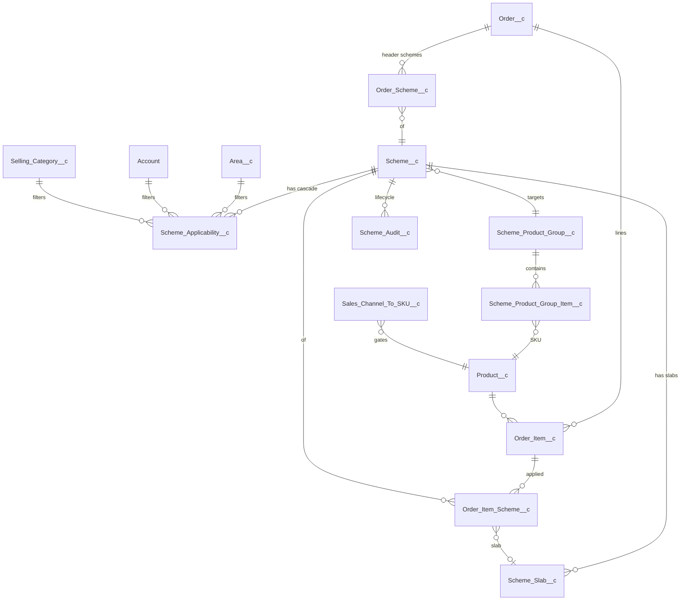
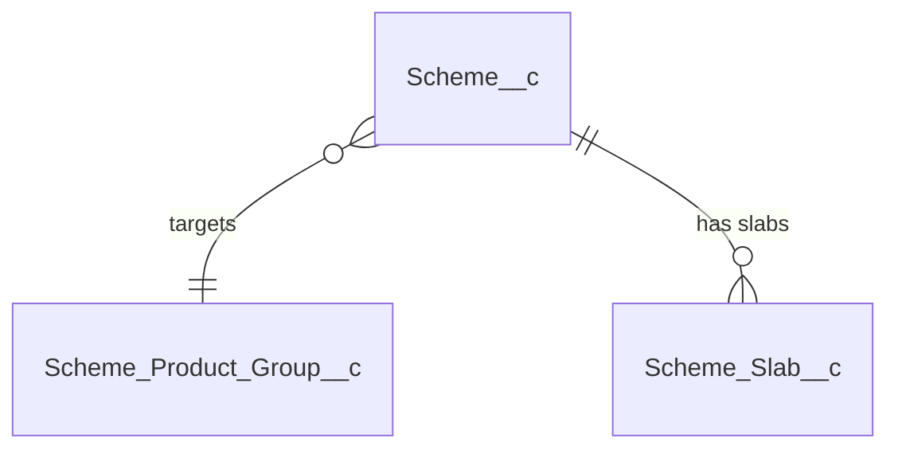
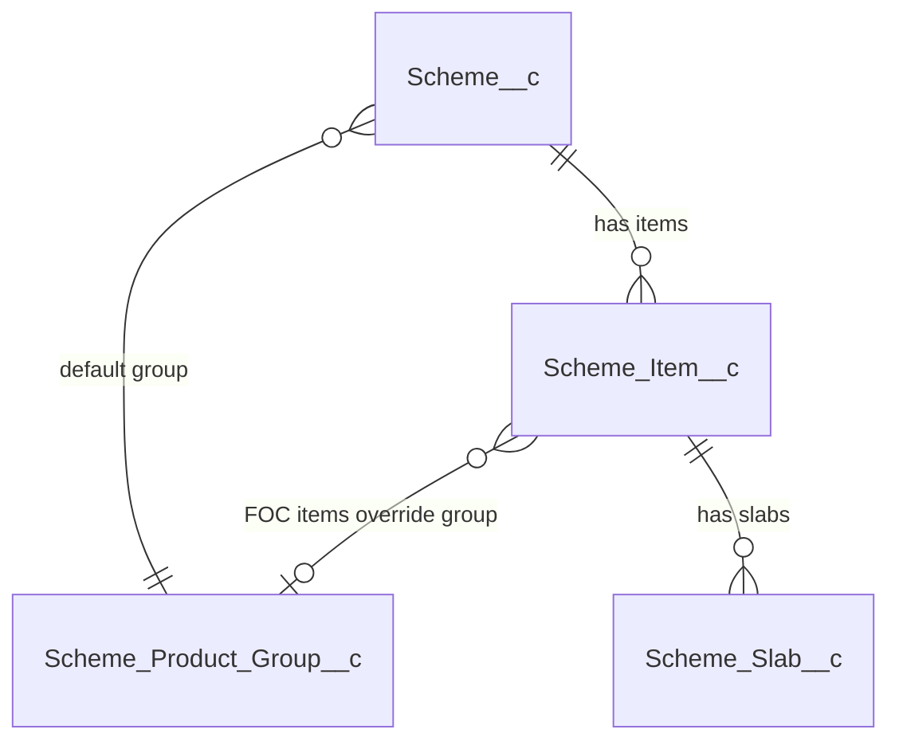

# Scheme Management — Architecture & UI Design

> Status: **DRAFT for Solution Architect review.** No code to be written until sign-off.
> Source BRD: `Scheme Management BRD .docx` + Session 1 (19 May 2026) & Session 2 (21 May 2026) transcripts.
> Sample data: `KA QPS Slab (Overall Order Level and Plum Related Scheme).xlsx`, `KA_Schemes FY26-27.xlsx`, `TN Schemes.xlsx`, `West Q1 Schemss.xlsx`.

---

## Reference — Full ER Diagram

The full data model is shown below. **Section 1** (Scheme Product Group Creation) covers `Scheme_Product_Group__c` and `Scheme_Product_Group_Item__c` (top of the diagram); the remaining objects are covered in Sections 2–8 (still to be restructured — see the placeholder further down).

### ER Diagram



---

## Section 1 — Scheme Product Group Creation

> **New section format (from this iteration onward):** each section presents the new SObject(s) first, then a UI example as structured tables + a numbered interaction list, then a short explanation. The remaining content (legacy §3.4 onward + §4..§12) is still in the prior format and is being re-flowed one per session.

A **Scheme Product Group** is a named bundle of SKUs that one or more schemes can target. It exists so an admin can define a scheme once against many SKUs instead of one scheme per SKU. Groups are created at **Sales Channel** level (FR-005), and the `Group_Purpose__c` picklist controls which validation rules apply.

### 1.1 Object — `Scheme_Product_Group__c` (NEW)

The parent record for the bundle.

| Field | Type | Required | Notes |
|---|---|---|---|
| `Name` | Auto-number `SPG-{0000}` | system | display id |
| `Group_Label__c` | Text(120) | Yes | human label, e.g. "Cake-25g-MRP10" or "Atta-AnyPack" |
| `Sales_Channel__c` | Picklist (mirrors `Product__c.Channel__c`) | Yes | single-channel grouping (FR-005) |
| `Group_Purpose__c` | Picklist | Yes | `Price_Division` / `FOC_Qualifier` / `FOC_Free` |
| `MRP__c` | Currency(10,2) | Conditional | required **only when** `Group_Purpose__c = Price_Division` |
| `Net_Weight__c` | Number(10,2) | Conditional | required **only when** `Group_Purpose__c = Price_Division` (cakes); validates member uniformity |
| `Description__c` | Text Area | No | |
| `Is_Active__c` | Checkbox | No | defaults true |
| `Member_Count__c` | Roll-up COUNT | system | from `Scheme_Product_Group_Item__c` |

**Validation:**
- `Group_Purpose__c = Price_Division` → MRP + Net_Weight mandatory; trigger enforces `All_Members_Same_MRP__c` + `All_Members_Same_NetWeight__c` across child items.
- `Group_Purpose__c = FOC_Qualifier` / `FOC_Free` → MRP / Net_Weight may be null; uniformity check skipped (mixed-MRP / mixed-grammage SKUs allowed).

**Sharing:** Public Read/Write to `Scheme_Admin` permission set; Public Read-Only to all others.
**Volume:** ~500–1,500 groups org-wide. Custom index on `Sales_Channel__c + Group_Purpose__c + Is_Active__c`.

### 1.2 Object — `Scheme_Product_Group_Item__c` (NEW)

Junction between `Scheme_Product_Group__c` and `Product__c` — one row per SKU in the group.

| Field | Type | Required | Notes |
|---|---|---|---|
| `Scheme_Product_Group__c` | Master-Detail → `Scheme_Product_Group__c` | Yes | cascade delete with parent |
| `Product__c` | Lookup → `Product__c` | Yes | the SKU |
| `Unique_Key__c` | Text(80), External ID, Unique | system | formula `Scheme_Product_Group__c + '-' + Product__r.SKU_Code__c` |
| `Is_Active__c` | Checkbox | No | defaults true |

**Master-Detail rationale:** an item record is meaningless without its parent group, and the parent needs a `Member_Count__c` roll-up. Sharing inherits from the parent.
**Validation:** unique (`Scheme_Product_Group__c`, `Product__c`); a Product appears at most once per group.
**Volume:** ~80 items/group × 1,500 groups ≈ 120k rows org-wide.

### 1.3 UI Example — Scheme Group Builder

A single LWC page (`schemeProductGroupBuilder`) the admin lands on from the new **Scheme Product Groups** tab. The page has three areas — a **Header form**, a **Filter pane**, and an **SKU result grid** — followed by the save action. The header `Group Purpose` selection drives the visibility of MRP and Net Weight inputs and the live validation chip.

**Header form fields**

| Field | Widget | Required | Notes |
|---|---|---|---|
| Group Purpose | Radio: `Price_Division` / `FOC_Qualifier` / `FOC_Free` | Yes | drives MRP + Net Weight visibility and the validation chip |
| Group Label | Text input (max 120) | Yes | maps to `Group_Label__c` |
| Sales Channel | Picklist (single-select) | Yes | required first — gates the SKU catalogue |
| MRP | Currency input | Yes when `Price_Division` | hidden in FOC modes |
| Net Weight (g) | Number input | Yes when `Price_Division` (Cake category) | hidden in FOC modes |
| Description | Textarea (multi-line) | No | optional admin note |

**Filter pane** (narrows the SKU catalogue before selection)

| Filter | Widget | Notes |
|---|---|---|
| Category | Picklist | from `Product__c.Product_Category1__c` |
| Product Group | Picklist (dependent on Category) | from `Product__c.Group_Name__c` |
| Sub-group | Picklist | from `Product__c` sub-group field if present |
| Variant | Picklist | from `Product__c.Class__c` / `Flavors__c` |
| Grammage (g) | Picklist | from `Product__c.Net_Weight__c`; **advisory only in FOC modes** |
| MRP | Picklist | from `Product__c.MRP__c`; **advisory only in FOC modes** |

**SKU result grid columns**

| Column | Widget | Notes |
|---|---|---|
| Select | Checkbox | bulk-select via the "Select all filtered" action |
| SKU Code | Text (read-only) | `Product__c.SKU_Code__c` |
| Sku Name | Text (read-only) | `Product__c.Name` |
| Category | Text (read-only) | |
| Group | Text (read-only) | |
| Sub-group | Text (read-only) | |
| Grammage (g) | Number (read-only) | |
| MRP | Currency (read-only) | |

**User actions (in order)**

1. Admin opens the **Scheme Product Groups** tab and clicks **+ New Group**.
2. Admin picks a **Group Purpose**. The form re-renders: `Price_Division` shows MRP + Net Weight as required inputs; `FOC_Qualifier` / `FOC_Free` hide those fields.
3. Admin picks a **Sales Channel**. The SKU result grid loads SKUs gated by `Sales_Channel_To_SKU__c` for that channel.
4. Admin applies one or more **Filters** to narrow the grid (Category, Group, Sub-group, Variant, Grammage, MRP).
5. Admin ticks the SKUs to include — row-by-row, or via **Select all filtered**.
6. **Live validation chip** updates as the selection changes:
   - `Price_Division` mode — chip is **GREEN** when all selected SKUs share the same MRP and Net_Weight; **RED** otherwise with message *"Mixed MRP — group not allowed"*.
   - `FOC_Qualifier` / `FOC_Free` mode — chip is **INFO-GREEN** with message *"Mixed MRP / Weight allowed for FOC"*.
7. Admin clicks **Save as Group**. A modal prompts for the **Group Label**, then the page persists one parent `Scheme_Product_Group__c` plus one `Scheme_Product_Group_Item__c` per selected SKU in a single transaction.
8. On success the page redirects to a read-only view of the new group, showing member count and the actions **Edit (admin only)**, **Clone to new group**, **Deactivate**.

### 1.4 Explanation

The Scheme Product Group is the foundation that lets a single scheme cover many SKUs. The BRD (FR-001..FR-006) requires that a scheme be defined against a *group* of SKUs, not a single SKU, and that the admin be able to filter the catalogue by Category / Group / Sub-group / Variant / Grammage / MRP and "Select all".

Two further requirements drive the `Group_Purpose__c` picklist:

1. **Price-division uniformity (FR-006).** For Basic (X+Y), QPS, Order-Value and Plum schemes, the per-unit price reduction is redistributed across the qualifying quantity using a single MRP. Mixing SKUs of different MRP or grammage would break the redistribution. We enforce this with `Group_Purpose__c = Price_Division` — all members must share MRP + Net_Weight.

2. **FOC qualifying pools may be mixed (BRD Session 2).** The FOC example is *"buy 5 kg of Chakki Atta → get 200 g vermicelli per kg"*. The qualifying SKUs may span Atta 1 kg + 5 kg + 10 kg packs at different MRPs and grammages. We enforce this with `Group_Purpose__c = FOC_Qualifier`, which relaxes the uniformity rule. The *free* products are kept in a separate `FOC_Free` purpose group when there is a choice of giveaways (vermicelli OR oats); for a single-SKU giveaway a direct lookup is used (covered in Section 2 — Scheme Definition).

The group is **always** scoped to one **Sales Channel** (FR-005), so the same SKU may belong to different groups in different channels. A trigger on `Scheme_Product_Group_Item__c` enforces that the same SKU cannot appear in more than one *active* group of the **same** `Group_Purpose__c` within the **same** Sales Channel — preventing ambiguity when a scheme resolves "which group does this order line belong to".

Groups are referenced from `Scheme__c.Scheme_Product_Group__c` (covered in Section 2). Groups are never deleted — only deactivated — so historical orders that referenced a superseded group remain traceable.

---

## Section 2 — Scheme Definition

This section defines how a scheme is structured once its Product Group (Section 1) is in place. **Two design alternatives are presented** for the architect to choose between; both share the same `Scheme_Slab__c` child and the same slab semantics. They differ only in whether a single `Scheme__c` may carry **one** scheme-type's slabs (Option A) or **many** scheme-types' slabs at once via an intermediate `Scheme_Item__c` (Option B).

### 2.1 Design Options at a Glance

| Aspect | **Option A — Single-Type per Scheme** | **Option B — Multi-Type per Scheme (via `Scheme_Item__c`)** |
|---|---|---|
| `Primary_Scheme_Type__c` lives on | `Scheme__c` | `Scheme_Item__c` (one row per type per scheme) |
| Object count for the scheme tree | 2 (Scheme + Slab) | 3 (Scheme + Item + Slab) |
| One scheme → one type only? | Yes — one Basic OR one QPS OR one Order-Value etc. | No — a single scheme can bundle e.g. Basic + QPS + Order-Value at once |
| To combine types in real life | Create 2..N parallel schemes targeting the same group | Add 2..N items under one scheme |
| Reporting / claim-credit posting unit | `Scheme__c` | `Scheme_Item__c` (rolls up to parent `Scheme__c`) |
| Lifecycle (`Is_Locked__c`, validity, cascade) lives on | `Scheme__c` | `Scheme__c` — items inherit |
| UI Wizard shape | one type → one slab editor | "Add an item" loop, each item gets its own type + slab editor |

§2.2 specifies Option A · §2.3 specifies Option B · §2.4 specifies the **shared** `Scheme_Slab__c` · §2.5 covers UI for both · §2.6 records the recommendation.

### 2.2 Option A — Single-Type Scheme

#### Object — `Scheme__c`

| Field | Type | Required | Notes |
|---|---|---|---|
| `Name` | Text(255) | Yes | display name |
| `Description__c` | Long Text | No | |
| `Sales_Channel__c` | Picklist | Yes | must match `Scheme_Product_Group__c.Sales_Channel__c` |
| `Scheme_Start_Date__c` | Date | Yes | |
| `Scheme_End_Date__c` | Date | Yes | only field admins can edit once `Is_Locked__c = true` (extend-only) |
| `IsActive__c` | Checkbox | No | toggled via `SchemeLifecycleService.activate / deactivate` only |
| `Primary_Scheme_Type__c` | Picklist (`Basic` / `QPS` / `FOC_Giveaway` / `Order_Value` / `Category_Value`) | Yes | the operational type — drives slab editor + engine |
| `Scheme_Product_Group__c` | Lookup → `Scheme_Product_Group__c` | Yes | the SKU bundle. For FOC, `Group_Purpose__c` must be `FOC_Qualifier`; for all other types, `Price_Division` |
| `Is_Locked__c` | Checkbox | system | flipped true on activation; blocks edits except `Scheme_End_Date__c` (extend) and `IsActive__c` |
| `Slab_Count__c` | Roll-up COUNT from `Scheme_Slab__c` | system | shown on list views |
| `Applicability_Summary__c` | Long Text(2000) | system | populated by trigger on `Scheme_Applicability__c` (Section 3) |
| `Credit_Percentage__c` | Number | No | used by claim-credit posting (Section 7) |
| `Scheme_Eligibility_Percentage__c` | Number | No | used by claim-credit posting (Section 7) |

**Validation:**
- `Primary_Scheme_Type__c = FOC_Giveaway` → linked group's `Group_Purpose__c` must be `FOC_Qualifier`.
- All other `Primary_Scheme_Type__c` values → linked group's `Group_Purpose__c` must be `Price_Division`.
- `Scheme_End_Date__c >= Scheme_Start_Date__c`.
- When `Is_Locked__c = true`: only `Scheme_End_Date__c` (with new ≥ old) and `IsActive__c` may change.
- Activation rejected unless ≥ 1 child `Scheme_Slab__c` exists and the cascade (Section 3) is complete.

**Sharing:** Public Read-Only; writes gated by `Scheme_Admin` permission set.
**Volume:** ~3,000 schemes/year. Indexes on `Sales_Channel__c + IsActive__c` and `Scheme_End_Date__c`.

#### ER fragment (Option A)



#### Trade-offs

- **Simpler model** — 2 objects, no intermediate. One row per scheme on list views.
- **Multi-type scenarios force parallel schemes.** When the same SKU group needs Basic + QPS + Order-Value at the same time (BRD §5.2 allows this), the admin creates 3 separate `Scheme__c` records targeting the same group. The calc engine applies them concurrently per FR-022 — but Operations see 3 records in the Active Schemes list.
- **Claim accrual is per-scheme** — clean for Finance.

### 2.3 Option B — Multi-Type Scheme (via `Scheme_Item__c`)

#### Object — `Scheme__c`

| Field | Type | Required | Notes |
|---|---|---|---|
| `Name` | Text(255) | Yes | display name |
| `Description__c` | Long Text | No | |
| `Sales_Channel__c` | Picklist | Yes | applies to all items |
| `Scheme_Start_Date__c` | Date | Yes | applies to all items |
| `Scheme_End_Date__c` | Date | Yes | only field admins can edit once `Is_Locked__c = true` |
| `IsActive__c` | Checkbox | No | via `SchemeLifecycleService` only |
| `Default_Scheme_Product_Group__c` | Lookup → `Scheme_Product_Group__c` (`Price_Division` only) | Yes | inherited by all non-FOC items |
| `Is_Locked__c` | Checkbox | system | activation flag |
| `Item_Count__c` | Roll-up COUNT from `Scheme_Item__c` | system | list views |
| `Applicability_Summary__c` | Long Text(2000) | system | populated by trigger on `Scheme_Applicability__c` (Section 3) |
| `Credit_Percentage__c` | Number | No | used by claim-credit posting (Section 7) |
| `Scheme_Eligibility_Percentage__c` | Number | No | used by claim-credit posting (Section 7) |

Note: **no `Primary_Scheme_Type__c` here** — type lives on the item.

#### Object — `Scheme_Item__c` (NEW)

The intermediate object that represents one "type-level offer" inside a scheme. One row per Primary Scheme Type per scheme.

| Field | Type | Required | Notes |
|---|---|---|---|
| `Scheme__c` | Master-Detail → `Scheme__c` | Yes | cascade delete with parent |
| `Item_Sequence__c` | Number(2,0) | Yes | display order within the scheme |
| `Primary_Scheme_Type__c` | Picklist (`Basic` / `QPS` / `FOC_Giveaway` / `Order_Value` / `Category_Value`) | Yes | the type for this item's slabs |
| `Scheme_Product_Group__c` | Lookup → `Scheme_Product_Group__c` | Conditional | required for FOC items (must be `FOC_Qualifier`). For non-FOC items, defaults from parent's `Default_Scheme_Product_Group__c` |
| `Slab_Count__c` | Roll-up COUNT from `Scheme_Slab__c` | system | list views |
| `Item_Label__c` | Formula(text) | system | "Basic 11+1", "QPS (3 slabs)", "Order-Value (4 slabs)" |
| `Is_Active__c` | Checkbox | No | inherits from parent on activation |

**Validation:**
- Unique (`Scheme__c`, `Primary_Scheme_Type__c`) — at most one item per type per scheme.
- FOC items must populate `Scheme_Product_Group__c` (because the qualifying group differs from the scheme's default Price_Division group).
- Non-FOC items must NOT override the group (use parent's default).

#### ER fragment (Option B)



#### Trade-offs

- **Native multi-type bundling.** A single scheme record can carry Basic + QPS + Order-Value at once, matching BRD §5.2 phrasing ("…the business can run, concurrently, a Basic scheme, one or more QPS slabs, a category/value-based scheme and an order-value scheme").
- **Lifecycle stays at `Scheme__c` level** — activation / extend / deactivate / clone operate on the whole bundle. Useful when the bundle shares validity dates.
- **One extra object** — slabs become grand-children of `Scheme__c`, adding a small layer in reporting, claim posting, and the engine read path.
- **Claim accrual** posts at `Scheme_Item__c` level then rolls to `Scheme__c` for summary — Finance sees both.

### 2.4 Common Child — `Scheme_Slab__c` (NEW)

`Scheme_Slab__c` is the single child object that holds every offer rule, **in both options**. In Option A the parent is `Scheme__c` directly; in Option B the parent is `Scheme_Item__c`. The field set and semantics are identical.

| Field | Type | Required | Notes |
|---|---|---|---|
| Parent lookup | Master-Detail | Yes | `Scheme__c` (Option A) or `Scheme_Item__c` (Option B) |
| `Slab_Sequence__c` | Number(2,0) | Yes | stable display order; 1, 2, 3, … |
| `Slab_Type__c` | Picklist (`Basic` / `QPS` / `FOC_Giveaway` / `Order_Value` / `Category_Value`) | Yes | must match parent's `Primary_Scheme_Type__c` |
| `Qualifying_Qty_Min__c` | Number(8,0) | Conditional | min trigger qty in EA. Basic: the X (e.g. 11). QPS: the slab threshold (entered in cases via UI; engine converts cases × `Product__c.Units_Per_Case__c` → EA at evaluation). FOC: minimum-to-qualify |
| `Qualifying_Qty_Max__c` | Number(8,0) | Conditional | inclusive upper for quantity-band Basic. Null = unbounded. Not used by QPS / FOC / value-based types |
| `Qualifying_Value_Min__c` | Currency(12,2) | Conditional | slab lower bound on GSV (Order-Value) or category GSV (Category-Value) |
| `Qualifying_Value_Max__c` | Currency(12,2) | Conditional | inclusive upper; null = unbounded (top slab) |
| `Free_Qty__c` | Number(6,0) | Conditional | Y for Basic. For FOC, fixed free qty when `FOC_Ratio_Per_Qualifying_Unit__c = 1` |
| `Benefit_Per_Case__c` | Currency(8,2) | Conditional | per-case ₹ payout (QPS). Data-entry stays per-case to match how schemes are negotiated; the engine converts to per-EA at evaluation using `Product__c.Units_Per_Case__c` (defaulting to 1 if absent) — see §2.6 |
| `Benefit_Percent__c` | Percent(5,2) | Conditional | discount % for Order-Value / Category-Value |
| `FOC_Product__c` | Lookup → `Product__c` | Conditional | single fixed free SKU (simple FOC case) |
| `FOC_Product_Group__c` | Lookup → `Scheme_Product_Group__c` (`Group_Purpose__c = FOC_Free` only) | Conditional | pool of choosable free SKUs — covers "vermicelli OR oats" |
| `FOC_Ratio_Per_Qualifying_Unit__c` | Number(6,3) | Conditional | per-qualifying-unit multiplier — e.g. `0.200` = 200 g free per 1 kg bought. Default `1.000` for fixed-pack giveaways |
| `Category__c` | Lookup → `Sales_Product_Category__c` | Conditional | required when `Slab_Type__c = Category_Value` |
| `Slab_Label__c` | Formula(text) | system | human label, e.g. "Basic · 11+1 (cycle)", "Basic · 11–20 → 1 free", "QPS-2 · 5 cases · ₹120/cs", "Order-Value · 50k–1L · 7%" |
| `Is_Active__c` | Checkbox | No | defaults true |

**Field usage by `Slab_Type__c`:**

| Slab_Type | Qty_Min | Qty_Max | Value_Min / Max | Free_Qty | Benefit_Per_Case | Benefit_Percent | FOC fields | Category | # slabs |
|---|---|---|---|---|---|---|---|---|---|
| `Basic` (cycle mode) | **Yes (X)** | — (null) | — | **Yes (Y)** | — | — | — | — | exactly 1 |
| `Basic` (band mode) | **Yes** | **Yes** (last band may be null) | — | **Yes** (flat Y per band) | — | — | — | — | 1..N (non-overlapping bands) |
| `QPS` | **Yes** (threshold, in cases) | — | — | — | **Yes** (per case → EA at eval) | — | — | — | 1..N (mutually exclusive thresholds) |
| `FOC_Giveaway` | **Yes** (min trigger) | — | — | optional (if ratio = 1) | — | — | **Yes** (Product OR Group + Ratio) | — | exactly 1 |
| `Order_Value` | — | — | **Yes** | — | — | **Yes** | — | — | 1..N (non-overlapping ranges) |
| `Category_Value` | — | — | **Yes** | — | — | **Yes** | — | **Yes** | 1..N per category |

#### Basic slab — two modes

The engine determines mode from the slab data — no separate flag:

- **Cycle mode** — exactly 1 Basic slab with `Qualifying_Qty_Max__c` null. Engine treats it as classic X+Y repeating: for ordered qty Q with `Qualifying_Qty_Min__c = X` and `Free_Qty__c = Y`, free count = `FLOOR(Q / X) × Y`. Any remainder gets no Basic benefit. This is BRD FR-010 (e.g. 11+1, 22+2, 6+1, 36+36).
- **Band mode** — 1..N Basic slabs with `Qualifying_Qty_Min__c` and `Qualifying_Qty_Max__c` defining non-overlapping bands. For ordered qty Q the engine finds the single band where Min ≤ Q ≤ Max (or Min ≤ Q if Max null) and gives that band's `Free_Qty__c` as a one-shot. Example:
  - 11–20 → 1 free
  - 21–50 → 2 free
  - 51+ → 5 free  *(top band Max null = unbounded)*

In both modes the engine writes **one** `Order_Item_Scheme__c` row per Basic slab consumed (Section 4), preserving per-line traceability.

#### Validation

- `Slab_Type__c` must match parent's `Primary_Scheme_Type__c`.
- `Slab_Sequence__c` unique per parent.
- Basic in cycle mode → exactly 1 slab with `Qualifying_Qty_Max__c` null on activation.
- Basic in band mode → all slabs have `Qualifying_Qty_Min__c` and `Qualifying_Qty_Max__c` populated (only the top slab may have Max null); bands must not overlap.
- QPS → thresholds unique within parent (no two slabs share `Qualifying_Qty_Min__c`).
- Order-Value / Category-Value → value ranges must not overlap within a parent.
- FOC slab → exactly one of `FOC_Product__c` or `FOC_Product_Group__c` populated; when group is set, its `Group_Purpose__c` must be `FOC_Free`.
- Category_Value slab → `Category__c` mandatory.
- Once parent `Is_Locked__c = true`, no insert / update / delete of `Scheme_Slab__c` rows.

**Sharing:** Controlled by parent.
**Volume:** ~15,000 slab rows per year (avg ~5 per scheme or item).

### 2.5 UI Example — Scheme Definition Wizard

A multi-step LWC wizard (`schemeDefinitionWizard`) launched from the **Schemes** tab. The wizard shape changes slightly between options; the per-type slab editor is identical.

#### Step 1 — Master fields (Option A)

| Field | Widget | Required | Notes |
|---|---|---|---|
| Scheme Name | Text input (max 255) | Yes | `Scheme__c.Name` |
| Primary Scheme Type | Radio: `Basic` / `QPS` / `FOC Giveaway` / `Order Value` / `Category Value` | Yes | drives Step 3 slab editor + Step 2 group-purpose filter |
| Sales Channel | Picklist | Yes | must match group's channel |
| Start Date / End Date | Date pickers | Yes | End ≥ Start |
| Description | Textarea | No | |

#### Step 1 — Master fields (Option B)

| Field | Widget | Required | Notes |
|---|---|---|---|
| Scheme Name | Text input (max 255) | Yes | `Scheme__c.Name` |
| Sales Channel | Picklist | Yes | applies to all items |
| Default Product Group | Lookup → `Scheme_Product_Group__c` (`Price_Division` only) | Yes | inherited by all non-FOC items |
| Start Date / End Date | Date pickers | Yes | applies to all items |
| Description | Textarea | No | |

#### Step 2 — Items (Option B only)

A repeating panel: **+ Add Item**. Each item card asks for:

| Field | Widget | Required | Notes |
|---|---|---|---|
| Primary Scheme Type | Radio (5 values) | Yes | one item per type per scheme |
| Qualifying Group (FOC only) | Lookup → `Scheme_Product_Group__c` (`FOC_Qualifier` only) | Yes for FOC | non-FOC items inherit parent default |

After saving an item, the admin proceeds to that item's slab editor (Step 3) before adding the next item.

#### Step 3 — Slabs editor (both options)

Renders one of five column sets based on `Primary_Scheme_Type__c` (Option A: from the scheme; Option B: from the active item):

**Basic — cycle mode** (1 row, Max blank → repeats)

| Column | Widget | Required | Maps to |
|---|---|---|---|
| Buy Qty (X) | Number input | Yes | `Qualifying_Qty_Min__c` |
| Max Qty | Number input (blank = cycle mode) | No | `Qualifying_Qty_Max__c` |
| Free Qty (Y) | Number input | Yes | `Free_Qty__c` |
| Mode hint | Auto-text | system | "Repeats every X+Y (cycle)" when Max blank; "Flat band" when Max populated |

> Example (cycle): one row — Buy=11, Max=blank, Free=1 → "Repeats every 11+1".

**Basic — band mode** (multiple rows, each with Min + Max + Free)

> Example: three rows — `11–20 → 1 free`, `21–50 → 2 free`, `51+ → 5 free` (top row Max blank).

**QPS** — 1..N rows, mutually exclusive thresholds

| Column | Widget | Required | Maps to |
|---|---|---|---|
| Slab # | Auto | system | `Slab_Sequence__c` |
| Qualifying Cases | Number input | Yes | `Qualifying_Qty_Min__c` (in cases; engine converts cases × `Units_Per_Case__c` → EA at eval) |
| Benefit ₹/Case | Currency input | Yes | `Benefit_Per_Case__c` (per case; engine converts to per-EA when redistributing the discount) |
| Delete | Icon | — | removes draft row |

> Example (TN Rusk): two rows — `3 cases → ₹40/case`, `5 cases → ₹80/case`.

**FOC Giveaway** — exactly one row

| Column | Widget | Required | Maps to |
|---|---|---|---|
| Min Qualifying Qty | Number input | Yes | `Qualifying_Qty_Min__c` |
| Free Product Source | Radio: `Single SKU` / `Choose from Group` | Yes | drives which lookup to populate |
| FOC Product (Single SKU) | Lookup → `Product__c` | Yes (Single SKU) | `FOC_Product__c` |
| FOC Product Group | Lookup → `Scheme_Product_Group__c` (`FOC_Free` only) | Yes (Pool) | `FOC_Product_Group__c` |
| Free Qty / Ratio | Number input | Yes | `Free_Qty__c` (when ratio = 1) or `FOC_Ratio_Per_Qualifying_Unit__c` (e.g. 0.200 = 200 g per 1 kg) |

> Example (Atta): Min Qualifying Qty = 1000 g, Source = Single SKU = Vermicelli 200 g, Ratio = 0.200.

**Order Value** — 1..N rows, mutually exclusive ₹ ranges

| Column | Widget | Required | Maps to |
|---|---|---|---|
| Slab From (₹) | Currency input | Yes | `Qualifying_Value_Min__c` |
| Slab To (₹) | Currency input (blank = unbounded) | No | `Qualifying_Value_Max__c` |
| Discount % | Percent input | Yes | `Benefit_Percent__c` |

> Example: `5,000–20,000 → 5%`, `20,001–35,000 → 7%`, `35,001–50,000 → 9%`, `50,001+ → 11%`.

**Category Value (Plum)** — 1..N rows per category

| Column | Widget | Required | Maps to |
|---|---|---|---|
| Category | Lookup → `Sales_Product_Category__c` | Yes | `Category__c` |
| Slab From (₹) | Currency input | Yes | `Qualifying_Value_Min__c` |
| Slab To (₹) | Currency input (blank = unbounded) | No | `Qualifying_Value_Max__c` |
| Discount % | Percent input | Yes | `Benefit_Percent__c` |

> Example: Category = Cake — `50,000–100,000 → 1%`, `100,001–150,000 → 1.5%`, `200,001+ → 2.5%`.

#### User actions (Option A)

1. Admin clicks **+ New Scheme** on the **Schemes** tab.
2. Step 1: Name, type, channel, dates, description → Next.
3. Step 2: pick / create Product Group → Next.
4. Step 3: type-driven slab editor — add row(s) → Next.
5. Step 4 (Section 3): Applicability cascade.
6. Step 5 (Section 5): Review + Activate.

#### User actions (Option B)

1. Admin clicks **+ New Scheme** on the **Schemes** tab.
2. Step 1: Name, channel, **default** Product Group, dates → Next.
3. Step 2: **+ Add Item** N times. For each item: pick `Primary Scheme Type`; for FOC pick a `FOC_Qualifier` group override; fill that item's slab editor. Repeat for the next item.
4. Step 3 (Section 3): Applicability cascade — applies to the whole scheme.
5. Step 4 (Section 5): Review + Activate.

### 2.6 Architect Decision + Explanation

**Recommendation: Option A** for the first delivery — fewer moving parts, simpler claim posting, simpler page layouts. The BRD's "multiple types on the same group concurrently" requirement is satisfied by creating parallel `Scheme__c` records that all target the same `Scheme_Product_Group__c`; the calc engine applies them concurrently either way (FR-022). **Option B** is the better long-term choice if Operations expect to bundle multiple scheme types into a single record routinely — pivot to it then.

**FOC stays on `Scheme_Slab__c`.** A single child object with a `Slab_Type__c` discriminator keeps the calc engine, validation rules, UI, and migration uniform. The cost is a handful of conditional fields (`FOC_Product__c`, `FOC_Product_Group__c`, `FOC_Ratio_Per_Qualifying_Unit__c`, `Category__c`) that only some types populate. A separate `Scheme_FOC_Item__c` object was considered and rejected: it doubles the engine read paths with no real schema saving.

**`Benefit_Per_Case__c` → per-EA conversion (FR-013).** Business enters QPS payout as "₹X per case" because that's how schemes are negotiated. Secondary billing is always in EA. The engine converts at evaluation time: `benefit_per_EA = Benefit_Per_Case__c / Product__c.Units_Per_Case__c` (defaulting `Units_Per_Case__c` to 1 if absent). The slab record stays in the business-friendly per-case form for reporting and audit; the conversion happens inside `SchemeEvaluationService` (Section 6).

**Basic in two modes.** BRD FR-010 shows X+Y as the canonical Basic shape. Real operations also need flat quantity-band Basic schemes ("buy 11–20 → 1 free, 21–50 → 2 free"). Both fit on `Scheme_Slab__c`: cycle mode is one slab with Max null; band mode is multiple slabs with explicit Min + Max. The engine picks the mode from the data — no separate picklist needed. The slab's `Slab_Label__c` formula prints the resolved mode so the admin sees exactly what they configured.

**Lifecycle (preview of Section 5).** Activation flips `Is_Locked__c = true` on `Scheme__c`. Validation rules then prevent any change to slabs, group link, type, cascade, start date. Only `Scheme_End_Date__c` may be extended forward, and `IsActive__c` may be toggled via the lifecycle service (which writes a `Scheme_Audit__c` row). Schemes are never deleted — only deactivated — and a "Clone to New" action creates a fresh draft with all child rows copied.

---

## Sections to be restructured in next iterations

> The content from here onward is from the prior draft and will be re-flowed into the new Section-N format (Object → UI Example → Explanation) one per session. **Up next:** **Section 3 — Applicability Cascade** will pull from §3.5 `Scheme_Applicability__c` and §6.c Cascade Picker.
>
> **Planned order:**
> - Section 3 — Applicability Cascade — from §3.5, §6.c ← next
> - Section 4 — Order Capture & Application — from §3.6, §3.7, §6.e, §6.f
> - Section 5 — Lifecycle / Audit — from §3.8, §5, §6.d, §6.g
> - Section 6 — Calc Engine — from §4
> - Section 7 — Reporting — from §7
> - Section 8 — Scalability / Security / Migration — from §8, §9, §10

### Legacy §3.4 `Scheme_Slab__c` (NEW)

*Moved to **Section 2.2 — Object — `Scheme_Slab__c`** above. The new format gives the full field table with per-slab-type usage matrix, validation rules, and a UI Example covering the type-driven Step 3 slab editor.*

### 3.5 `Scheme_Applicability__c` (NEW)

Cascade rows with "Apply to all" semantics — one row per cascade level per scheme, with a flag for "applies to everything at this level" or a specific value at that level.

| Field | Type | Notes |
|---|---|---|
| NEW: `Scheme__c` | Master-Detail | cascade delete |
| NEW: `Level__c` | Picklist | Channel / Region / Area / Distributor / OutletCategory |
| NEW: `Apply_All__c` | Checkbox | value fields null when true |
| NEW: `Value_Channel__c` | Picklist | |
| NEW: `Value_Region__c` | Picklist | |
| NEW: `Value_Area__c` | Lookup → Area__c | = Territory in this org |
| NEW: `Value_Distributor__c` | Lookup → Account | |
| NEW: `Value_Outlet_Category__c` | Lookup → Selling_Category__c | |
| NEW: `Selector_Key__c` | Formula(text) | Platform Cache key fragment |

- **Pattern:** 5 rows if all-levels-all; otherwise 5+N rows (one per specific value at non-"all" levels).
- **Validation:** exactly one value field non-null unless `Apply_All__c`; activation rejected if any level has zero rows.
- **Volume:** ~36k/yr.

### 3.6 `Order_Item_Scheme__c` (NEW)

Junction for concurrent schemes per line (FR-022, FR-060).

| Field | Type | Notes |
|---|---|---|
| NEW: `Order_Item__c` | Master-Detail | cascade with line |
| NEW: `Scheme__c` | Lookup | source scheme |
| NEW: `Scheme_Slab__c` | Lookup | null for Basic |
| NEW: `Sequence__c` | Number(2,0) | 1=Basic, 2=QPS, 3=Plum |
| NEW: `Scheme_Snapshot_Type__c` | Text(40) | hardcopy, immune to picklist edits |
| NEW: `Benefit_Amount__c` | Currency(10,2) | total ₹ benefit |
| NEW: `Per_Unit_Discount__c` | Currency(8,4) | redistributed per-unit reduction |
| NEW: `Free_Qty__c` | Number(6,0) | Y (Basic) or FOC qty |
| NEW: `Qualifying_Qty__c` | Number(8,0) | portion of line qty consumed |
| NEW: `Notes__c` | Long Text(2000) | calc trail |

- **Validation:** unique (`Order_Item__c`, `Scheme__c`, `Scheme_Slab__c`).
- **Volume:** 3–5× `Order_Item__c` → 18-month archival to `Order_Item_Scheme_Archive__b`.

### 3.7 `Order_Scheme__c` (NEW)

Header-level junction for Order-Value (FR-018 / FR-019) and Plum per-category (FR-021).

| Field | Type | Notes |
|---|---|---|
| NEW: `Order__c` | Master-Detail | cascade |
| NEW: `Scheme__c` | Lookup | |
| NEW: `Scheme_Slab__c` | Lookup | which slab fired |
| NEW: `Slab_Applied__c` | Text(60) | "₹50k–₹1L slab" |
| NEW: `Qualifying_GSV__c` | Currency(12,2) | |
| NEW: `Category__c` | Lookup → Sales_Product_Category__c | null for Order_Value |
| NEW: `Discount_Amount__c` | Currency(10,2) | |
| NEW: `Discount_Percent__c` | Percent(5,2) | |
| NEW: `Sequence__c` | Number(2,0) | |

### 3.8 `Scheme_Audit__c` (NEW)

| Field | Type | Notes |
|---|---|---|
| NEW: `Old_Scheme__c` | Lookup | |
| NEW: `New_Scheme__c` | Lookup | for clones |
| NEW: `Action__c` | Picklist | Activate / Extend / Deactivate / Clone |
| NEW: `Old_End_Date__c` / `New_End_Date__c` | Date | for Extend |
| NEW: `Acted_By__c` | Lookup → User | |
| NEW: `Acted_On__c` | DateTime | |
| NEW: `Reason__c` | Text Area | mandatory for Deactivate |

### 3.9 New fields on existing Order objects (cross-reference)

*Scheme__c definition lives in **Section 2.1 / 2.3** above. The Order side additions below will move into **Section 4 — Order Capture & Application** in the next iteration; kept here for quick reference.*

| Object | New field | Notes |
|---|---|---|
| `Order_Item__c` | `Total_Scheme_Benefit__c` (Roll-up SUM from `Order_Item_Scheme__c`) | drives the per-line discount display |
| `Order__c` | `Header_Discount_Total__c` (Roll-up SUM from `Order_Scheme__c`) | order-value + Plum totals |
| `Order__c` | `Line_Scheme_Benefit_Total__c` (Roll-up SUM via `Order_Item__c`) | summary panel |
| `Order__c` | `Scheme_Eval_Status__c` (Picklist: Pending / Computed / Stale / Computing / Error) | drives async re-evaluation |
| `Order__c` | `Scheme_Eval_Timestamp__c` (DateTime) | last successful eval |

---

## 4. Scheme Calculation Engine

### 4.1 `SchemeEvaluationService` (NEW — signatures only)

```apex
public with sharing class SchemeEvaluationService {
    public static SchemeApplicationResult evaluateOrder(Order__c hdr, List<Order_Item__c> lines);
    public static SchemeApplicationResult previewOrder(Order__c hdr, List<Order_Item__c> lines); // no DML
    public static List<Scheme__c> resolveApplicableSchemes(
        Id distributorId, Id areaId, String channel, Id outletCategoryId, Set<Id> productIds);
    @future(callout=false) public static void evaluateOrderAsync(Id orderId);
}

public class SchemeApplicationResult {
    public List<Order_Item_Scheme__c> lineApplications;
    public List<Order_Scheme__c>      headerApplications;
    public Map<Id, Decimal>           perLineRedistributedPrice;
    public List<String>               warnings;
}
```

### 4.2 Pipeline (deterministic order)

| # | Step | Reads | Writes |
|---|---|---|---|
| 1 | **Cascade match** — candidate `Scheme__c` per line via cache | Scheme_Applicability__c, Scheme_Product_Group__c, Scheme_Product_Group_Item__c, Sales_Channel_To_SKU__c | — |
| 2 | **Prune by SKU gating** | — | — |
| 3 | **Apply Basic (X+Y):** `price_after = MRP × X ÷ (X+Y)` | Scheme_Slab__c (Basic) | staged line app |
| 4 | **QPS decomposition (FR-015):** greedy DESC over slabs, e.g. 8 → 5+3; remainder no QPS | Scheme_Slab__c (QPS) | staged line app |
| 5 | **FOC giveaway** — for each line whose SKU is in the qualifying group, compute `free_qty = ROUND(line_qty × FOC_Ratio_Per_Qualifying_Unit__c, 0)` (or `Free_Qty__c` flat if ratio = 1) for the chosen `FOC_Product__c` / first active member of `FOC_Product_Group__c`; append synthetic `Order_Item__c` line at ₹0.01 (FR-017) | Scheme_Slab__c (FOC), Scheme_Product_Group__c (FOC_Free pool) | new line + junction |
| 6 | **Order-Value header slab on total GSV** | Scheme_Slab__c (Order_Value) | staged header app |
| 7 | **Category Plum:** group GSV by category, slab per category | Scheme_Slab__c (Category_Value) | staged header app |
| 8 | **Persist:** delete-and-reinsert in one txn; stamp `Scheme_Eval_Status__c=Computed` | — | DML |

Mutual exclusion (FR-022 / FR-034) enforced at scheme activation, not in evaluation.

### 4.3 Triggers & Async

- Extend `OrderItemTriggerHandler` → mark `Scheme_Eval_Status__c=Stale`, enqueue `SchemeEvaluationQueueable`.
- New LWC `orderCaptureScheme` calls `previewOrder` synchronously during edit (no DML).
- `SchemeEvaluationBatch` for back-dated re-evaluation after end-date extend.

### 4.4 Governor-Limit / Bulk Safety

- Bulkified SOQL; one query per object per evaluation.
- Platform Cache org partition `SchemeCascadeCache` (5 MB, TTL 30 min), invalidated on Scheme save/activate.
- Orders > 100 lines routed to Queueable.
- `Sales_Channel_To_SKU__c` pre-fetched once per order.

### 4.5 Existing Apex / LWC Interaction

- `SchemeLwc.cls` — extend with read-only adapters exposing `Scheme_Slab__c` alongside `Buy_Product__c`.
- `RunningSchemeController.cls` — extend `getRunningSchemes()` to UNION via cascade match.
- `schemeDataPage` LWC — add child `appliedSchemeIndicator` LWC.
- Aura `CreateEditScheme` — wrap inside new wizard, keep available as legacy quick-edit.

---

## 5. Lifecycle & Validation Rules

| Rule | Object | Condition (high level) | Enforcement |
|---|---|---|---|
| Admin-only DML | Scheme family | `!$Permission.Scheme_Admin` | VR + trigger guard |
| No delete | Scheme__c | always | `Before Delete` trigger throws |
| Immutability once live | Scheme__c | `ISCHANGED(field) && Is_Locked__c && field NOT IN {Scheme_End_Date__c, IsActive__c}` | VR |
| End-date extend only | Scheme__c | new end < old end | VR |
| Slabs frozen once live | Scheme_Slab__c | parent locked + change | VR + trigger |
| Applicability frozen once live | Scheme_Applicability__c | same | VR + trigger |
| Group MRP/grammage uniformity | Scheme_Product_Group_Item__c | applies **only when** parent `Group_Purpose__c = Price_Division`; siblings must match MRP + Net_Weight | trigger |
| MRP / Net_Weight required | Scheme_Product_Group__c | mandatory **only when** `Group_Purpose__c = Price_Division`; null allowed for `FOC_Qualifier` and `FOC_Free` | VR |
| SKU in one group per channel per purpose | Scheme_Product_Group_Item__c | unique (Product, parent.Channel, parent.Group_Purpose__c) among active | trigger |
| FOC scheme group purpose | Scheme__c | when `Primary_Scheme_Type__c = FOC_Giveaway`, the linked `Scheme_Product_Group__c.Group_Purpose__c` must be `FOC_Qualifier` | VR |
| FOC slab free-product source | Scheme_Slab__c | exactly one of `FOC_Product__c` or `FOC_Product_Group__c` populated; if the group is set, its purpose must be `FOC_Free` | VR |
| Competing-scheme uniqueness in area | Scheme__c on activate | overlap query per type per area per group | `SchemeLifecycleService.activate()` |
| Validity sanity | Scheme__c | `End >= Start` | VR |
| Category_Value needs Category | Scheme_Slab__c | | VR |
| Applicability completeness | Scheme__c on activate | all 5 levels must have rows | `SchemeLifecycleService.activate()` |
| Eval concurrency | Order__c | soft lock via `Scheme_Eval_Status__c=Computing` | trigger |

`SchemeLifecycleService` exposes: `activate(Id)`, `extendEndDate(Id, Date)`, `deactivate(Id, String reason)`, `cloneScheme(Id) returns Id`. Each writes a `Scheme_Audit__c` row.

---

## 6. UI Screen Designs

### 6.a Scheme Group Builder

*Moved to **Section 1.3 — UI Example — Scheme Group Builder** at the top of this document. The new format uses structured field tables + a numbered interaction list instead of ASCII boxes.*

### 6.b Scheme Definition Wizard

*Steps 1–3 (Basics, Product Group link, Slabs editor) moved to **Section 2.3 — UI Example — Scheme Definition Wizard** in the new structured-table format. Step 4 (Cascading Applicability Picker) will move into **Section 3** in the next iteration. Step 5 (Review & Activate) will move into **Section 5 — Lifecycle / Audit**.*

### 6.c Cascading Applicability Picker (embedded LWC)

Reusable component (`cascadingApplicabilityPicker`) embedded in Step 4 and in clone-and-edit contexts.

```
+----------------------- Applicability ------------------------+
| > Channel           [x] All                                  |
| > Region            [ ] All  [Karnataka x] [Tamil Nadu x] +  |
| > Area (Territory)  [ ] All  [Bangalore x] [Mysore x] +      |
| > Distributor       [x] All                                  |
| > Outlet Category   [ ] All  [GT x] +                        |
+--------------------------------------------------------------+
```

### 6.d Active Schemes Console

```
+---------------------------------------------------------------------------+
| Active Schemes                                          [ + New Scheme ]  |
+---------------------------------------------------------------------------+
| Filters: Status [Active v] Channel [v] Type [v] Area [v] [ Apply ]        |
+---------------------------------------------------------------------------+
|[ ]| Name              | Type     | Channel | Valid Through | Status      |
|---|-------------------|----------|---------|---------------|-------------|
|[ ]| KA Cake QPS Q1    | QPS      | GT      | 2026-06-30    | Active  ... |
|[ ]| TN Plum Cat       | CatValue | GT      | 2026-12-31    | Active  ... |
|[ ]| West Order >50k   | OrderVal | Club    | 2026-09-30    | Active  ... |
+---------------------------------------------------------------------------+
| [ Bulk Deactivate ]   [ Clone Selected ]   [ Export CSV ]                 |
+---------------------------------------------------------------------------+
```

### 6.e Order Capture — Applied Scheme Indicator (per line)

Click `(i)` to expand inline panel listing each `Order_Item_Scheme__c` row.

```
+-----------------------------------------------------------------------------+
| # | SKU      | Qty | Net Rate | Disc/Unit | Line Total | Schemes           |
|---|----------|-----|----------|-----------|------------|-------------------|
| 1 | EL-00121 |  8  | 8.00     | 0.94      | 56.50      |  [ (i) 3 schemes ]|
+-----------------------------------------------------------------------------+
                              v expand v
+-----------------------------------------------------------------------------+
|   Applied Schemes for line 1 (EL-00121 / 8 EA)                              |
|   1. Basic 1+1 (Marble Cake)         Per-unit Rs 4.00     Free Qty 4        |
|   2. QPS-2 (5 cases)                  Per-unit Rs 0.94     Benefit Rs 4.70  |
|   3. Plum Cat (Cake)                   Header allocation   Rs 0.32          |
|   [ View Calc Trail ]                                                       |
+-----------------------------------------------------------------------------+
```

### 6.f Order Capture — Header Scheme Summary (GST-summary style)

```
+----------------------------- Order Summary -------------------------------+
| Gross Sales Value            : 1,24,500.00                                |
| Line Scheme Benefit Total    :    4,820.00  (-)                           |
| Header Scheme Discounts                                                   |
|   Order-Value (50k-1L slab)  :    2,490.00  (-)                           |
|   Plum · Cake category       :      850.00  (-)                           |
|   Plum · Biscuit category    :      210.00  (-)                           |
| Net before GST               : 1,16,130.00                                |
| GST 18%                       :   20,903.40                               |
| Grand Total                   : 1,37,033.40                               |
+---------------------------------------------------------------------------+
| Scheme Eval Status: Computed at 2026-05-24 11:42  [ Re-evaluate ]         |
+---------------------------------------------------------------------------+
```

### 6.g Scheme Lifecycle Modal

```
+-------------------- Scheme Lifecycle: KA Cake QPS Q1 ---------------------+
| Current Status:  Active   (locked since 2026-06-01)                       |
|                                                                           |
|  (o) Extend End Date     New End Date [ 2026-07-31 ]   (>= old)           |
|  ( ) Deactivate          Reason [______________________________]          |
|  ( ) Clone to New        New Name [ KA Cake QPS Q1 (copy) ]               |
|                                                                           |
|  Disabled (per policy): Edit Slabs · Edit Applicability · Delete          |
|                                                                           |
|                                       [ Cancel ]            [ Apply ]     |
+---------------------------------------------------------------------------+
```

---

## 7. Reporting & Claims

- `Scheme_Credit__c` continues as the canonical claim ledger; new `SchemeCreditPostingBatch` (scheduled nightly) walks the day's `Order_Item_Scheme__c` + `Order_Scheme__c` rows and upserts per (Customer × Scheme). Existing `Credit_Percentage__c` and `Scheme_Eligibility_Percentage__c` on `Scheme__c` honoured unchanged.
- New report types:
  1. Schemes vs Achievement by Area — `Scheme_Applicability__c`(Level=Area) × `Order_Item_Scheme__c`.
  2. Scheme Benefit Roll-up by SKU Group — `Scheme_Product_Group__c` × `Order_Item_Scheme__c.Benefit_Amount__c`.
  3. Order-Value Discount Audit — `Order_Scheme__c` WHERE Slab_Type=Order_Value.
  4. Plum Category Slab Achievement — `Order_Scheme__c` WHERE Slab_Type=Category_Value, grouped by Category.
  5. Scheme Lifecycle Audit — `Scheme_Audit__c`.
- Existing reports keyed off `Order_Item__c.Scheme__c` keep working; flagged "legacy".

---

## 8. Scalability

- **Volume:** ~3k `Scheme__c`/yr, ~15k `Scheme_Slab__c`/yr, ~36k `Scheme_Applicability__c`/yr, ~1.5k `Scheme_Product_Group__c`, ~120k `Scheme_Product_Group_Item__c`. `Order_Item_Scheme__c` at 50k orders/day × 20 lines × 4 schemes = 4M rows/day → MUST archive.
- **Archival:** `Order_Item_Scheme__c` and `Order_Scheme__c` older than 18 months relocated nightly to BigObjects `Order_Item_Scheme_Archive__b` and `Order_Scheme_Archive__b`.
- **Indexes:** `Scheme__c.Sales_Channel__c + IsActive__c`, `Scheme_Applicability__c.Value_Area__c`, `.Value_Distributor__c`, `Scheme_Product_Group_Item__c.Product__c`, `Order_Item_Scheme__c.Scheme__c`.
- **Caching:** Platform Cache org partition `SchemeCascadeCache` (5 MB, TTL 30 min), invalidated on Scheme save/activate.
- **Async:** Orders > 100 lines routed to `SchemeEvaluationQueueable`. Back-dated re-evaluation via `SchemeEvaluationBatch` (200-record scope).
- **Selective SOQL:** every cascade query filters `Sales_Channel__c`, `IsActive__c`, `Scheme_End_Date__c >= TODAY`.

---

## 9. Security & Permissions

- New permission set `Scheme_Admin` — CRUD + activate on Scheme family. No delete (also trigger-blocked).
- Sales rep profiles — RO on scheme family; LWC respects FLS via `Schema.SObjectType.X.getDescribe().isAccessible()`.
- Field Audit Trail on `Scheme__c` (Primary_Scheme_Type__c, Scheme_End_Date__c, IsActive__c, Is_Locked__c) and `Scheme_Slab__c` (benefit fields).
- Sharing: Scheme family Public RO (writes gated by perm set + VR); junctions controlled by parent; `Scheme_Audit__c` Public RO.
- All new classes `with sharing`. `SchemeEvaluationService` uses `WITH USER_MODE` for reads, `AS SYSTEM` only for audit-write.

---

## 10. Migration Plan

**Phase 0 — Foundations (Week 1–2).** Deploy NEW objects + perm set + Platform Cache partition. No UI, no active triggers. Sandbox smoke tests.

**Phase 1 — Backfill (Week 3–4).**
1. Derive `Primary_Scheme_Type__c` from existing `Scheme_Type__c`.
2. For each `Buy_Product__c` → one `Scheme_Slab__c`.
3. For each `Mapping__c` → infer `Level__c` from populated FK, emit `Scheme_Applicability__c`; default `Apply_All__c=true` on missing levels.
4. For each historical `Order_Item__c` with `Scheme__c` → snapshot `Order_Item_Scheme__c` (Scheme_Snapshot_Type__c=Legacy).

One-shot `SchemeBackfillBatch` with idempotency markers (External ID on each new row).

**Phase 2 — UI cutover (Week 5–6).** Activate new triggers (eval, lifecycle, validation). Extend `schemeDataPage` to show new wizard. Aura `CreateEditScheme` → read-only.

**Phase 3 — Deprecate (Week 7+).** Mark `Product_Scheme__c` deprecated; hide tab. Plan removal once no dependencies (Apex dependency API scan).

Rollback per phase: feature-flag via `Scheme_Refactor_Settings__c` hierarchical Custom Setting (`Is_Engine_Enabled`, `Is_Lifecycle_Enabled`, `Is_UI_Enabled`).

---

## 11. Open Questions for Architect

1. Master-detail vs Lookup on `Order_Item_Scheme__c → Order_Item__c`. Master-detail gives roll-up summaries but locks sharing to parent — acceptable?
2. BigObject archival cadence — 18mo chosen; does Finance need 7-yr retention for claim reconciliation?
3. Real-time vs near-real-time evaluation — sync `previewOrder` adds 300–600 ms per edit. Acceptable or debounce + async?
4. Migrate `Order__c` to standard Salesforce `Order` / `OrderItem` to ride standard pricing?
5. Should Order-Value & Plum discounts also roll up to `Invoice__c` at conversion?
6. Mutual exclusion scope: per `Primary_Scheme_Type__c` only, or slab-type granularity?
7. Concurrent Plum + Order-Value — apply both on raw GSV, or apply Order-Value first then Plum on post-discount GSV?
8. FOC line as synthetic `Order_Item__c` — need a "synthetic line" boolean to bypass quantity/credit triggers?
9. Permission set licensing — does `Scheme_Admin` role exist or need a new permission set group?
10. Backfill quality bar — 99% or 100% reconciled rows before Phase 2 cutover?

---

## 12. Verification Plan

### 12.1 Sample-data demos (per xlsx)

| Workbook | Scheme types exercised | Expected artefacts |
|---|---|---|
| `KA QPS Slab ... .xlsx` | QPS + Order-Value + Plum | 3 `Scheme_Slab__c` + 1 `Order_Scheme__c` Order-Value + N `Order_Scheme__c` Plum |
| `KA_Schemes FY26-27.xlsx` | Basic + QPS + FOC | per-line `Order_Item_Scheme__c` seq 1/2 + synthetic FOC line |
| `TN Schemes.xlsx` | Basic + Category_Value | per-line Basic + header Plum |
| `West Q1 Schemss.xlsx` | Order-Value only | single `Order_Scheme__c` |

### 12.2 Unit tests (new)

- `SchemeEvaluationService_BasicTest` — X+Y price division across multiple group SKUs.
- `SchemeEvaluationService_QPSTest` — 8-case → 5+3 decomposition; verify per-unit redistribution.
- `SchemeEvaluationService_FOCTest` — synthetic line at ₹0.01 + linkage.
- `SchemeEvaluationService_OrderValueTest` — slab boundary (₹49,999 vs ₹50,000).
- `SchemeEvaluationService_PlumTest` — per-category bucketing.
- `SchemeEvaluationService_CascadeTest` — cascade precedence; "all" wins when no specifics.
- `SchemeLifecycleServiceTest` — activate/extend/deactivate/clone + audit trail.
- `SchemeValidationTest` — immutability, extend-only, MRP/grammage uniformity, competing uniqueness.
- `SchemeBackfillBatchTest` — idempotency on rerun.

Target ≥ 90% coverage on new classes (per existing `SchemeLwcTest` baseline).

### 12.3 E2E scenario

Single secondary order with 8 EA of a Basic+QPS-eligible SKU, 12 EA of an FOC-trigger SKU, GSV crossing ₹50k Order-Value slab, Cake category crossing the Plum ₹20k slab. Expected:
- Line 1: 2 × `Order_Item_Scheme__c` (Basic + QPS-2 from 5+3).
- Line 2: 1 × `Order_Item_Scheme__c` (FOC qualifier) + new synthetic Line 3 at ₹0.01.
- Header: 1 Order_Value + 1 Plum-Cake `Order_Scheme__c`.
- Roll-ups match BRD worked examples within ±₹0.01.
- 1 `Scheme_Audit__c` row from activation.
- Re-run after end-date extend: idempotent, no duplicate junctions.

### 12.4 Performance gate

- 200-line order eval p95 ≤ 1.5 s (sync) or queued.
- 10k-order back-dated re-evaluation ≤ 30 min via Batch.
- No SOQL > 50 / DML > 150 per `evaluateOrder` invocation; verified via `Limits.getQueries()` in tests.

---

## Appendix A — Critical files for implementation (Phase 2 onwards)

- `force-app/main/default/objects/Scheme__c/`
- `force-app/main/default/objects/Buy_Product__c/`
- `force-app/main/default/objects/Mapping__c/`
- `force-app/main/default/objects/Order_Item__c/`
- `force-app/main/default/classes/SchemeLwc.cls`
- `force-app/main/default/classes/RunningSchemeController.cls`
- `force-app/main/default/classes/OrderItemTriggerHandler.cls`
- `force-app/main/default/lwc/schemeDataPage/`

---

*End of document — awaiting Solution Architect review.*
