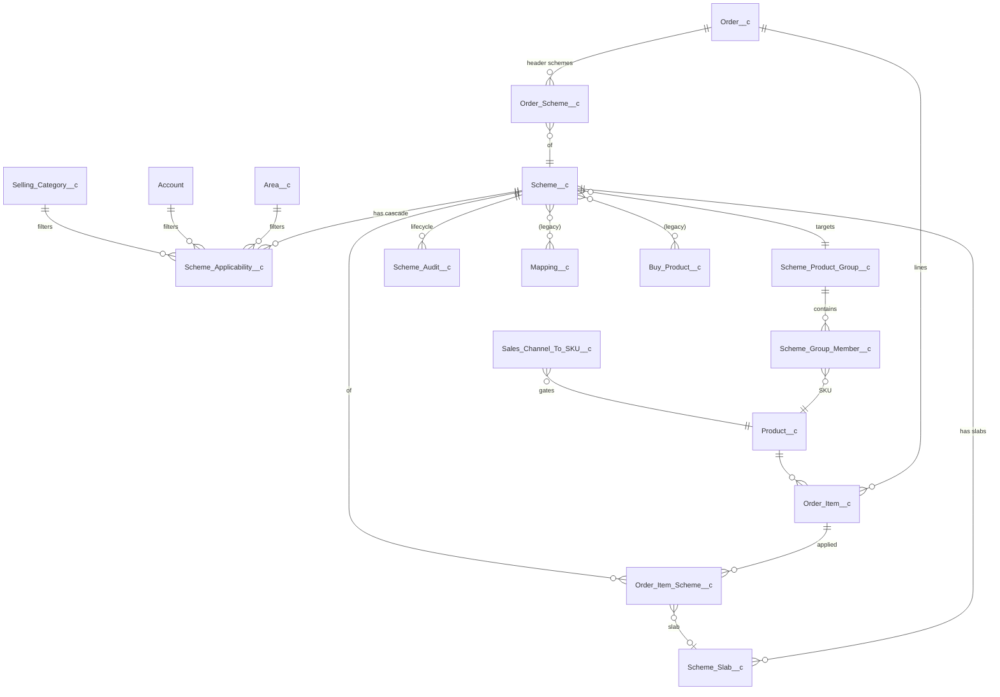

# Scheme Management — Architecture & UI Design

> Status: **DRAFT for Solution Architect review.** No code to be written until sign-off.
> Source BRD: `Scheme Management BRD .docx` + Session 1 (19 May 2026) & Session 2 (21 May 2026) transcripts.
> Sample data: `KA QPS Slab (Overall Order Level and Plum Related Scheme).xlsx`, `KA_Schemes FY26-27.xlsx`, `TN Schemes.xlsx`, `West Q1 Schemss.xlsx`.

---

## 1. Context & Goal

Elite Foods runs its secondary sales (Distributor → Outlet) on a custom Salesforce-based DMS where six concurrent scheme types co-exist on the same secondary order: Basic (X+Y), QPS slabs, FOC giveaway, Order-Value slab discount, and a per-category "Plum" slab. Today, the scheme model in the org (`Scheme__c` + flat `Buy_Product__c` + a single `Mapping__c` row + a single-lookup `Order_Item__c.Scheme__c`) cannot represent (a) named SKU groups sharing MRP/grammage, (b) multi-slab QPS, (c) cascading applicability (Channel → Region → Area → Distributor → Outlet Category), (d) concurrent multi-scheme application on one line/order, or (e) the lifecycle immutability rules in FR-050..FR-053. Admin teams maintain schemes in spreadsheets and the apex calc has grown ad-hoc.

This refactor introduces a normalised, reuse-first model on top of the existing `Scheme__c` master and a new `SchemeEvaluationService` Apex layer that evaluates an order against all in-force schemes at capture time and persists per-line and per-header benefit junction rows for full traceability. Scope is strictly **secondary sales**. Existing `Scheme_Credit__c` claim accrual is preserved unchanged.

**Out of scope:** Primary schemes, multi-month / period-cumulative claims, B2C combos, loyalty programs, migration of `Product_Scheme__c` (deprecate Phase 3).

**Success criteria:**
1. All six BRD scheme types representable without code change.
2. One order line can carry N concurrent schemes with audit trail.
3. Admins build / activate / extend / clone schemes via UI with zero spreadsheet handoff.
4. Calc engine reproduces the four xlsx sample workbooks within ±₹0.01.
5. Lifecycle FR-050..FR-053 enforced by validation, not policy.

---

## 2. Reuse-First Inventory

We are **not greenfield**. Every BRD capability lands on an existing object first; new objects appear only where the existing model cannot express the relationship.

| BRD capability | Reuse | New |
|---|---|---|
| Scheme master | `Scheme__c` (Name, Validity, IsActive, Sales_Channel, Description, Credit_Percentage, Scheme_Eligibility_Percentage, Value) | + `Primary_Scheme_Type__c`, `Scheme_Product_Group__c` lookup, `Is_Locked__c` |
| Buy/Offer rules (legacy flat) | `Buy_Product__c` kept read-only | superseded by `Scheme_Slab__c` |
| SKU master | `Product__c` (`SKU_Code__c`, `Group_Name__c`, `Net_Weight__c`, `MRP__c`, `Channel__c`, `Product_Category1__c`, `Class__c`, `Brand__c`, `Flavors__c`, `Is_Active__c`) | none — `Group_Name__c` stays informational |
| Channel-SKU gating | `Sales_Channel_To_SKU__c` | none |
| Outlet category | `Selling_Category__c` (GT / Club / HoReCa) | none |
| Area / Territory | `Area__c` (reused for both per stakeholder decision) | none |
| Distributor / Outlet | `Account` (Account.Sales_Channel__c) | none |
| Cascade applicability | `Mapping__c` (legacy, frozen) | `Scheme_Applicability__c` |
| Order header / lines | `Order__c`, `Order_Item__c` (existing Before/After/Difference/Scheme_Claim_Amount formulas preserved) | + roll-up fields |
| Per-line scheme link (single today) | `Order_Item__c.Scheme__c`, `.Buy_Product__c` (deprecated, kept for back-compat read) | `Order_Item_Scheme__c` |
| Header Order-Value & Plum link | none today | `Order_Scheme__c` |
| Claim accrual | `Scheme_Credit__c` | none — source switches to new engine |
| Existing LWC | `schemeDataPage`, `runningSchemes`, `schemeData_MapRegion` extended | child LWCs only |
| Existing Apex | `SchemeLwc`, `RunningSchemeController` extended | + `SchemeEvaluationService`, `SchemeLifecycleService` |
| Lifecycle audit | none | `Scheme_Audit__c` |

`Product_Scheme__c` is dormant — retire in Phase 3.

---

## 3. New / Modified Objects

### 3.1 ER Diagram



### 3.2 `Scheme_Product_Group__c` (NEW)

Named SKU bundle. Created via the Scheme Group Builder UI; reusable across schemes. The `Group_Purpose__c` picklist controls which validation rules apply:

- **`Price_Division`** — used by Basic / QPS / Order-Value / Plum schemes. MRP and Net_Weight are **required** and **all members must match** (FR-006).
- **`FOC_Qualifier`** — used by FOC Giveaway schemes for the "what you must buy" pool (e.g. all Atta SKUs across 1kg / 5kg / 10kg packs). MRP and Net_Weight are **not required** and members may differ.
- **`FOC_Free`** — used by FOC Giveaway schemes for the "what you get free" pool (e.g. vermicelli OR oats). MRP and Net_Weight not required.

| Field | Type | Notes |
|---|---|---|
| NEW: `Name` | Auto-number `SPG-{0000}` | |
| NEW: `Group_Label__c` | Text(120) | e.g. "Cake-25g-MRP10" or "Atta-AnyPack" |
| NEW: `Sales_Channel__c` | Picklist (mirrors `Product__c.Channel__c`) | single-channel grouping (FR-005) |
| NEW: `Group_Purpose__c` | Picklist | `Price_Division` / `FOC_Qualifier` / `FOC_Free` |
| NEW: `MRP__c` | Currency(10,2) | **required only when `Group_Purpose__c = Price_Division`**; trigger validates all members match |
| NEW: `Net_Weight__c` | Number(10,2) | **required only when `Group_Purpose__c = Price_Division`** (cakes); validated for member uniformity |
| NEW: `Description__c` | Text Area | |
| NEW: `Is_Active__c` | Checkbox | |
| NEW: `Member_Count__c` | Roll-up COUNT | |

- **Sharing:** Public RW to `Scheme_Admin`, Public RO others.
- **Validation:**
  - `Group_Purpose__c = Price_Division` → MRP + Net_Weight mandatory + `All_Members_Same_MRP__c` + `All_Members_Same_NetWeight__c` (Apex trigger).
  - `Group_Purpose__c = FOC_Qualifier` / `FOC_Free` → MRP / Net_Weight may be null; uniformity check skipped.
- **Volume:** ~500–1,500 groups. Index on `Sales_Channel__c + Group_Purpose__c + Is_Active__c`.

### 3.3 `Scheme_Group_Member__c` (NEW)

Junction `Scheme_Product_Group__c` ↔ `Product__c`.

| Field | Type | Notes |
|---|---|---|
| NEW: `Scheme_Product_Group__c` | Master-Detail | cascade delete |
| NEW: `Product__c` | Lookup | required |
| NEW: `Unique_Key__c` | Text(80), External ID, Unique | `SPG-Id-SKU_Code__c` |
| NEW: `Is_Active__c` | Checkbox | |

- **Master-detail rationale:** meaningless standalone; need roll-ups.
- **Volume:** ~120k rows total.

### 3.4 `Scheme_Slab__c` (NEW)

Replaces flat `Buy_Product__c` for new schemes. Supports multi-slab QPS, multi-slab Order-Value, Category-Plum, and simple Basic / FOC.

| Field | Type | Notes |
|---|---|---|
| NEW: `Scheme__c` | Master-Detail | cascade delete |
| NEW: `Slab_Sequence__c` | Number(2,0) | QPS-1, QPS-2 |
| NEW: `Slab_Type__c` | Picklist | Basic / QPS / FOC_Giveaway / Order_Value / Category_Value |
| NEW: `Qualifying_Qty_EA__c` | Number(8,0) | Basic / QPS / FOC |
| NEW: `Qualifying_Value_From__c` | Currency(12,2) | Order_Value / Category_Value lower bound |
| NEW: `Qualifying_Value_To__c` | Currency(12,2) | inclusive upper; null = unbounded |
| NEW: `Benefit_Per_Case__c` | Currency(8,2) | QPS ₹/case |
| NEW: `Benefit_Percent__c` | Percent(5,2) | Order_Value / Category_Value |
| NEW: `Free_Qty__c` | Number(6,0) | Basic Y or fixed FOC qty (when ratio = 1) |
| NEW: `FOC_Product__c` | Lookup → Product__c | single fixed free SKU — simple FOC case |
| NEW: `FOC_Product_Group__c` | Lookup → Scheme_Product_Group__c | pool of choosable free SKUs (group must be `FOC_Free` purpose) — e.g. "vermicelli OR oats" |
| NEW: `FOC_Ratio_Per_Qualifying_Unit__c` | Number(6,3) | per-unit multiplier — e.g. `0.2` = "200 g free per 1 kg bought"; default `1.000` for fixed-pack giveaways |
| NEW: `Category__c` | Lookup → Sales_Product_Category__c | required when Category_Value |
| NEW: `Slab_Label__c` | Formula(text) | "QPS-2 · 5 cases · ₹120/cs" |
| NEW: `Is_Active__c` | Checkbox | |

- **Validation:** unique `Slab_Sequence__c` per scheme; FOC requires either `FOC_Product__c` OR `FOC_Product_Group__c` (exactly one); when `FOC_Product_Group__c` is set, the group's `Group_Purpose__c` must be `FOC_Free`; Category_Value requires Category.
- **Volume:** ~15k/yr. Index on `Scheme__c + Slab_Type__c`.

### 3.5 `Scheme_Applicability__c` (NEW)

Cascade rows with "Apply to all" semantics. Replaces `Mapping__c`'s one-level-per-row rigidity.

| Field | Type | Notes |
|---|---|---|
| NEW: `Scheme__c` | Master-Detail | cascade delete |
| NEW: `Level__c` | Picklist | Channel / Region / Area / Distributor / OutletCategory |
| NEW: `Apply_All__c` | Checkbox | value fields null when true |
| NEW: `Value_Channel__c` | Picklist | |
| NEW: `Value_Region__c` | Picklist | |
| NEW: `Value_Area__c` | Lookup → Area__c | = Territory in this org |
| NEW: `Value_Distributor__c` | Lookup → Account | |
| NEW: `Value_Outlet_Category__c` | Lookup → Selling_Category__c | |
| NEW: `Selector_Key__c` | Formula(text) | Platform Cache key fragment |

- **Pattern:** 5 rows if all-levels-all; otherwise 5+N rows (one per specific value at non-"all" levels).
- **Validation:** exactly one value field non-null unless `Apply_All__c`; activation rejected if any level has zero rows.
- **Volume:** ~36k/yr.

### 3.6 `Order_Item_Scheme__c` (NEW)

Junction for concurrent schemes per line (FR-022, FR-060).

| Field | Type | Notes |
|---|---|---|
| NEW: `Order_Item__c` | Master-Detail | cascade with line |
| NEW: `Scheme__c` | Lookup | source scheme |
| NEW: `Scheme_Slab__c` | Lookup | null for Basic |
| NEW: `Sequence__c` | Number(2,0) | 1=Basic, 2=QPS, 3=Plum |
| NEW: `Scheme_Snapshot_Type__c` | Text(40) | hardcopy, immune to picklist edits |
| NEW: `Benefit_Amount__c` | Currency(10,2) | total ₹ benefit |
| NEW: `Per_Unit_Discount__c` | Currency(8,4) | redistributed per-unit reduction |
| NEW: `Free_Qty__c` | Number(6,0) | Y (Basic) or FOC qty |
| NEW: `Qualifying_Qty__c` | Number(8,0) | portion of line qty consumed |
| NEW: `Notes__c` | Long Text(2000) | calc trail |

- **Validation:** unique (`Order_Item__c`, `Scheme__c`, `Scheme_Slab__c`).
- **Volume:** 3–5× `Order_Item__c` → 18-month archival to `Order_Item_Scheme_Archive__b`.

### 3.7 `Order_Scheme__c` (NEW)

Header-level junction for Order-Value (FR-018 / FR-019) and Plum per-category (FR-021).

| Field | Type | Notes |
|---|---|---|
| NEW: `Order__c` | Master-Detail | cascade |
| NEW: `Scheme__c` | Lookup | |
| NEW: `Scheme_Slab__c` | Lookup | which slab fired |
| NEW: `Slab_Applied__c` | Text(60) | "₹50k–₹1L slab" |
| NEW: `Qualifying_GSV__c` | Currency(12,2) | |
| NEW: `Category__c` | Lookup → Sales_Product_Category__c | null for Order_Value |
| NEW: `Discount_Amount__c` | Currency(10,2) | |
| NEW: `Discount_Percent__c` | Percent(5,2) | |
| NEW: `Sequence__c` | Number(2,0) | |

### 3.8 `Scheme_Audit__c` (NEW)

| Field | Type | Notes |
|---|---|---|
| NEW: `Old_Scheme__c` | Lookup | |
| NEW: `New_Scheme__c` | Lookup | for clones |
| NEW: `Action__c` | Picklist | Activate / Extend / Deactivate / Clone |
| NEW: `Old_End_Date__c` / `New_End_Date__c` | Date | for Extend |
| NEW: `Acted_By__c` | Lookup → User | |
| NEW: `Acted_On__c` | DateTime | |
| NEW: `Reason__c` | Text Area | mandatory for Deactivate |

### 3.9 Modifications to Existing Objects

| Object | Change | Why |
|---|---|---|
| `Scheme__c` | NEW: `Primary_Scheme_Type__c` picklist (Basic / QPS / FOC_Giveaway / Order_Value / Category_Value) | existing `Scheme_Type__c` too generic |
| `Scheme__c` | NEW: `Scheme_Product_Group__c` Lookup | binds scheme to SKU bundle |
| `Scheme__c` | NEW: `Is_Locked__c` Checkbox | set true at first activation |
| `Scheme__c` | NEW: `Slab_Count__c` roll-up | list views |
| `Scheme__c` | NEW: `Applicability_Summary__c` Long Text | visual summary |
| `Order_Item__c` | NEW: `Total_Scheme_Benefit__c` roll-up | replaces formula source |
| `Order_Item__c` | MODIFY: rebase `Difference_Scheme_Unit_per_EA__c` formula on `Total_Scheme_Benefit__c / Order_Qty` | keep formula contract for PDFs |
| `Order_Item__c` | DEPRECATE (keep): `Scheme__c`, `Buy_Product__c` single lookups | back-compat read |
| `Order__c` | NEW: `Header_Discount_Total__c` roll-up | no header discount today |
| `Order__c` | NEW: `Line_Scheme_Benefit_Total__c` roll-up | summary panel |
| `Order__c` | NEW: `Scheme_Eval_Status__c` picklist + `Scheme_Eval_Timestamp__c` | async re-evaluation |
| `Product__c` | none — `Group_Name__c` stays informational | avoid dual source of truth |
| `Mapping__c` | none — frozen, legacy reads | |
| `Buy_Product__c` | none — frozen | |

---

## 4. Scheme Calculation Engine

### 4.1 `SchemeEvaluationService` (NEW — signatures only)

```apex
public with sharing class SchemeEvaluationService {
    public static SchemeApplicationResult evaluateOrder(Order__c hdr, List<Order_Item__c> lines);
    public static SchemeApplicationResult previewOrder(Order__c hdr, List<Order_Item__c> lines); // no DML
    public static List<Scheme__c> resolveApplicableSchemes(
        Id distributorId, Id areaId, String channel, Id outletCategoryId, Set<Id> productIds);
    @future(callout=false) public static void evaluateOrderAsync(Id orderId);
}

public class SchemeApplicationResult {
    public List<Order_Item_Scheme__c> lineApplications;
    public List<Order_Scheme__c>      headerApplications;
    public Map<Id, Decimal>           perLineRedistributedPrice;
    public List<String>               warnings;
}
```

### 4.2 Pipeline (deterministic order)

| # | Step | Reads | Writes |
|---|---|---|---|
| 1 | **Cascade match** — candidate `Scheme__c` per line via cache | Scheme_Applicability__c, Scheme_Product_Group__c, Scheme_Group_Member__c, Sales_Channel_To_SKU__c | — |
| 2 | **Prune by SKU gating** | — | — |
| 3 | **Apply Basic (X+Y):** `price_after = MRP × X ÷ (X+Y)` | Scheme_Slab__c (Basic) | staged line app |
| 4 | **QPS decomposition (FR-015):** greedy DESC over slabs, e.g. 8 → 5+3; remainder no QPS | Scheme_Slab__c (QPS) | staged line app |
| 5 | **FOC giveaway** — for each line whose SKU is in the qualifying group, compute `free_qty = ROUND(line_qty × FOC_Ratio_Per_Qualifying_Unit__c, 0)` (or `Free_Qty__c` flat if ratio = 1) for the chosen `FOC_Product__c` / first active member of `FOC_Product_Group__c`; append synthetic `Order_Item__c` line at ₹0.01 (FR-017) | Scheme_Slab__c (FOC), Scheme_Product_Group__c (FOC_Free pool) | new line + junction |
| 6 | **Order-Value header slab on total GSV** | Scheme_Slab__c (Order_Value) | staged header app |
| 7 | **Category Plum:** group GSV by category, slab per category | Scheme_Slab__c (Category_Value) | staged header app |
| 8 | **Persist:** delete-and-reinsert in one txn; stamp `Scheme_Eval_Status__c=Computed` | — | DML |

Mutual exclusion (FR-022 / FR-034) enforced at scheme activation, not in evaluation.

### 4.3 Triggers & Async

- Extend `OrderItemTriggerHandler` → mark `Scheme_Eval_Status__c=Stale`, enqueue `SchemeEvaluationQueueable`.
- New LWC `orderCaptureScheme` calls `previewOrder` synchronously during edit (no DML).
- `SchemeEvaluationBatch` for back-dated re-evaluation after end-date extend.

### 4.4 Governor-Limit / Bulk Safety

- Bulkified SOQL; one query per object per evaluation.
- Platform Cache org partition `SchemeCascadeCache` (5 MB, TTL 30 min), invalidated on Scheme save/activate.
- Orders > 100 lines routed to Queueable.
- `Sales_Channel_To_SKU__c` pre-fetched once per order.

### 4.5 Existing Apex / LWC Interaction

- `SchemeLwc.cls` — extend with read-only adapters exposing `Scheme_Slab__c` alongside `Buy_Product__c`.
- `RunningSchemeController.cls` — extend `getRunningSchemes()` to UNION via cascade match.
- `schemeDataPage` LWC — add child `appliedSchemeIndicator` LWC.
- Aura `CreateEditScheme` — wrap inside new wizard, keep available as legacy quick-edit.

---

## 5. Lifecycle & Validation Rules

| Rule | Object | Condition (high level) | Enforcement |
|---|---|---|---|
| Admin-only DML | Scheme family | `!$Permission.Scheme_Admin` | VR + trigger guard |
| No delete | Scheme__c | always | `Before Delete` trigger throws |
| Immutability once live | Scheme__c | `ISCHANGED(field) && Is_Locked__c && field NOT IN {Scheme_End_Date__c, IsActive__c}` | VR |
| End-date extend only | Scheme__c | new end < old end | VR |
| Slabs frozen once live | Scheme_Slab__c | parent locked + change | VR + trigger |
| Applicability frozen once live | Scheme_Applicability__c | same | VR + trigger |
| Group MRP/grammage uniformity | Scheme_Group_Member__c | applies **only when** parent `Group_Purpose__c = Price_Division`; siblings must match MRP + Net_Weight | trigger |
| MRP / Net_Weight required | Scheme_Product_Group__c | mandatory **only when** `Group_Purpose__c = Price_Division`; null allowed for `FOC_Qualifier` and `FOC_Free` | VR |
| SKU in one group per channel per purpose | Scheme_Group_Member__c | unique (Product, parent.Channel, parent.Group_Purpose__c) among active | trigger |
| FOC scheme group purpose | Scheme__c | when `Primary_Scheme_Type__c = FOC_Giveaway`, the linked `Scheme_Product_Group__c.Group_Purpose__c` must be `FOC_Qualifier` | VR |
| FOC slab free-product source | Scheme_Slab__c | exactly one of `FOC_Product__c` or `FOC_Product_Group__c` populated; if the group is set, its purpose must be `FOC_Free` | VR |
| Competing-scheme uniqueness in area | Scheme__c on activate | overlap query per type per area per group | `SchemeLifecycleService.activate()` |
| Validity sanity | Scheme__c | `End >= Start` | VR |
| Category_Value needs Category | Scheme_Slab__c | | VR |
| Applicability completeness | Scheme__c on activate | all 5 levels must have rows | `SchemeLifecycleService.activate()` |
| Eval concurrency | Order__c | soft lock via `Scheme_Eval_Status__c=Computing` | trigger |

`SchemeLifecycleService` exposes: `activate(Id)`, `extendEndDate(Id, Date)`, `deactivate(Id, String reason)`, `cloneScheme(Id) returns Id`. Each writes a `Scheme_Audit__c` row.

---

## 6. UI Screen Designs

### 6.a Scheme Group Builder

**Purpose:** Admin builds a `Scheme_Product_Group__c` by first selecting a **Group Purpose** and then filtering the SKU catalog.
**User:** Scheme Admin.
**Group Purpose drives the form:**
- `Price_Division` → MRP and Net_Weight inputs appear and are mandatory; uniformity chip is enforced (red if SKUs disagree).
- `FOC_Qualifier` → MRP / Net_Weight inputs hidden; uniformity chip hidden; mixed-MRP/weight SKUs allowed in the same group (e.g. Atta 1kg + Atta 5kg + Atta 10kg).
- `FOC_Free` → same as FOC_Qualifier; this is the "what you get free" pool.

**Common filters:** Channel, Category, Group, Sub-group, Variant, Grammage, MRP (advisory for FOC modes).

**Price_Division mode**
```
+---------------------------------------------------------------------------+
| Scheme Group Builder                                          [ Help (?) ]|
+---------------------------------------------------------------------------+
| Group Purpose ( o ) Price Division   ( ) FOC Qualifier   ( ) FOC Free     |
+---------------------------------------------------------------------------+
| Channel [GT v]  Category [Cake v]  Group [Marble v]  Sub-group [-- v]     |
| Variant [-- v]  Grammage* [25g v]  MRP* [10 v]   [ Apply ]   [ Clear ]    |
|                                              * required for Price Division|
+---------------------------------------------------------------------------+
| Selected: 12 SKUs    Price match: OK   Grammage match: OK   [ chip ]      |
+---------------------------------------------------------------------------+
| [x] | SKU Code | Sku Name             | Cat | Grp    | Sub | g  | MRP   |
|-----|----------|----------------------|-----|--------|-----|----|-------|
| [x] | EL-00121 | Marble Cake 25g Choc | Cak | Marble | Std | 25 | 10.00 |
| [x] | EL-00122 | Marble Cake 25g Van  | Cak | Marble | Std | 25 | 10.00 |
| [ ] | EL-00130 | Marble Cake 30g Choc | Cak | Marble | Std | 30 | 12.00 |
+---------------------------------------------------------------------------+
| [ Select All Filtered ]   [ Clear Selection ]   [ Save as Group... ]      |
+---------------------------------------------------------------------------+
```

**FOC_Qualifier mode** (MRP / grammage fields hidden, uniformity chip hidden)
```
+---------------------------------------------------------------------------+
| Scheme Group Builder                                          [ Help (?) ]|
+---------------------------------------------------------------------------+
| Group Purpose ( ) Price Division   ( o ) FOC Qualifier   ( ) FOC Free     |
+---------------------------------------------------------------------------+
| Channel [GT v]  Category [Atta v]  Group [Chakki v]  Sub-group [-- v]     |
| Variant [-- v]                            [ Apply ]   [ Clear ]           |
|       (MRP & Grammage not required — mixed SKUs allowed for FOC)          |
+---------------------------------------------------------------------------+
| Selected: 3 SKUs    [ Mixed MRP / Weight OK for FOC ]                     |
+---------------------------------------------------------------------------+
| [x] | SKU Code | Sku Name              | Cat  | Grp    | g    | MRP    |
|-----|----------|-----------------------|------|--------|------|--------|
| [x] | EL-02201 | Chakki Atta 1 kg      | Atta | Chakki | 1000 |  55.00 |
| [x] | EL-02205 | Chakki Atta 5 kg      | Atta | Chakki | 5000 | 250.00 |
| [x] | EL-02210 | Chakki Atta 10 kg     | Atta | Chakki |10000 | 480.00 |
+---------------------------------------------------------------------------+
| [ Select All Filtered ]   [ Clear Selection ]   [ Save as Group... ]      |
+---------------------------------------------------------------------------+
```

### 6.b Scheme Definition Wizard

5 steps, save-as-draft at every step.

**Step 1 — Basics**
```
+---------------------------------------------------------------------------+
| Create Scheme · Step 1 of 5 — Basics                                      |
+---------------------------------------------------------------------------+
| Name [____________________________]                                       |
| Primary Scheme Type ( ) Basic  ( ) QPS  ( ) FOC Giveaway                  |
|                     ( ) Order Value  ( ) Category Value (Plum)            |
| Start Date [ 2026-06-01 ]   End Date [ 2026-06-30 ]                       |
| Channel [ GT v ]                                                          |
| Description [______________________________________]                      |
|                                       [ Cancel ]   [ Save Draft ] [ Next ]|
+---------------------------------------------------------------------------+
```

**Step 2 — Link Scheme Product Group**

For Basic / QPS / Order-Value / Plum types — pick a single Price_Division group.

```
+---------------------------------------------------------------------------+
| Create Scheme · Step 2 of 5 — Product Group               Type: QPS       |
+---------------------------------------------------------------------------+
| Scheme Product Group [ SPG-0042 · Marble-25g-MRP10  v ]   [ + New Group ] |
|   Purpose: Price_Division · MRP 10.00 · 25 g                              |
| Member SKUs (12): EL-00121, EL-00122, ... (preview)                       |
|                                          [ Back ] [ Save Draft ] [ Next ] |
+---------------------------------------------------------------------------+
```

For FOC Giveaway — pick a **Qualifying group** AND a free product source (single SKU or `FOC_Free` group), plus the per-unit ratio.

```
+---------------------------------------------------------------------------+
| Create Scheme · Step 2 of 5 — Product Group         Type: FOC Giveaway    |
+---------------------------------------------------------------------------+
| Qualifying Group   [ SPG-0117 · Atta-AnyPack  v ]      [ + New Group ]    |
|   Purpose: FOC_Qualifier · 3 SKUs (1kg / 5kg / 10kg, mixed MRP)           |
|                                                                           |
| Free Product Source                                                       |
|   ( o ) Single SKU      [ EL-08801 · Vermicelli 200 g  v ]                |
|   ( ) Choose from Group [ SPG-0118 · Free-Snack-Pool   v ]                |
|                          Purpose: FOC_Free · 2 SKUs (vermicelli / oats)   |
|                                                                           |
| FOC Ratio per qualifying unit  [ 0.200 ]                                  |
|   Example: 0.200 = 200 g free per 1 kg of qualifying Atta bought          |
|                                          [ Back ] [ Save Draft ] [ Next ] |
+---------------------------------------------------------------------------+
```

**Step 3 — Slabs editor (columns vary by Primary Scheme Type)**
```
+---------------------------------------------------------------------------+
| Create Scheme · Step 3 of 5 — Slabs                          Type: QPS    |
+---------------------------------------------------------------------------+
| # | Qualifying Cases | Benefit Rs/Case | Notes              | [del]       |
|---|------------------|-----------------|--------------------|-------------|
| 1 | 3                | 50              | QPS-1              |  [x]        |
| 2 | 5                | 120             | QPS-2              |  [x]        |
| 3 | 10               | 300             | QPS-3              |  [x]        |
+---------------------------------------------------------------------------+
| [ + Add Slab ]                                                            |
|                                          [ Back ] [ Save Draft ] [ Next ] |
+---------------------------------------------------------------------------+
```

Column variants per `Slab_Type`:
- **Basic:** Buy Qty (X) | Free Qty (Y)
- **FOC Giveaway:** Qualifying Qty | FOC Product | Free Qty
- **Order_Value:** Slab From | Slab To | Discount %
- **Category_Value:** Category | Slab From | Slab To | Discount %

**Step 4 — Cascading Applicability Picker**
```
+---------------------------------------------------------------------------+
| Create Scheme · Step 4 of 5 — Applicability Cascade                       |
+---------------------------------------------------------------------------+
| Level             | Apply to all | Specific values                        |
|-------------------|--------------|----------------------------------------|
| Channel           | [x] All      | (chips)                                |
| Region            | [ ]          | [Karnataka] [Tamil Nadu]               |
| Area (Territory)  | [ ]          | [Bangalore Urban] [Mysore] [+ add]     |
| Distributor       | [x] All      | (chips)                                |
| Outlet Category   | [ ]          | [GT]                                   |
+---------------------------------------------------------------------------+
|                                          [ Back ] [ Save Draft ] [ Next ] |
+---------------------------------------------------------------------------+
```

**Step 5 — Review & Activate**
```
+---------------------------------------------------------------------------+
| Create Scheme · Step 5 of 5 — Review                                      |
+---------------------------------------------------------------------------+
| Name: KA Cake QPS Q1                                                      |
| Type: QPS · Validity 2026-06-01 -> 2026-06-30 · Channel GT                |
| Product Group: SPG-0042 (12 SKUs)                                         |
| Slabs: 3 (QPS-1 / QPS-2 / QPS-3)                                          |
| Cascade: Region=KA,TN · Area=Bangalore,Mysore · OutletCat=GT              |
|                                                                           |
| Conflicts check: [ Run ]   ->  OK (no competing active QPS in these areas)|
|                                                                           |
| [ Back ]              [ Save as Draft ]              [ Activate Scheme ]  |
+---------------------------------------------------------------------------+
```

### 6.c Cascading Applicability Picker (embedded LWC)

Reusable component (`cascadingApplicabilityPicker`) embedded in Step 4 and in clone-and-edit contexts.

```
+----------------------- Applicability ------------------------+
| > Channel           [x] All                                  |
| > Region            [ ] All  [Karnataka x] [Tamil Nadu x] +  |
| > Area (Territory)  [ ] All  [Bangalore x] [Mysore x] +      |
| > Distributor       [x] All                                  |
| > Outlet Category   [ ] All  [GT x] +                        |
+--------------------------------------------------------------+
```

### 6.d Active Schemes Console

```
+---------------------------------------------------------------------------+
| Active Schemes                                          [ + New Scheme ]  |
+---------------------------------------------------------------------------+
| Filters: Status [Active v] Channel [v] Type [v] Area [v] [ Apply ]        |
+---------------------------------------------------------------------------+
|[ ]| Name              | Type     | Channel | Valid Through | Status      |
|---|-------------------|----------|---------|---------------|-------------|
|[ ]| KA Cake QPS Q1    | QPS      | GT      | 2026-06-30    | Active  ... |
|[ ]| TN Plum Cat       | CatValue | GT      | 2026-12-31    | Active  ... |
|[ ]| West Order >50k   | OrderVal | Club    | 2026-09-30    | Active  ... |
+---------------------------------------------------------------------------+
| [ Bulk Deactivate ]   [ Clone Selected ]   [ Export CSV ]                 |
+---------------------------------------------------------------------------+
```

### 6.e Order Capture — Applied Scheme Indicator (per line)

Click `(i)` to expand inline panel listing each `Order_Item_Scheme__c` row.

```
+-----------------------------------------------------------------------------+
| # | SKU      | Qty | Net Rate | Disc/Unit | Line Total | Schemes           |
|---|----------|-----|----------|-----------|------------|-------------------|
| 1 | EL-00121 |  8  | 8.00     | 0.94      | 56.50      |  [ (i) 3 schemes ]|
+-----------------------------------------------------------------------------+
                              v expand v
+-----------------------------------------------------------------------------+
|   Applied Schemes for line 1 (EL-00121 / 8 EA)                              |
|   1. Basic 1+1 (Marble Cake)         Per-unit Rs 4.00     Free Qty 4        |
|   2. QPS-2 (5 cases)                  Per-unit Rs 0.94     Benefit Rs 4.70  |
|   3. Plum Cat (Cake)                   Header allocation   Rs 0.32          |
|   [ View Calc Trail ]                                                       |
+-----------------------------------------------------------------------------+
```

### 6.f Order Capture — Header Scheme Summary (GST-summary style)

```
+----------------------------- Order Summary -------------------------------+
| Gross Sales Value            : 1,24,500.00                                |
| Line Scheme Benefit Total    :    4,820.00  (-)                           |
| Header Scheme Discounts                                                   |
|   Order-Value (50k-1L slab)  :    2,490.00  (-)                           |
|   Plum · Cake category       :      850.00  (-)                           |
|   Plum · Biscuit category    :      210.00  (-)                           |
| Net before GST               : 1,16,130.00                                |
| GST 18%                       :   20,903.40                               |
| Grand Total                   : 1,37,033.40                               |
+---------------------------------------------------------------------------+
| Scheme Eval Status: Computed at 2026-05-24 11:42  [ Re-evaluate ]         |
+---------------------------------------------------------------------------+
```

### 6.g Scheme Lifecycle Modal

```
+-------------------- Scheme Lifecycle: KA Cake QPS Q1 ---------------------+
| Current Status:  Active   (locked since 2026-06-01)                       |
|                                                                           |
|  (o) Extend End Date     New End Date [ 2026-07-31 ]   (>= old)           |
|  ( ) Deactivate          Reason [______________________________]          |
|  ( ) Clone to New        New Name [ KA Cake QPS Q1 (copy) ]               |
|                                                                           |
|  Disabled (per policy): Edit Slabs · Edit Applicability · Delete          |
|                                                                           |
|                                       [ Cancel ]            [ Apply ]     |
+---------------------------------------------------------------------------+
```

---

## 7. Reporting & Claims

- `Scheme_Credit__c` continues as the canonical claim ledger; new `SchemeCreditPostingBatch` (scheduled nightly) walks the day's `Order_Item_Scheme__c` + `Order_Scheme__c` rows and upserts per (Customer × Scheme). Existing `Credit_Percentage__c` and `Scheme_Eligibility_Percentage__c` on `Scheme__c` honoured unchanged.
- New report types:
  1. Schemes vs Achievement by Area — `Scheme_Applicability__c`(Level=Area) × `Order_Item_Scheme__c`.
  2. Scheme Benefit Roll-up by SKU Group — `Scheme_Product_Group__c` × `Order_Item_Scheme__c.Benefit_Amount__c`.
  3. Order-Value Discount Audit — `Order_Scheme__c` WHERE Slab_Type=Order_Value.
  4. Plum Category Slab Achievement — `Order_Scheme__c` WHERE Slab_Type=Category_Value, grouped by Category.
  5. Scheme Lifecycle Audit — `Scheme_Audit__c`.
- Existing reports keyed off `Order_Item__c.Scheme__c` keep working; flagged "legacy".

---

## 8. Scalability

- **Volume:** ~3k `Scheme__c`/yr, ~15k `Scheme_Slab__c`/yr, ~36k `Scheme_Applicability__c`/yr, ~1.5k `Scheme_Product_Group__c`, ~120k `Scheme_Group_Member__c`. `Order_Item_Scheme__c` at 50k orders/day × 20 lines × 4 schemes = 4M rows/day → MUST archive.
- **Archival:** `Order_Item_Scheme__c` and `Order_Scheme__c` older than 18 months relocated nightly to BigObjects `Order_Item_Scheme_Archive__b` and `Order_Scheme_Archive__b`.
- **Indexes:** `Scheme__c.Sales_Channel__c + IsActive__c`, `Scheme_Applicability__c.Value_Area__c`, `.Value_Distributor__c`, `Scheme_Group_Member__c.Product__c`, `Order_Item_Scheme__c.Scheme__c`.
- **Caching:** Platform Cache org partition `SchemeCascadeCache` (5 MB, TTL 30 min), invalidated on Scheme save/activate.
- **Async:** Orders > 100 lines routed to `SchemeEvaluationQueueable`. Back-dated re-evaluation via `SchemeEvaluationBatch` (200-record scope).
- **Selective SOQL:** every cascade query filters `Sales_Channel__c`, `IsActive__c`, `Scheme_End_Date__c >= TODAY`.

---

## 9. Security & Permissions

- New permission set `Scheme_Admin` — CRUD + activate on Scheme family. No delete (also trigger-blocked).
- Sales rep profiles — RO on scheme family; LWC respects FLS via `Schema.SObjectType.X.getDescribe().isAccessible()`.
- Field Audit Trail on `Scheme__c` (Primary_Scheme_Type__c, Scheme_End_Date__c, IsActive__c, Is_Locked__c) and `Scheme_Slab__c` (benefit fields).
- Sharing: Scheme family Public RO (writes gated by perm set + VR); junctions controlled by parent; `Scheme_Audit__c` Public RO.
- All new classes `with sharing`. `SchemeEvaluationService` uses `WITH USER_MODE` for reads, `AS SYSTEM` only for audit-write.

---

## 10. Migration Plan

**Phase 0 — Foundations (Week 1–2).** Deploy NEW objects + perm set + Platform Cache partition. No UI, no active triggers. Sandbox smoke tests.

**Phase 1 — Backfill (Week 3–4).**
1. Derive `Primary_Scheme_Type__c` from existing `Scheme_Type__c`.
2. For each `Buy_Product__c` → one `Scheme_Slab__c`.
3. For each `Mapping__c` → infer `Level__c` from populated FK, emit `Scheme_Applicability__c`; default `Apply_All__c=true` on missing levels.
4. For each historical `Order_Item__c` with `Scheme__c` → snapshot `Order_Item_Scheme__c` (Scheme_Snapshot_Type__c=Legacy).

One-shot `SchemeBackfillBatch` with idempotency markers (External ID on each new row).

**Phase 2 — UI cutover (Week 5–6).** Activate new triggers (eval, lifecycle, validation). Extend `schemeDataPage` to show new wizard. Aura `CreateEditScheme` → read-only.

**Phase 3 — Deprecate (Week 7+).** Mark `Product_Scheme__c` deprecated; hide tab. Plan removal once no dependencies (Apex dependency API scan).

Rollback per phase: feature-flag via `Scheme_Refactor_Settings__c` hierarchical Custom Setting (`Is_Engine_Enabled`, `Is_Lifecycle_Enabled`, `Is_UI_Enabled`).

---

## 11. Open Questions for Architect

1. Master-detail vs Lookup on `Order_Item_Scheme__c → Order_Item__c`. Master-detail gives roll-up summaries but locks sharing to parent — acceptable?
2. BigObject archival cadence — 18mo chosen; does Finance need 7-yr retention for claim reconciliation?
3. Real-time vs near-real-time evaluation — sync `previewOrder` adds 300–600 ms per edit. Acceptable or debounce + async?
4. Migrate `Order__c` to standard Salesforce `Order` / `OrderItem` to ride standard pricing?
5. Should Order-Value & Plum discounts also roll up to `Invoice__c` at conversion?
6. Mutual exclusion scope: per `Primary_Scheme_Type__c` only, or slab-type granularity?
7. Concurrent Plum + Order-Value — apply both on raw GSV, or apply Order-Value first then Plum on post-discount GSV?
8. FOC line as synthetic `Order_Item__c` — need a "synthetic line" boolean to bypass quantity/credit triggers?
9. Permission set licensing — does `Scheme_Admin` role exist or need a new permission set group?
10. Backfill quality bar — 99% or 100% reconciled rows before Phase 2 cutover?

---

## 12. Verification Plan

### 12.1 Sample-data demos (per xlsx)

| Workbook | Scheme types exercised | Expected artefacts |
|---|---|---|
| `KA QPS Slab ... .xlsx` | QPS + Order-Value + Plum | 3 `Scheme_Slab__c` + 1 `Order_Scheme__c` Order-Value + N `Order_Scheme__c` Plum |
| `KA_Schemes FY26-27.xlsx` | Basic + QPS + FOC | per-line `Order_Item_Scheme__c` seq 1/2 + synthetic FOC line |
| `TN Schemes.xlsx` | Basic + Category_Value | per-line Basic + header Plum |
| `West Q1 Schemss.xlsx` | Order-Value only | single `Order_Scheme__c` |

### 12.2 Unit tests (new)

- `SchemeEvaluationService_BasicTest` — X+Y price division across multiple group SKUs.
- `SchemeEvaluationService_QPSTest` — 8-case → 5+3 decomposition; verify per-unit redistribution.
- `SchemeEvaluationService_FOCTest` — synthetic line at ₹0.01 + linkage.
- `SchemeEvaluationService_OrderValueTest` — slab boundary (₹49,999 vs ₹50,000).
- `SchemeEvaluationService_PlumTest` — per-category bucketing.
- `SchemeEvaluationService_CascadeTest` — cascade precedence; "all" wins when no specifics.
- `SchemeLifecycleServiceTest` — activate/extend/deactivate/clone + audit trail.
- `SchemeValidationTest` — immutability, extend-only, MRP/grammage uniformity, competing uniqueness.
- `SchemeBackfillBatchTest` — idempotency on rerun.

Target ≥ 90% coverage on new classes (per existing `SchemeLwcTest` baseline).

### 12.3 E2E scenario

Single secondary order with 8 EA of a Basic+QPS-eligible SKU, 12 EA of an FOC-trigger SKU, GSV crossing ₹50k Order-Value slab, Cake category crossing the Plum ₹20k slab. Expected:
- Line 1: 2 × `Order_Item_Scheme__c` (Basic + QPS-2 from 5+3).
- Line 2: 1 × `Order_Item_Scheme__c` (FOC qualifier) + new synthetic Line 3 at ₹0.01.
- Header: 1 Order_Value + 1 Plum-Cake `Order_Scheme__c`.
- Roll-ups match BRD worked examples within ±₹0.01.
- 1 `Scheme_Audit__c` row from activation.
- Re-run after end-date extend: idempotent, no duplicate junctions.

### 12.4 Performance gate

- 200-line order eval p95 ≤ 1.5 s (sync) or queued.
- 10k-order back-dated re-evaluation ≤ 30 min via Batch.
- No SOQL > 50 / DML > 150 per `evaluateOrder` invocation; verified via `Limits.getQueries()` in tests.

---

## Appendix A — Critical files for implementation (Phase 2 onwards)

- `force-app/main/default/objects/Scheme__c/`
- `force-app/main/default/objects/Buy_Product__c/`
- `force-app/main/default/objects/Mapping__c/`
- `force-app/main/default/objects/Order_Item__c/`
- `force-app/main/default/classes/SchemeLwc.cls`
- `force-app/main/default/classes/RunningSchemeController.cls`
- `force-app/main/default/classes/OrderItemTriggerHandler.cls`
- `force-app/main/default/lwc/schemeDataPage/`

---

*End of document — awaiting Solution Architect review.*
